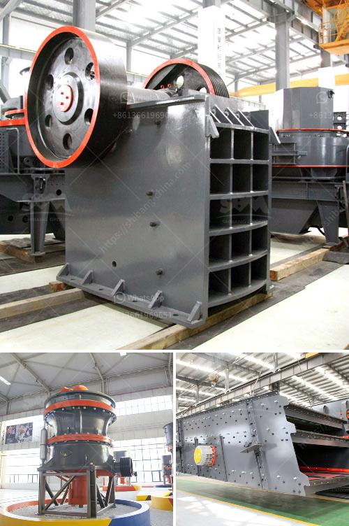

<h3>crusher machine in pakistan</h3>
Crusher machines are used for crushing of hard and solid materials into pieces. These machines play an important role in many industrial sectors such as mining, construction, and recycling. As their name suggests, they crush materials to turn them into smaller particles for further use.

One of the most prominent crusher machines manufacturers in Pakistan is Shanghai Shibang Machinery Co., Ltd. It has been established for over three decades and has a strong reputation in the industry. The company produces a wide range of crushers, including jaw crushers, cone crushers, and impact crushers.

Jaw crushers are used for coarse crushing of materials. They are commonly used in construction sites and mining industries to crush rocks and other hard materials. These machines consist of a fixed jaw and a movable jaw, which are arranged in a V shape. The material is fed into the jaws and is gradually crushed as the jaws move closer together.

Cone crushers, on the other hand, are used for medium to fine crushing. They are primarily used in the mining industry to crush materials such as iron ore, copper ore, limestone, and granite. These machines have a conical shape and a mantle that rotates, crushing the material against the walls of the cone.

Lastly, impact crushers are used for crushing materials that are relatively soft and non-abrasive, such as coal, limestone, and clay. These machines use a high-speed impact force to break the material into smaller pieces. They are ideal for recycling applications and can be used to crush recycled concrete, asphalt, and other construction waste.

Crusher machines are heavily utilized in Pakistan due to the robust construction, dependable performance, and low maintenance requirements. The crushers provided by Shanghai Shibang Machinery Co., Ltd are of high quality and have competitive prices. These machines are also known for their excellent after-sales service, ensuring customer satisfaction.

In addition to the above-mentioned crushers, Shanghai Shibang Machinery Co., Ltd also produces other equipment such as vibrating screens, feeders, and belt conveyors. These machines are used in conjunction with crushers to enhance the efficiency of the crushing process and provide a complete solution to the customer's needs.

In conclusion, crusher machines are essential equipment in various industries in Pakistan. They are used for crushing hard and solid materials into smaller pieces for further use. The crushers produced by Shanghai Shibang Machinery Co., Ltd are of high quality and offer excellent performance. They are widely used in the mining, construction, and recycling industries. With strong after-sales service, these machines have gained a favorable reputation among customers in Pakistan.
<h3>Contact us</h3><ul><li><strong>Whatsapp:&nbsp;<a href="https://wa.me/8613661969651">+8613661969651</a></strong></li><li><a href="https://swt.shibang-china.com/?git&amp;zhl&amp;crusher machine in pakistan"><strong>Online Service(chat now)</strong></a></li></ul><h3>Related</h3><ul><li><a href='price of crusher of stone in peru.md'>price of crusher of stone in peru</a></li><li><a href='power calculation hammer mill equation.md'>power calculation hammer mill equation</a></li><li><a href='talcum powder manufacturing process.md'>talcum powder manufacturing process</a></li><li><a href='price of diamond mining construction.md'>price of diamond mining construction</a></li><li><a href='prices of gemini concentrating tables manufacturers.md'>prices of gemini concentrating tables manufacturers</a></li></ul>