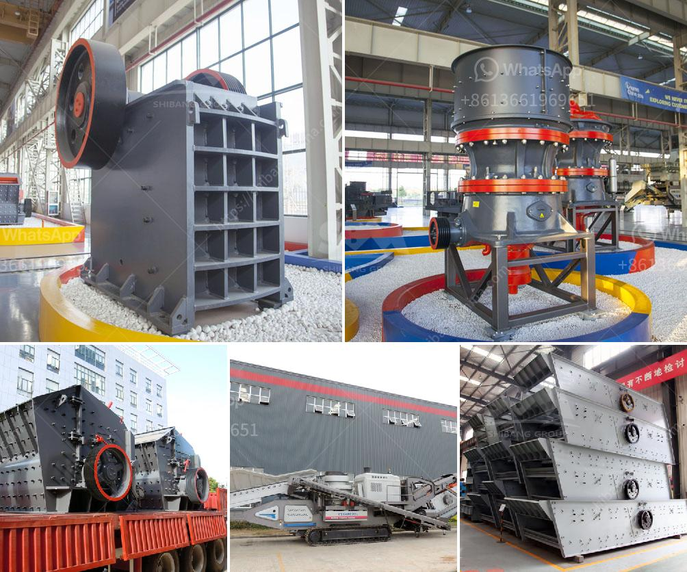

<h3>crusher machine plant</h3>
Crusher machine plant is mainly divided into jaw crusher, impact crusher, cone crusher and sand making machine. In the crushing process, jaw crusher and impact crusher are common crusher equipment. This article will introduce these two types of crusher machine plant in detail.

Jaw crusher plant is an indispensable part of almost all crushing projects. Regardless of the hardness and size of the materials being crushed, it provides high-quality materials needed for construction, road building, bridge construction, and other industries. As one of the most commonly used primary crushers, jaw crusher plant can process all kinds of stone materials, such as pebbles, granite, limestone, basalt, etc. The jaw crusher uses a motor as its power to drive the eccentric shaft to rotate, making the movable jaw move in an arc trajectory. This movement ensures that the materials are gradually crushed into smaller sizes.

Impact crusher plant, also known as impact crushing machine or impact breaker, is a kind of equipment with high crushing ratio and low energy consumption. It has unique advantages in crushing large materials. Impact crusher plant is widely used in various fields of mining, construction, metallurgy, transportation, cement, chemical industries, etc. When the materials enter the crushing chamber, they are subjected to a high-speed impact by the blow bars of the rotor. These materials are then thrown to the impact plates on the rotor for secondary crushing. The crushed materials are finally discharged through the outlet, and the size of the discharged materials can be adjusted by adjusting the gap between the impact plates.

Sand making machine plant, also known as vertical shaft impact crusher, is a type of crusher that facilitates the crushing of materials into fine particles. The machine is designed for highway, railway, high-rise construction, municipal engineering, hydroelectric dam construction, and concrete mixing station. Sand making machine plant is widely used in both metal and non-metallic minerals, cement, refractories, abrasives, glass raw materials, building aggregates, machine-made sand, metallurgy and other industries. It can crush various medium-hard ores and rocks, especially suitable for materials with high hardness and abrasiveness.

In conclusion, crusher machine plants play an essential role in the mining industry. They are the backbone of the crushing process and provide high-quality materials needed for various construction projects. Jaw crusher plant, impact crusher plant, and sand making machine plant are three common crusher equipment used in mining and construction industries. Each type of crusher has its uniqueness and application range. Choosing the right crusher machine plant can greatly improve the efficiency of the crushing process and reduce production costs. Whether it's for large-scale construction projects or small-scale mineral processing plants, investing in a reliable and efficient crusher machine plant is always a wise choice.
<h3>Contact us</h3><ul><li><strong>Whatsapp:&nbsp;<a href="https://wa.me/8613661969651">+8613661969651</a></strong></li><li><a href="https://swt.shibang-china.com/?git&amp;zhl&amp;crusher machine plant"><strong>Online Service(chat now)</strong></a></li></ul><h3>Related</h3><ul><li><a href='quartz crusher machine.md'>quartz crusher machine</a></li><li><a href='stone crushing machine for sale.md'>stone crushing machine for sale</a></li><li><a href='philippines crusher equipment.md'>philippines crusher equipment</a></li><li><a href='crusher for aggregate.md'>crusher for aggregate</a></li><li><a href='how to build a small rock crusher.md'>how to build a small rock crusher</a></li></ul>