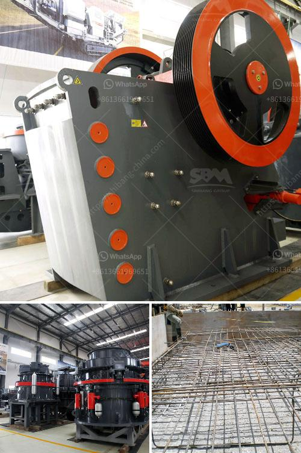

<h3>crusher machine price in kenya</h3>
In today's highly competitive market, the price of a crusher machine is very important. So, what is the crusher machine price in Kenya? In this article, we will analyze and discuss several factors that affect the price of a crusher machine in Kenya.

The stone crushing production line in Kenya is used for crushing basalt, granite, pebbles, river stone, limestone, and other materials. The following is a brief introduction of the equipment configuration and price analysis of this production line.

First, the stone crushing machine in Kenya has simple structure, reliable work, and high crushing efficiency, which not only reduces production costs but also improves profits. The machine adopts advanced technology and is wear-resistant, which effectively reduces the maintenance cycle and improves the service life of the equipment.

Second, the aggregate production line has small footprint and high degree of automation, which greatly saves manpower and reduces labor costs. The large-scale crushing production line is equipped with multiple crushing machines, each with high crushing efficiency, low energy consumption, and large crushing ratio, which not only improves productivity but also reduces equipment investment.

Third, the machine has low failure rate and long service life. Regular maintenance and replacement of vulnerable parts can effectively extend the service life of the equipment, further reducing production costs and increasing profits.

Fourth, the crusher machine price in Kenya is influenced by the machine's capacity. Different production equipment has different capacities. Therefore, customers need to choose the appropriate model according to their production needs. The following table is a detailed introduction to the price range of different models of crusher machines in Kenya.

Note: The price range mentioned above is approximate and may vary depending on the specific model, configuration, and supplier.

In addition to the above factors, the crusher machine price in Kenya is also closely related to the equipment's quality and after-sales service. Quality directly affects the crushing efficiency and service life of the equipment. A machine with good quality and excellent performance will have a higher price.

Furthermore, after-sales service is crucial for customers. A reliable and responsible supplier can provide comprehensive pre-sales and after-sales services, including installation guidance, equipment debugging, and maintenance training. Choosing a reputable supplier with excellent after-sales service can reduce potential problems and create a better user experience.

In conclusion, the crusher machine price in Kenya is influenced by various factors, including capacity, quality, and after-sales service. With the continuous advancement of technology and the development of the market economy, the price of the crusher machine in Kenya will gradually increase in the future. Customers should pay attention to the selection and purchase of equipment to ensure a reasonable investment and maximize profits.
<h3>Contact us</h3><ul><li><strong>Whatsapp:&nbsp;<a href="https://wa.me/8613661969651">+8613661969651</a></strong></li><li><a href="https://swt.shibang-china.com/?git&amp;zhl&amp;crusher machine price in kenya"><strong>Online Service(chat now)</strong></a></li></ul><h3>Related</h3><ul><li><a href='vsi5x crusher for sale.md'>vsi5x crusher for sale</a></li><li><a href='dry processing of coal in south africa.md'>dry processing of coal in south africa</a></li><li><a href='ballast crusher kenya.md'>ballast crusher kenya</a></li><li><a href='alluvial mobile diamond processing plant.md'>alluvial mobile diamond processing plant</a></li><li><a href='gold ore hammer mills prices mining supplies in zimbabwe.md'>gold ore hammer mills prices mining supplies in zimbabwe</a></li></ul>