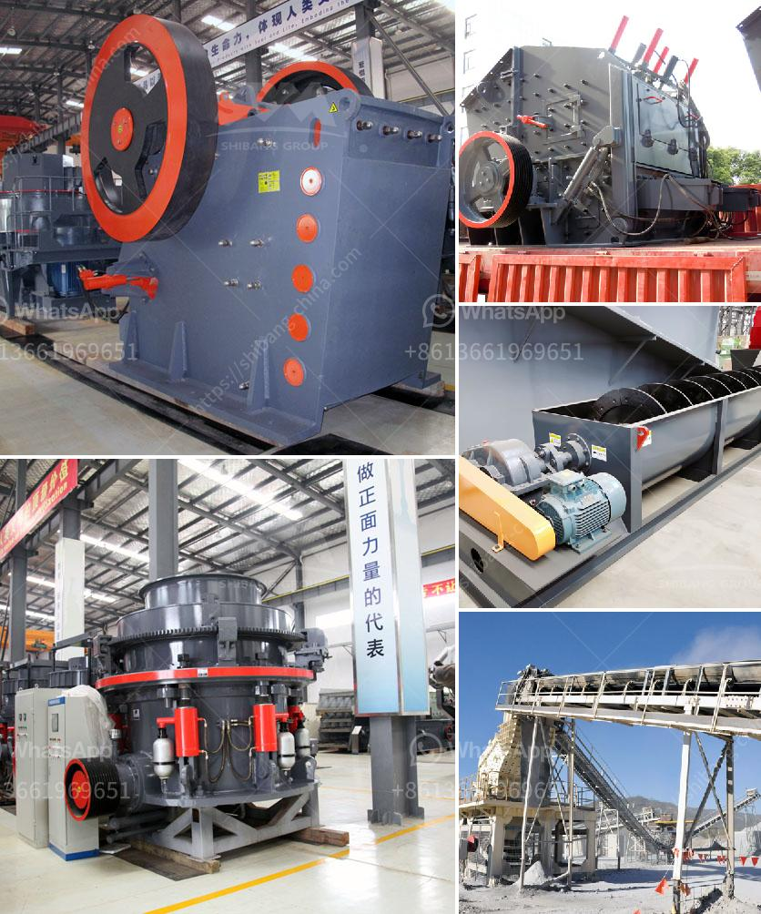

<h3>crusher machine price list</h3>
Crusher machines are designed to break large rocks into smaller rocks, gravel, or rock dust. They are commonly used for reducing the size of materials such as construction waste, paving stones, and demolition debris. These machines prove to be essential in various industries, including mining, construction, and recycling.

When it comes to purchasing a crusher machine, price is undoubtedly one of the most important factors to consider. It plays a significant role in determining the overall investment and profitability of a project. Here, we will explore the crusher machine price list and factors that influence it.

The price of crusher machines can vary significantly depending on several factors such as the brand, model, capacity, and additional features. High-quality machines from well-known brands tend to have a higher price tag, reflecting their reputation for durability and performance. These machines often come with advanced features that improve efficiency and productivity.

The size and capacity of the machine also play a crucial role in determining its price. Larger machines with higher capacity usually cost more compared to smaller ones. These machines are designed to handle heavy-duty tasks and have a higher production rate.

Another factor that affects the price of crusher machines is the specific requirements of the customer. Different industries have different needs, and machines can be customized accordingly. Additional features and modifications requested by the customer can increase the overall price of the machine.

Furthermore, the availability of spare parts and after-sales service also influences the price of crusher machines. Buying from a reputable company that offers readily available spare parts and efficient customer support might come at a higher price, but it ensures a longer lifespan of the machine and reduces downtime.

The market demand and competition also impact the pricing of crusher machines. A high demand for crushers in a particular region may lead to higher prices due to limited supply. Conversely, intense competition among manufacturers can drive prices down as they strive to offer the best deals to attract customers.

In terms of price range, crusher machines can range anywhere from a few thousand dollars up to several hundred thousand dollars. It is essential for buyers to thoroughly research and compare prices from different suppliers to make an informed decision that suits their budget and requirements.

Understanding the pricing factors allows buyers to navigate the market with confidence. Researching and comparing different suppliers and their price lists is crucial in finding the best value for money. It is recommended to obtain multiple quotes and conduct on-site visits to assess the quality and performance of the machines before making a final decision.

In conclusion, the price of crusher machines is influenced by various factors such as brand, model, capacity, additional features, customer requirements, market demand, and competition. Understanding these factors is essential for buyers to make an informed decision that meets their specific needs and budget. Taking the time to research and compare prices from different suppliers is crucial in ensuring the best value for money.
<h3>Contact us</h3><ul><li><strong>Whatsapp:&nbsp;<a href="https://wa.me/8613661969651">+8613661969651</a></strong></li><li><a href="https://swt.shibang-china.com/?git&amp;zhl&amp;crusher machine price list"><strong>Online Service(chat now)</strong></a></li></ul><h3>Related</h3><ul><li><a href='how to make a stone crusher.md'>how to make a stone crusher</a></li><li><a href='cement grinding plants.md'>cement grinding plants</a></li><li><a href='clay processing techniques.md'>clay processing techniques</a></li><li><a href='iron crushing machine for sale.md'>iron crushing machine for sale</a></li><li><a href='gold processing machinery in china.md'>gold processing machinery in china</a></li></ul>