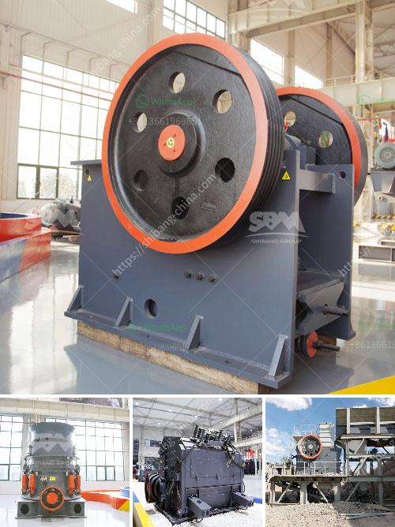

<h3>crusher machine sale</h3>
Crusher machines are widely used in industries such as mining, construction, metallurgy, and recycling for the purpose of crushing materials into smaller particles. These machines come in various sizes and designs, and are capable of handling a wide range of materials, including stones, ores, coal, and concrete.

One of the primary reasons for using crusher machines is to reduce the size of the material for further processing. For instance, in mining operations, crushers are used to break down large rocks into smaller, more manageable pieces that can be processed through other machinery, such as screens and conveyor belts. Similarly, in construction projects, crusher machines are used to crush concrete and asphalt into reusable materials, which can then be used as aggregate for new construction projects.

The market for crusher machines has been growing steadily in recent years, due to the increasing demand for processed materials in various industries. With advancements in technology, crusher machines have become more efficient, reliable, and versatile. Today, there are various types of crusher machines available, each designed for specific applications.

Jaw crushers are commonly used in mining and construction industries to crush large rocks and stones. These machines have a stationary jaw and a moving jaw, which together create a crushing motion. The material is fed into the jaws, and as it moves downwards, it is crushed between the two jaws and discharged at the bottom.

Cone crushers, on the other hand, are used for secondary and tertiary crushing purposes. These machines have a cone-shaped crushing chamber and rotate at high speeds. The material enters the chamber from the top and is crushed between the mantle and concave.

Another popular type of crusher machine is the impact crusher, which is commonly used in recycling applications. These machines use impact and attrition forces to crush the material. They consist of a rotor, blow bars, and anvils, which strike the material and break it into smaller pieces.

Crusher machines are typically powered by electricity or diesel engines, depending on the application and location. Some machines also have additional features, such as adjustable settings for different particle sizes, automated controls, and even remote monitoring capabilities.

When considering a crusher machine sale, it is important to choose a reputable manufacturer or dealer that offers quality machines and reliable after-sales service. The machine should be durable, easy to operate, and require minimal maintenance. Additionally, it is essential to consider factors such as the desired capacity, feed size, and the specific materials to be crushed.

In conclusion, crusher machines play a crucial role in various industries by reducing the size of materials for further processing. They are available in different types and sizes, each designed for specific applications. When purchasing a crusher machine, it is important to consider factors such as quality, capacity, and the specific needs of the application. With the advancements in technology, crusher machines have become more efficient, reliable, and versatile, making them an essential investment for any industry requiring material processing.
<h3>Contact us</h3><ul><li><strong>Whatsapp:&nbsp;<a href="https://wa.me/8613661969651">+8613661969651</a></strong></li><li><a href="https://swt.shibang-china.com/?git&amp;zhl&amp;crusher machine sale"><strong>Online Service(chat now)</strong></a></li></ul><h3>Related</h3><ul><li><a href='gold refinery in philippines south africa.md'>gold refinery in philippines south africa</a></li><li><a href='industrial crushing machines.md'>industrial crushing machines</a></li><li><a href='ethiopia gypsum machinery supplier.md'>ethiopia gypsum machinery supplier</a></li><li><a href='price hammer crusher nigeria.md'>price hammer crusher nigeria</a></li><li><a href='small sand washing machine.md'>small sand washing machine</a></li></ul>