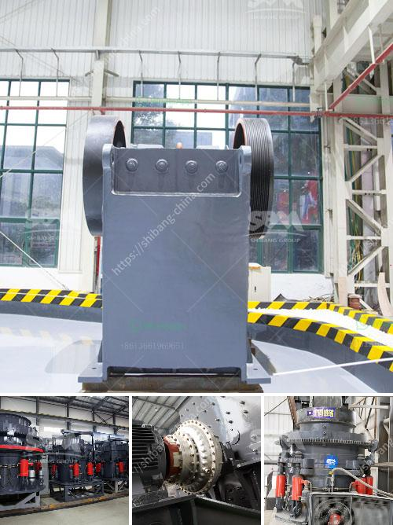

<h3>crusher machines for crushing limestone</h3>
Crusher machines play an essential role in the mining and quarrying industry. They are typically used to crush various types of rocks, such as limestone, into smaller sizes for further processing or for use in other industries. A crusher machine consists of a fixed jaw and a moving jaw, which are used to break down larger rocks into smaller pieces.

One of the key advantages of using a crusher machine is its versatility. These machines can handle a wide range of materials, including limestone. Limestone is a sedimentary rock that is primarily composed of calcium carbonate (CaCO3) in the form of calcite or aragonite. It is a popular choice for construction and landscaping applications due to its durability and versatility.

There are several types of crusher machines that can be used for crushing limestone. These include jaw crushers, gyratory crushers, cone crushers, hammer crushers, and impact crushers. Each type is designed to handle different sizes and types of materials and provides a variety of final products.

Jaw crushers are commonly used machines in the mining and quarrying industry. These machines are suitable for crushing hard or abrasive materials, such as limestone. They can produce a variety of product sizes, depending on the desired output size. Jaw crushers are often used in aggregate production and construction projects, as they can break down large rocks into smaller, more manageable sizes.

Gyratory crushers are another popular choice for crushing limestone. These machines have a conical-shaped design and a central gyrating spindle. As the rocks are crushed against the crushing chamber's walls, they are broken into smaller pieces. Gyratory crushers are often used in primary crushing stages and can produce a narrow product size distribution.

Cone crushers are similar to gyratory crushers, but they have a shorter spindle with a larger eccentric angle. This allows them to handle larger feed sizes and produce finer product sizes. Cone crushers are commonly used in secondary and tertiary crushing stages, as they provide a higher reduction ratio and finer product sizes.

Hammer crushers and impact crushers are suitable for crushing limestone with medium hardness. They are commonly used in cement plants, limestone mines, and quarries. Hammer crushers use rotating hammers to break down the rocks, while impact crushers use the principle of impact to crush the rocks.

When selecting a crusher machine for limestone crushing, it is essential to consider various factors. These include the hardness of the material, the desired output size, the capacity requirements, and the budget. Additionally, it is crucial to choose a reliable manufacturer that provides high-quality machines and excellent after-sales service.

In conclusion, crusher machines are vital equipment for crushing limestone in the mining and quarrying industry. They can handle various types of rocks and produce a variety of final products. When choosing a crusher machine, factors such as material hardness, desired output size, and capacity requirements should be considered. Additionally, selecting a reputable manufacturer is crucial to ensure the reliability and durability of the machines.
<h3>Contact us</h3><ul><li><strong>Whatsapp:&nbsp;<a href="https://wa.me/8613661969651">+8613661969651</a></strong></li><li><a href="https://swt.shibang-china.com/?git&amp;zhl&amp;crusher machines for crushing limestone"><strong>Online Service(chat now)</strong></a></li></ul><h3>Related</h3><ul><li><a href='china granite crusher.md'>china granite crusher</a></li><li><a href='magnetic separator manufacturers in turkey.md'>magnetic separator manufacturers in turkey</a></li><li><a href='jaw crusher global machines sweden ab.md'>jaw crusher global machines sweden ab</a></li><li><a href='hard rock crushers manufacturers india.md'>hard rock crushers manufacturers india</a></li><li><a href='denver lab jaw crusher.md'>denver lab jaw crusher</a></li></ul>