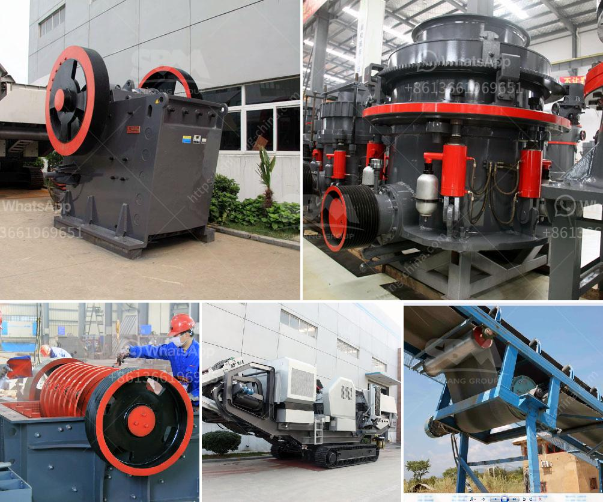

<h3>crusher machines for granite in nigeria</h3>
Crusher machines are used to reduce the size of large rocks, stones, and ore into smaller particles for further processing. Nigeria is blessed with abundant granite resources, which can be used for building materials and other industrial applications. Granite ore is extracted from quarries and then processed into finished products, including stone aggregates for construction projects, or granite slabs and tiles for countertops and flooring.

Crushing is the initial stage of the granite production line. Large granite materials are fed into the jaw crusher evenly and gradually by vibrating feeder through a hopper for primary crushing. After the first crushing process, the materials will be transferred to the impact crusher for further crushing. Secondary crushing will reduce the size further to meet the requirements of different applications.

In Nigeria, granite is widely used in construction and other applications due to its hardness and durability. For this reason, there is a growing demand for granite crusher machines in Nigeria. The market for crusher machines in Nigeria is constantly growing, and it is expected to continue to grow in the future.

There are several granite crusher machines available in the Nigerian market. Crushers and their types are commonly classified based on the stage of crushing they accomplish. Primary crushers are used for the first stage of crushing, while secondary and tertiary crushers provide the final stages in the crushing process.

Jaw crusher is the primary granite crusher machine, and is used in coarse granite crushing process. Its feed size is usually up to 1000mm, and the final size of granite dust can be adjusted from 10-100 mm. Jaw crusher has many models such as PE-750×1060, PE-1000×1200. Even the capacity varies from 10 TPH to 300 TPH. Cone crusher is the most common granite quarry crusher. It has four types: spring cone crusher, CS series cone crusher, hydraulic cone crusher, and hcs90 cone crusher. CS series cone crusher has two type: standard CS series cone crusher and short head CS series cone crusher. These two kinds have several types: 2ft, 3 foot, 4 1/2 ft, 5 1/2 ft, 7ft CS series cone crusher. Mobile crusher is also a good choice for granite crushing. It is convenient to move and provides flexible configurations for the granite quarry.

The granite crusher machine in Nigeria is ideally suited for crushing medium-hard stone such as limestone, shale, granite, cobblestone, etc. It can crush various sizes of raw materials into required sizes. The granite crusher machine is widely used as a fine crushing equipment in modern granite processing factories.

As one of the key mining equipment manufacturers in China, our company has been supplying high-quality and low-cost granite crusher machines for Nigeria granite quarry operators for many years. We have a variety of granite crusher for sale in Nigeria, including jaw crusher, impact crusher, cone crusher, hammer crusher, VSI crusher, etc.

If you are interested, please feel free to contact us for more information. We will provide you with the best solution and granite crusher machine price range based on your specific needs. Let us help you maximize your efficiency and improve your profitability in Nigeria’s granite industry.
<h3>Contact us</h3><ul><li><strong>Whatsapp:&nbsp;<a href="https://wa.me/8613661969651">+8613661969651</a></strong></li><li><a href="https://swt.shibang-china.com/?git&amp;zhl&amp;crusher machines for granite in nigeria"><strong>Online Service(chat now)</strong></a></li></ul><h3>Related</h3><ul><li><a href='micro fine powder grinder.md'>micro fine powder grinder</a></li><li><a href='stone grinding plant equipment specification.md'>stone grinding plant equipment specification</a></li><li><a href='how to start sand business in nigeria.md'>how to start sand business in nigeria</a></li><li><a href='calcite ball milling equipment.md'>calcite ball milling equipment</a></li><li><a href='calcium carbonate in kenya.md'>calcium carbonate in kenya</a></li></ul>