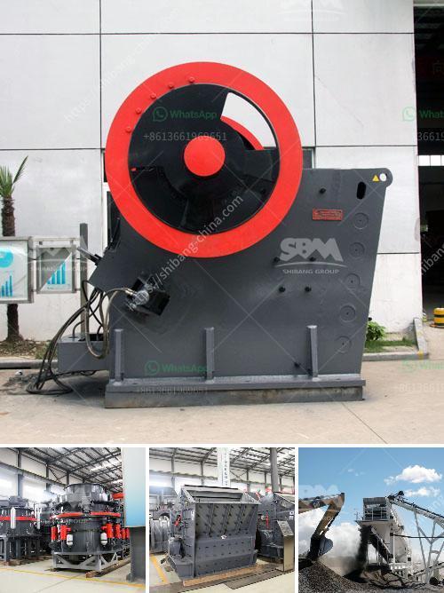

<h3>crusher machines for sale</h3>
In today's fast-paced technological era, machinery plays a crucial role in every industry. However, when it comes to crushing rocks, minerals, or other hard materials, choosing the right machine is paramount for maximizing productivity and efficiency. That is where crusher machines step in, offering an invaluable solution to various industries such as mining, construction, and recycling.

These versatile machines are designed to break down large rocks, ores, and minerals into smaller fragments, facilitating efficient extraction, transportation, or reuse. With advancements in design and technology, crusher machines have become even more powerful, enabling operators to process larger volumes in a shorter time span.

One of the key benefits of using crusher machines is their ability to reduce material transportation costs. By crushing materials on-site, companies can save significantly on transportation expenses, as the raw materials do not need to be transported to external processing facilities. This not only cuts down on costs but also reduces the carbon footprint associated with additional transportation.

With various types of crushers available in the market, finding the right one for your specific needs is essential. Jaw crushers are often preferred for primary crushing, as they feature a stationary plate and a movable jaw, enabling a powerful and efficient crushing action. Cone crushers, on the other hand, are commonly used for secondary or tertiary crushing, offering a fine and uniform final product.

When looking for crusher machines for sale, it is crucial to consider factors such as the machine's capacity, power consumption, and maintenance requirements. Additionally, keeping an eye on the brand reputation and customer reviews can provide valuable insights into the machine's reliability and performance.

Overall, crusher machines offer an indispensable solution for industries that rely on crushing materials to fuel their operations. With the right machine, companies can unlock the hidden potential of their raw materials, improving efficiency, reducing costs, and contributing to a more sustainable future. So, whether you need to crush rocks, ores, or recycle construction waste, investing in a reliable crusher machine is a decision that will pay off in the long run.
<h3>Contact us</h3><ul><li><strong>Whatsapp:&nbsp;<a href="https://wa.me/8613661969651">+8613661969651</a></strong></li><li><a href="https://swt.shibang-china.com/?git&amp;zhl&amp;crusher machines for sale"><strong>Online Service(chat now)</strong></a></li></ul><h3>Related</h3><ul><li><a href='granite crusher price in nigeria.md'>granite crusher price in nigeria</a></li><li><a href='new crushing machines in oman.md'>new crushing machines in oman</a></li><li><a href='conveyor belts in east africa.md'>conveyor belts in east africa</a></li><li><a href='ball mill india india.md'>ball mill india india</a></li><li><a href='equipment perlite mining.md'>equipment perlite mining</a></li></ul>