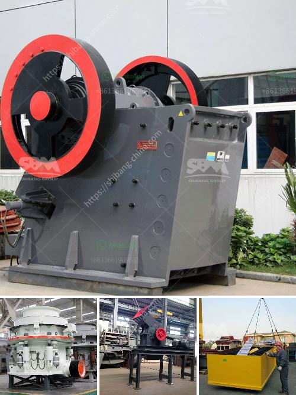

<h3>crusher manufacturer in china</h3>
When it comes to choosing a crusher manufacturer in China, there are numerous factors to consider. Not only are you looking for the best price and quality, but you also need to ensure that the manufacturer has a good reputation within the industry and is reliable.

China has become one of the most important manufacturing hubs in the world, and crusher manufacturers have established their foothold in the country. With a wide range of manufacturers available, it can be challenging to determine which one is the best fit for your needs. However, with careful research and due diligence, you can find a reputable and reliable manufacturer that meets your requirements.

First and foremost, it is crucial to evaluate the manufacturer's reputation. Look for companies that have been in the industry for a significant period and have positive reviews from their clients. You can check online forums, industry websites, and social media platforms to gather feedback about the manufacturer's products and services. Additionally, you can also request references from the manufacturer and contact their previous or existing clients directly to inquire about their experiences.

Quality is another crucial factor to consider when selecting a crusher manufacturer. Look for manufacturers that adhere to international standards and have certifications such as ISO 9001:2015. This ensures that the manufacturer follows strict quality control measures and produces crushers that meet the required specifications. Additionally, you can request product samples or visit the manufacturer's facility to inspect the quality of their products firsthand.

Price is also an important consideration. While it may be tempting to opt for the lowest-priced manufacturer, it is essential to strike a balance between price and quality. Cheap crushers may not be durable or reliable, and you may end up spending more on repairs and replacements in the long run. Look for manufacturers that offer competitive prices without compromising on quality.

In addition to price and quality, it is crucial to assess the manufacturer's after-sales service and support. A reliable manufacturer will offer technical assistance, spare parts availability, and warranty for their products. This ensures that you have peace of mind and support in case any issues arise with the crusher.

Furthermore, consider the manufacturer's production capacity and delivery time. It is important to choose a manufacturer that can meet your production requirements within the desired timeframe. Prompt delivery is essential to avoid any delays in your project and ensure its smooth execution.

Lastly, consider the manufacturer's communication and customer service. Prompt responses to inquiries, clear communication, and a strong customer service team are indicators of a professional and reliable manufacturer. This ensures that your concerns and queries are addressed promptly, and you can have a seamless working relationship with the manufacturer.

In conclusion, choosing a crusher manufacturer in China requires careful consideration of various factors such as reputation, quality, price, after-sales service, production capacity, and customer service. By conducting thorough research, reading reviews, and evaluating the manufacturer's credentials, you can find the right manufacturer that meets your requirements and provides you with high-quality crushers.
<h3>Contact us</h3><ul><li><strong>Whatsapp:&nbsp;<a href="https://wa.me/8613661969651">+8613661969651</a></strong></li><li><a href="https://swt.shibang-china.com/?git&amp;zhl&amp;crusher manufacturer in china"><strong>Online Service(chat now)</strong></a></li></ul><h3>Related</h3><ul><li><a href='gold sand separation equipment philippines.md'>gold sand separation equipment philippines</a></li><li><a href='minimum output size in jaw crusher.md'>minimum output size in jaw crusher</a></li><li><a href='coal roller mill.md'>coal roller mill</a></li><li><a href='ball clay crusher manufacturing process.md'>ball clay crusher manufacturing process</a></li><li><a href='layout design for stone crushing plant.md'>layout design for stone crushing plant</a></li></ul>