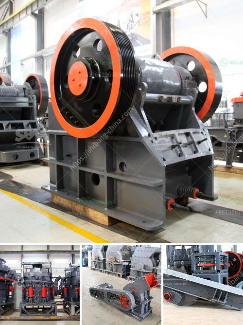

<h3>crusher plant distributor in saudi arabia</h3>
Crusher plants are key players in the construction industry in Saudi Arabia. They facilitate the process of breaking down large pieces of concrete, stone, or gravel into smaller pieces for further use. While there are many types of crushers available in the market, choosing the right crusher plant distributor in Saudi Arabia is essential for the success of any construction project. Some of the key factors to consider when selecting a distributor are price, quality, and reliability.

One of the leading construction companies in Saudi Arabia, located in the heart of the capital city Riyadh, is looking for a reliable crusher plant distributor to supply their extensive range of machinery to fuel their growing business. The company specializes in various construction projects, from high-rise buildings to road works, and requires a distributor that can provide top-notch equipment to meet their demanding needs.

Price is always an important consideration for any business. The distributor should offer competitive pricing without compromising on quality. A crusher plant distributor that can provide high-quality machinery at a reasonable price will have a significant advantage in the market.

Quality is another crucial aspect when choosing a crusher plant distributor. The machinery should be durable, reliable, and efficient to ensure smooth operations at the construction site. A distributor that offers top-quality equipment, equipped with the latest technology, will ensure that the customers' needs are met effectively.

Reliability is key in the construction industry, where deadlines are tight, and projects are time-sensitive. A crusher plant distributor that can deliver machinery on time and provide prompt after-sales service will be highly valued by contractors. The distributor should also have a strong support system that can cater to any maintenance or repair needs promptly.

In conclusion, selecting the right crusher plant distributor in Saudi Arabia is crucial for successful construction projects. Price, quality, and reliability are important factors that should be carefully considered while making a decision. By choosing a reputable distributor, construction companies can ensure that their projects are completed efficiently and within the given timeframe, leading to client satisfaction and repeat business.
<h3>Contact us</h3><ul><li><strong>Whatsapp:&nbsp;<a href="https://wa.me/8613661969651">+8613661969651</a></strong></li><li><a href="https://swt.shibang-china.com/?git&amp;zhl&amp;crusher plant distributor in saudi arabia"><strong>Online Service(chat now)</strong></a></li></ul><h3>Related</h3><ul><li><a href='gypsum crushing machines.md'>gypsum crushing machines</a></li><li><a href='iron ore crushing.md'>iron ore crushing</a></li><li><a href='spare parts dealer of crusher plant in odisha.md'>spare parts dealer of crusher plant in odisha</a></li><li><a href='quarry plant all in one gold mining equipment.md'>quarry plant all in one gold mining equipment</a></li><li><a href='price of crusher machine.md'>price of crusher machine</a></li></ul>