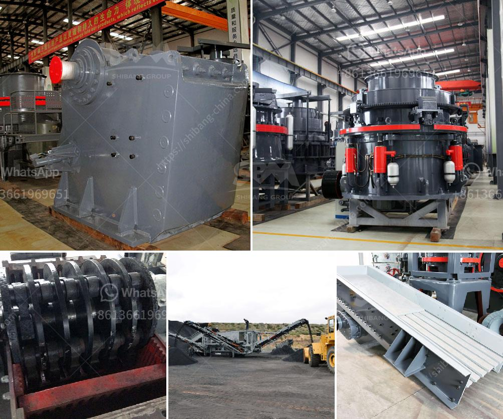

<h3>crusher plant for sale in usa</h3>
The crusher plant for sale in the USA is a versatile machinery used in various construction projects. With the growing demand for infrastructure development, the importance of crusher plants is increasing as it allows efficient recycling of materials and saves time and money on construction projects. Whether it is recycling demolished concrete, asphalt, or crushing rock into desired sizes, crusher plants play a crucial role in the construction industry.

One of the primary benefits of using a crusher plant is its ability to recycle construction waste. Demolished concrete, for example, can be crushed to produce recycled aggregate, which can be used as a base material for constructing roads, parking lots, or as an ingredient in new concrete production. Recycling concrete not only saves landfill space but also helps in reducing carbon emissions associated with manufacturing new concrete. Similarly, asphalt can be recycled by crushing it into small particles and using it as an aggregate for constructing new roads or repairing existing ones.

In addition to recycling, crusher plants are also used to crush rock into specific sizes. Crushed rock can be used as a base material for constructing roads, driveways, or as an aggregate in concrete production. By crushing rocks onsite, the transportation costs associated with hauling crushed rock from remote quarries can be significantly reduced. This not only saves money but also reduces the carbon footprint associated with transportation.

Another advantage of using crusher plants is the ability to obtain desired sizes of crushed materials. Different construction projects often require different sizes of aggregates. A crusher plant provides the flexibility to adjust the crushing processes to obtain the desired sizes efficiently. This eliminates the need for purchasing different types of aggregates from suppliers, reducing the overall project costs.

When considering the purchase of a crusher plant in the USA, it is essential to consider its efficiency, reliability, and maintenance requirements. A high-quality crusher plant should be capable of producing consistent, high-quality aggregates at a reasonable cost. It should also be durable and require minimal maintenance to ensure smooth operation throughout its lifespan. Additionally, it is crucial to choose a crusher plant from a reputable manufacturer or supplier to ensure that spare parts and technical support are readily available when needed.

In conclusion, the crusher plant for sale in the USA offers numerous advantages for construction projects. It can efficiently recycle construction waste and reduce the need for purchasing new materials. It also enables the production of aggregates of desired sizes, saving costs and time associated with transportation and purchasing different types of aggregates. When investing in a crusher plant, it is essential to choose a reliable and efficient model from a reputable manufacturer to ensure long-term success. By utilizing crusher plants, construction projects in the USA can become more efficient, sustainable, and cost-effective.
<h3>Contact us</h3><ul><li><strong>Whatsapp:&nbsp;<a href="https://wa.me/8613661969651">+8613661969651</a></strong></li><li><a href="https://swt.shibang-china.com/?git&amp;zhl&amp;crusher plant for sale in usa"><strong>Online Service(chat now)</strong></a></li></ul><h3>Related</h3><ul><li><a href='cement mill vertical price in india.md'>cement mill vertical price in india</a></li><li><a href='dry grinding rod mill.md'>dry grinding rod mill</a></li><li><a href='limestone crushing machine.md'>limestone crushing machine</a></li><li><a href='stone crushing machine for sale.md'>stone crushing machine for sale</a></li><li><a href='basalt processing machine.md'>basalt processing machine</a></li></ul>