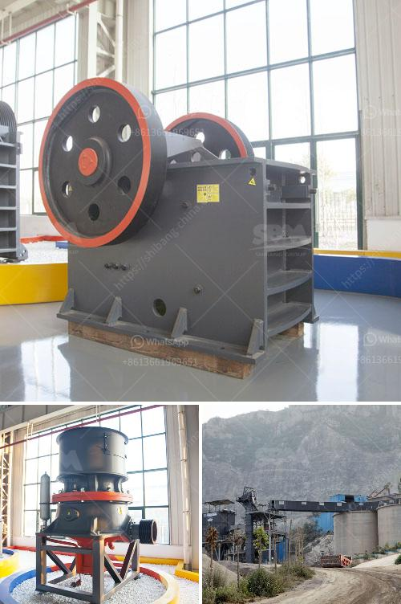

<h3>crusher plant for sale pakistan</h3>
Crusher plants have become indispensable for construction and infrastructure projects in Pakistan. In recent years, they have been experiencing a massive surge in demand from various sectors of the country. As the population grows and urbanization continues, the need for crushers and other mining equipment also increases. This has led to the development of crusher plant for sale Pakistan to cater to the growing needs of the construction industry.

A crusher plant is a machine designed to reduce large rocks into smaller rocks, gravel, or rock dust. It utilizes a metal surface to crush materials, such as coal, diamonds, and copper ore, into smaller particles to make it easier to transport or process. Crushing is an essential process in material handling, as it prepares the material for further processing or final disposal.

One of the primary benefits of a crusher plant is its mobility. Unlike traditional crushers, modern crusher plants are designed to be transported to the construction site, allowing for greater flexibility in project management. This feature is especially advantageous for contractors and construction companies working on multiple projects simultaneously in different locations.

Moreover, crusher plants are highly efficient and cost-effective. They provide a practical solution for processing large quantities of material without the need for extensive manual labor. These plants can significantly reduce the overall project costs by minimizing the need for additional equipment and speeding up the construction process.

In addition to their economic benefits, crusher plants also play a vital role in environmental sustainability. They are equipped with advanced technologies that ensure the efficient use of energy and minimize pollution. For instance, dust control systems are incorporated into these plants, reducing the release of harmful particles into the air and promoting worker safety.

In Pakistan, the demand for crusher plants has skyrocketed due to the rapid growth of the construction industry. As the country continues to invest in infrastructure development projects, such as the China-Pakistan Economic Corridor (CPEC), the need for crushers and other mining equipment is expected to increase further.

Fortunately, there are numerous crusher plant for sale Pakistan that can cater to the country's growing needs. These plants are manufactured by reputable companies, ensuring high-quality products that meet international standards. They are available in various sizes and capacities to handle different types of materials and project requirements.

However, selecting the right crusher plant for your project can be a daunting task. It is essential to consider factors such as operating costs, maintenance requirements, and technical specifications to make an informed decision. Working with a reliable supplier who can provide technical assistance and after-sales support is crucial to ensure a smooth and successful project.

In conclusion, crusher plants play a crucial role in the construction industry in Pakistan. Their mobility, efficiency, and cost-effectiveness make them an indispensable solution for material processing. As the demand for infrastructure projects continues to grow, the availability of crusher plant for sale Pakistan ensures that the country can meet its construction needs effectively and sustainably.
<h3>Contact us</h3><ul><li><strong>Whatsapp:&nbsp;<a href="https://wa.me/8613661969651">+8613661969651</a></strong></li><li><a href="https://swt.shibang-china.com/?git&amp;zhl&amp;crusher plant for sale pakistan"><strong>Online Service(chat now)</strong></a></li></ul><h3>Related</h3><ul><li><a href='tractor pto stone crusher for sale.md'>tractor pto stone crusher for sale</a></li><li><a href='mobile crusher china.md'>mobile crusher china</a></li><li><a href='small capacity double roller crusher for sale.md'>small capacity double roller crusher for sale</a></li><li><a href='mtm trapezium grinder mill.md'>mtm trapezium grinder mill</a></li><li><a href='how much would it cost to start a gravel quarry.md'>how much would it cost to start a gravel quarry</a></li></ul>