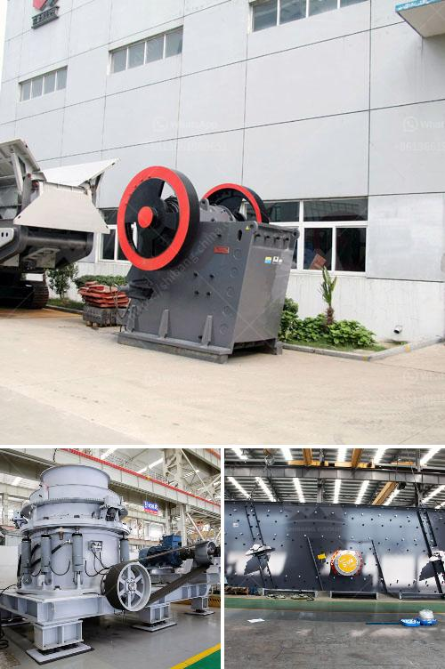

<h3>crusher plant germany</h3>
Germany is known for its vibrant cities, stunning landscapes, and rich history. But beyond these attractions, Germany has also made a name for itself in the construction and mining industry. With modern technology and innovative engineering, Germany is at the forefront of the crushing industry, offering state-of-the-art crusher plants that are efficient, reliable, and environmentally friendly.

One of the leading players in this field is Crusher Plant Germany. With over 20 years of experience and a strong commitment to quality, the company has established itself as a pioneer in the industry. Their crushers are designed to handle a wide range of materials, from hard and abrasive rocks to soft and non-abrasive materials like limestone, gypsum, and coal.

What sets Crusher Plant Germany apart from its competitors is their focus on innovation and continuous improvement. They invest heavily in research and development to develop cutting-edge technologies that meet the changing needs of their customers. This has resulted in the development of advanced features like intelligent automation, remote monitoring, and precision control systems.

Another key advantage of Crusher Plant Germany is their emphasis on environmental sustainability. They understand the need to reduce the impact of crushing activities on the environment, and thus, their crushers are designed to be energy-efficient and produce minimal dust and noise. They also have a strong commitment to recycling, with a range of recycling options available for their customers.

One of the flagship products of Crusher Plant Germany is the mobile crushing plant. This innovative machine combines high mobility with high crushing capacity, making it ideal for onsite crushing operations. Whether it is a construction site or a quarry, the mobile crushing plant can easily be transported to the desired location, saving time and cost.

Crusher Plant Germany also offers a wide range of stationary crushing plants, suitable for both small and large-scale projects. These plants are designed to deliver high productivity and excellent particle shape, ensuring maximum efficiency and quality in every crushing operation. They are equipped with powerful jaw crushers, cone crushers, and impact crushers that can handle even the toughest materials.

In addition to their high-quality crushers, Crusher Plant Germany also provides comprehensive after-sales service and support. Their team of highly skilled technicians is available round the clock to assist customers with installation, maintenance, and troubleshooting. They understand the importance of keeping the crushers running smoothly to ensure uninterrupted production.

To conclude, Crusher Plant Germany is a leading player in the crushing industry. With their focus on innovation, environmental sustainability, and customer satisfaction, they continue to set new benchmarks in the field. Whether it is a mobile crushing plant or a stationary one, customers can rely on Crusher Plant Germany for high-quality and reliable crushing solutions.

Germany's crusher plants are not just machines; they are engineering marvels that provide the backbone for many construction and mining projects. With their superior performance, durability, and efficiency, these plants contribute to Germany's reputation as a global leader in the crushing industry.
<h3>Contact us</h3><ul><li><strong>Whatsapp:&nbsp;<a href="https://wa.me/8613661969651">+8613661969651</a></strong></li><li><a href="https://swt.shibang-china.com/?git&amp;zhl&amp;crusher plant germany"><strong>Online Service(chat now)</strong></a></li></ul><h3>Related</h3><ul><li><a href='mobile crusher alkatrate.md'>mobile crusher alkatrate</a></li><li><a href='price and sales of quarry crusher in nigeria.md'>price and sales of quarry crusher in nigeria</a></li><li><a href='granite processing equipment for sale nigeria.md'>granite processing equipment for sale nigeria</a></li><li><a href='prices of gemini concentrating tables manufacturers.md'>prices of gemini concentrating tables manufacturers</a></li><li><a href='small capacity double roller crusher for sale.md'>small capacity double roller crusher for sale</a></li></ul>