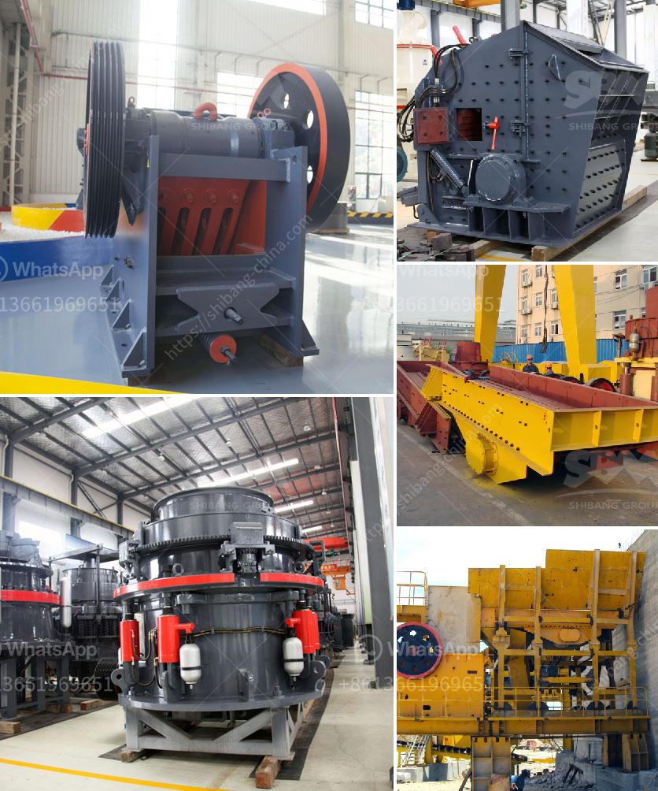

<h3>crusher plant in jizan saudi arabia</h3>
The construction industry is constantly on the move in Saudi Arabia, and its aggregate industry is no different. The crusher plant in Jizan Saudi Arabia helps supply big and small firms alike with construction materials, thus playing a vital role in the region's economy.

Jizan, located on the southwestern coast of Saudi Arabia, is one of the fastest-growing cities in the country. With the government's push for economic diversification, particularly in sectors like construction, it is no surprise that the demand for construction materials is soaring.

The crusher plant in Jizan is located in a convenient location, offering easy access to both the Red Sea coast and the Arabian Gulf. This strategic positioning enables the plant to efficiently serve various construction projects in Jizan and the surrounding regions.

The crusher plant in Jizan is equipped with state-of-the-art machinery and equipment, ensuring the production of high-quality construction materials. The plant boasts a large crushing capacity, enabling it to process a wide range of aggregates, including limestone, granite, gravel, and sand.

One of the main products produced by the crusher plant is crushed stone aggregates. These aggregates are essential for the construction of roads, highways, bridges, and buildings. They provide stability and strength to structures, making them a vital component of any construction project. Additionally, the crusher plant produces concrete aggregates, which are crucial for the production of concrete, an essential building material.

An important factor that sets the crusher plant in Jizan apart is its commitment to environmental sustainability. The plant adheres to strict environmental regulations and uses advanced filtering systems to minimize its impact on the environment. This dedication to sustainability makes the plant an attractive choice for construction projects that prioritize eco-friendly practices.

Furthermore, the crusher plant in Jizan plays a significant role in job creation. The plant provides employment opportunities for a large number of individuals, directly and indirectly contributing to the local economy. From lab technicians to machine operators, the plant offers a wide range of employment opportunities, ensuring the economic stability of the region.

In conclusion, the crusher plant in Jizan, Saudi Arabia, is an essential component of the region's construction industry. It provides high-quality construction materials, such as crushed stone and concrete aggregates, for various construction projects. With its strategic location and commitment to environmental sustainability, the plant contributes to the economic growth and development of the area. Additionally, through job creation, it helps improve the livelihoods of individuals and fosters a prosperous community.
<h3>Contact us</h3><ul><li><strong>Whatsapp:&nbsp;<a href="https://wa.me/8613661969651">+8613661969651</a></strong></li><li><a href="https://swt.shibang-china.com/?git&amp;zhl&amp;crusher plant in jizan saudi arabia"><strong>Online Service(chat now)</strong></a></li></ul><h3>Related</h3><ul><li><a href='vibrating screens pictures.md'>vibrating screens pictures</a></li><li><a href='iron crusher in mexico.md'>iron crusher in mexico</a></li><li><a href='rock crusher in dubai.md'>rock crusher in dubai</a></li><li><a href='buy ball mill india.md'>buy ball mill india</a></li><li><a href='ball mill in turkey.md'>ball mill in turkey</a></li></ul>