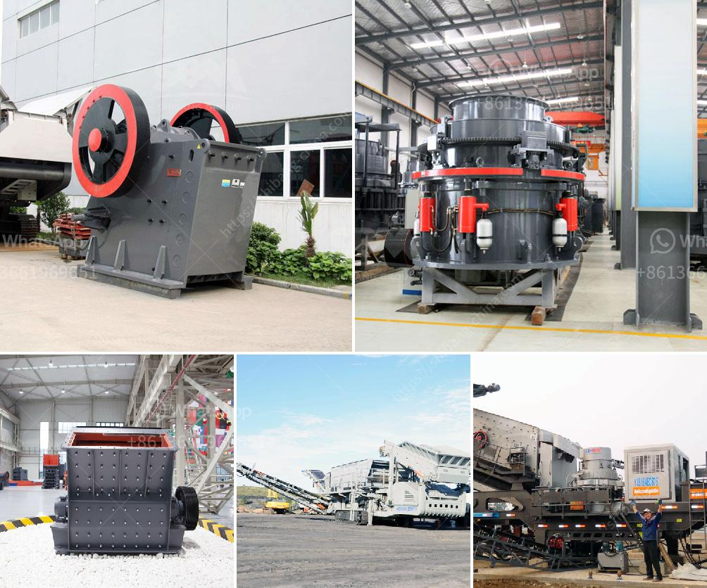

<h3>crusher plant in philippines</h3>
Crusher plant in the Philippines plays a crucial role in the construction industry. There are several types of crushers available in the market that can be used depending on the specific needs of the project. Crushers are an important piece of equipment in the construction industry and the demand for these machines is constantly increasing due to the growth in construction activities.

A crusher plant is a machine that reduces the size of large rocks to smaller rocks, gravel, or rock dust. Crushers are often used to change the form or reduce the size of waste materials for easy disposal and recycling. Notably, crushers are also used in the construction industry for crushing ore, limestone, and other materials.

The crushing equipment plants are commonly used in the mining industry. In the Philippines, crusher plants are used for various types of minerals such as gold, iron ore, copper, limestone, and other materials. For high-quality crushing plants, the operators should have an excellent understanding of the crushing process and equipment as well as good knowledge of mechanical principles.

Many quarrying operations rely on crusher plants to produce aggregate, which is used for road construction, concrete production, and other construction activities. In the Philippines, the crusher plant for sale Philippines belongs to a large type of mechanical equipment. In general, it is made of many different parts. Let’s take a stationary crusher machine plant as an example.

One complete set of stationary plant crusher includes feeding machine, crusher machine, screening machine, delivery machine, sand washing equipment, and dust removal equipment. Among these components, the crusher machine is a crucial part for the crushing process.

The crushing system consists of an impact crusher where the stones are crushed. After the material is crushed, it is sent to a vibrating screen for sorting. Different sizes of stones are sorted and transported to the stockpile by conveyor belts.

Crushing plants are designed to be able to produce specific quantities of materials in different sizes according to the customers' requirements. The materials that are used in construction need to be consistent and of high-quality, which is why crusher plants play such an important role. These plants ensure that the materials produced are of the right size and shape for their intended use, whether it be for road construction, building foundations, or other construction projects.

In conclusion, crusher plants are essential in the construction industry because they reduce the size of large rocks and optimize the quality of raw materials before they are used for construction purposes. The use of crushing plants has made construction projects more efficient and effective, allowing materials to be used in the most productive and cost-effective way possible. With the increasing demand for infrastructure development in the Philippines, the crusher plant industry will continue to grow and contribute to the country's economic growth.
<h3>Contact us</h3><ul><li><strong>Whatsapp:&nbsp;<a href="https://wa.me/8613661969651">+8613661969651</a></strong></li><li><a href="https://swt.shibang-china.com/?git&amp;zhl&amp;crusher plant in philippines"><strong>Online Service(chat now)</strong></a></li></ul><h3>Related</h3><ul><li><a href='ton crusher plant price.md'>ton crusher plant price</a></li><li><a href='dry process of cement.md'>dry process of cement</a></li><li><a href='crusher plant for sale in usa.md'>crusher plant for sale in usa</a></li><li><a href='ball mill grinding media.md'>ball mill grinding media</a></li><li><a href='are vertical ultrafine mill roller.md'>are vertical ultrafine mill roller</a></li></ul>