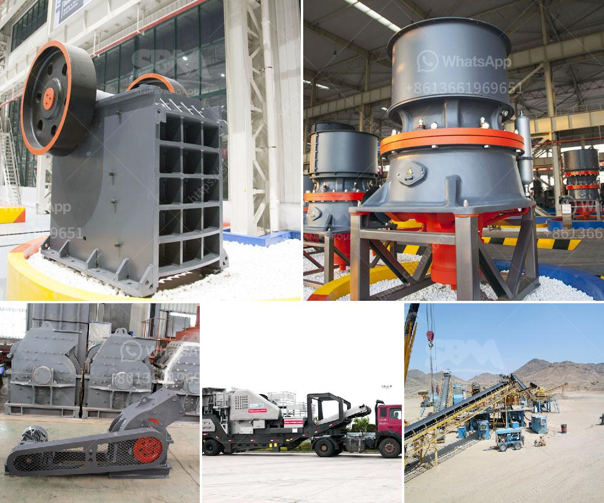

<h3>crusher plant in sri lanka</h3>
Crusher plant, also known as crushing plant, is an equipment used for the crushing of rocks and minerals in various industries such as metallurgy, mining, building materials, and energy. It is commonly used in the production of sand and aggregate in the construction industry.

Crusher plants in Sri Lanka have high reputation among its customers due to their reliable performance, efficient production capacity, and low operating costs. Currently, several types of rock crushers are available in the market to suit different industrial needs. These include, but not limited to, jaw crushers, impact crushers, cone crushers, and gyratory crushers.

Sri Lanka, being a tropical country with high rainfall, has a larger demand for sand and aggregate production. The need for more sand and aggregate resources has led to the rapid expansion of crusher plants in the country. Many crusher plants operate illegally and earn considerable profits from its operations, while posing a significant threat to the environment.

However, there are also crusher plants in Sri Lanka that are built and operated in compliance with the environmental regulations. These plants adopt modern technologies and advanced equipment to minimize negative impacts on the environment. They employ efficient dust suppression systems to control dust emissions, and often utilize water sprays to reduce the generation of airborne particles during the crushing process.

Furthermore, these legally-operated crusher plants also implement sound planning and management practices to minimize noise pollution. Noise barriers are often installed, and crushing operations are scheduled during non-peak hours to reduce noise disturbance to nearby residential areas.

The economic benefits provided by crusher plants in Sri Lanka are numerous. Firstly, they contribute to the overall development of the country's infrastructure by providing materials for road construction, railway tracks, and buildings. The availability of high-quality aggregate also encourages the growth of the construction industry, attracting foreign investments and creating employment opportunities.

In addition to the economic benefits, crusher plants in Sri Lanka also provide social benefits. As they are often located in rural areas, the presence of these plants brings economic opportunities to local communities, fostering rural development and reducing poverty. Moreover, these plants often prioritize the employment of local workers, contributing to the overall well-being of the community.

However, it is essential to ensure the sustainable operation of crusher plants in Sri Lanka. The government needs to strengthen its enforcement of environmental regulations and take necessary actions against illegal operators. On the other hand, crusher plant operators should adopt more eco-friendly practices, such as using renewable energy sources to power their plants and adopting circular economy principles to reduce waste generation.

In conclusion, crusher plants in Sri Lanka play a crucial role in the development of the country's infrastructure and economy. While some illegal operators pose environmental threats, there are also legally-operated crusher plants that prioritize sustainability and contribute to the social and economic well-being of local communities. Proper regulations and responsible business practices will ensure the successful operation of crusher plants while safeguarding the environment.
<h3>Contact us</h3><ul><li><strong>Whatsapp:&nbsp;<a href="https://wa.me/8613661969651">+8613661969651</a></strong></li><li><a href="https://swt.shibang-china.com/?git&amp;zhl&amp;crusher plant in sri lanka"><strong>Online Service(chat now)</strong></a></li></ul><h3>Related</h3><ul><li><a href='hydraulic cone crusher.md'>hydraulic cone crusher</a></li><li><a href='hammer mill sales in zimbabwe.md'>hammer mill sales in zimbabwe</a></li><li><a href='rock crusher production screen mesh.md'>rock crusher production screen mesh</a></li><li><a href='manufacturers of cement grinding units in india.md'>manufacturers of cement grinding units in india</a></li><li><a href='gypsum crushing machine price.md'>gypsum crushing machine price</a></li></ul>