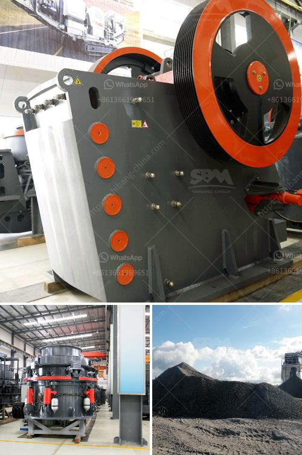

<h3>crusher plant project cost</h3>
Crusher plant project cost will depend upon the purpose of the project. The crusher plants main purpose is to reduce the size or change the form, of waste materials so they can be more easily disposed of or recycled, or to reduce the size of a solid mix of raw materials (as in rock ore), so that pieces of different composition can be differentiated. Crushing is the process of transferring a force amplified by mechanical advantage through a material made of molecules that bond together more strongly, and resist deformation more, than those in the material being crushed do.

Crushing devices hold material between two parallel or tangent solid surfaces, and apply sufficient force to bring the surfaces together to generate enough energy within the material being crushed so that its molecules separate from (fracturing), or change alignment in relation to (deformation), each other. The earliest crushers were hand-held stones, where the weight of the stone provided a boost to muscle power, used against a stone anvil. Querns and mortars are types of these crushing devices.

In the stationary crushing plant, the equipment is often located in underground mining operations where it is reduced to a convenient size for transportation. The industry also undertakes the extraction and primary crushing of clay and shale for use in the manufacture of kiln feed at paper mills. Synthetic materials account for about half of all materials that are consumed within the UK construction industry, of which crusher plant project cost. In addition, for the building of roads, flyovers and bypasses, there is a mass and consistent need of crushed stone across the country. Several projects are in progress and are being commenced shortly which will have high demand of crushed stone all over the country. These developments will require substantial quantities of crusher products, screeners, vibratory feeders, etc.
<h3>Contact us</h3><ul><li><strong>Whatsapp:&nbsp;<a href="https://wa.me/8613661969651">+8613661969651</a></strong></li><li><a href="https://swt.shibang-china.com/?git&amp;zhl&amp;crusher plant project cost"><strong>Online Service(chat now)</strong></a></li></ul><h3>Related</h3><ul><li><a href='mining equipment used in mining industry.md'>mining equipment used in mining industry</a></li><li><a href='price of diamond mining construction.md'>price of diamond mining construction</a></li><li><a href='quartz stone powder machinery manufacturing companies.md'>quartz stone powder machinery manufacturing companies</a></li><li><a href='how to crusher granite.md'>how to crusher granite</a></li><li><a href='quarry machines and prices.md'>quarry machines and prices</a></li></ul>