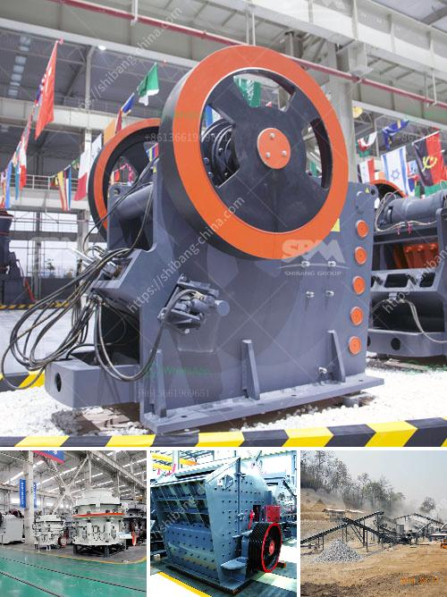

<h3>crusher power consumption</h3>
Crushing is an essential process in various industries, such as mining, quarrying, recycling, and construction. It involves reducing the size of large rocks, ores, or waste materials into smaller, more manageable pieces. However, crushing operations often consume a significant amount of energy, which can impact both the productivity and environmental sustainability of the industry. This article aims to shed light on crusher power consumption and emphasize the importance of energy-efficient equipment.

Crusher power consumption refers to the energy used by crushers to reduce the size of feed material. It is one of the key factors affecting the efficiency of a crushing operation. Higher power consumption means more energy is required to achieve the desired size reduction. Consequently, the crusher's operational costs increase, and the overall production capacity may be compromised.

There are several factors that influence crusher power consumption. One of the primary factors is the type of crusher used. Different crushers have distinct operational characteristics that affect their energy efficiency. For example, jaw crushers are known for their high energy consumption due to the strong compressive force required to break down the material. On the other hand, cone crushers are known for their lower power consumption, as they operate by squeezing the material between an eccentrically gyrating mantle and a concave.

Another factor that affects crusher power consumption is the feed material properties. Harder and larger particles require more energy to break, which results in higher power consumption. Additionally, the moisture content of the feed material also affects power consumption. Wet or sticky materials tend to clog the crusher and increase energy consumption.

Furthermore, the crusher's operational settings such as the discharge opening and the eccentric speed also impact power consumption. A larger discharge opening allows for larger-sized particles to pass through, reducing the overall energy required to crush the material. Similarly, higher eccentric speeds tend to increase the energy consumption as the material is subjected to faster crushing cycles.

Addressing crusher power consumption is of utmost importance in today's sustainable and environmentally conscious era. Implementing energy-efficient equipment not only helps to reduce the operational costs but also contributes to reducing carbon footprint and meeting regulatory requirements. Energy-efficient crushers have design features that optimize the crushing process, ensuring maximum size reduction with minimal energy input.

Manufacturers are continuously developing innovative solutions to minimize crusher power consumption. For instance, some crushers come with advanced crushing technologies like adjustable eccentricity and automated control systems that optimize the energy usage during the crushing process. Additionally, the use of efficient motors and drive systems can further contribute to reducing power consumption.

Choosing the right crusher for a specific application is crucial in reducing power consumption. Conducting thorough research, considering the desired final product size, feed material properties, and operational requirements can help select the most energy-efficient crusher. Performing regular maintenance, including inspecting and replacing worn-out parts, can also help to maintain the crusher's efficiency and minimize power consumption.

In conclusion, crusher power consumption plays a significant role in the efficiency and sustainability of crushing operations. Understanding the factors that influence power consumption and implementing energy-efficient equipment are essential for reducing operational costs and environmental impact. By selecting the right crusher, optimizing operational settings, and investing in innovative technologies, industries can move towards a greener and more economically viable future.
<h3>Contact us</h3><ul><li><strong>Whatsapp:&nbsp;<a href="https://wa.me/8613661969651">+8613661969651</a></strong></li><li><a href="https://swt.shibang-china.com/?git&amp;zhl&amp;crusher power consumption"><strong>Online Service(chat now)</strong></a></li></ul><h3>Related</h3><ul><li><a href='stone crusher plant for sale in saudi.md'>stone crusher plant for sale in saudi</a></li><li><a href='small quarry crusher for sale.md'>small quarry crusher for sale</a></li><li><a href='gold crusher plant for sale australia.md'>gold crusher plant for sale australia</a></li><li><a href='stone jaw crusher for rock crushing.md'>stone jaw crusher for rock crushing</a></li><li><a href='nigeria mobile crusher.md'>nigeria mobile crusher</a></li></ul>