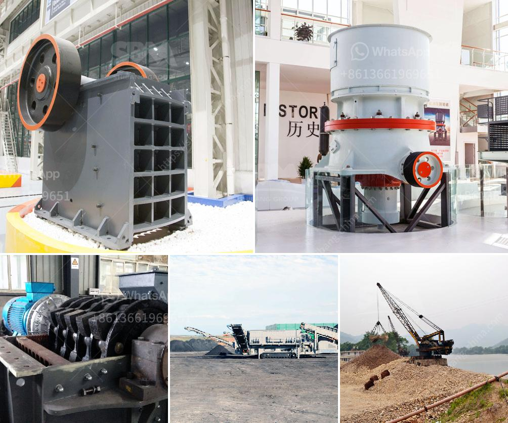

<h3>crusher price sayaji</h3>
Sayaji crusher machines are specifically designed to cater to the diverse needs of the customer in the mining, construction, and infrastructure industry. With a wide range of models available, customers can choose the appropriate size and specifications that best suit their requirements. One of the key factors that customers consider while purchasing a crusher is the price.

The price of a Sayaji crusher depends on several factors such as the model, size, capacity, and features. Generally, the smaller and simpler the crusher, the lower the price. However, larger and more advanced models with higher capacity and additional features tend to be priced higher. This is because they are designed to handle more demanding tasks and offer enhanced operational efficiency.

While the price of a Sayaji crusher may vary, it is important for customers to understand that investing in a quality machine will prove to be more cost-effective in the long run. A crusher with higher capacity and durability will ensure higher productivity and reduced downtime, ultimately leading to increased profitability.

Moreover, customers need to consider the maintenance and operational costs associated with the crusher. It is advisable to invest in a crusher that offers ease of maintenance and is designed to minimize operational costs. Sayaji crushers are known for their robust construction, high reliability, and low maintenance requirements, ensuring that customers get the maximum value from their investment.

In conclusion, the price of a Sayaji crusher depends on various factors, including the model, size, capacity, and features. It is crucial for customers to weigh the initial investment against long-term benefits and choose a crusher that offers optimum performance, durability, and cost-effectiveness. Investing in a quality Sayaji crusher will undoubtedly prove to be a wise decision in the long run.
<h3>Contact us</h3><ul><li><strong>Whatsapp:&nbsp;<a href="https://wa.me/8613661969651">+8613661969651</a></strong></li><li><a href="https://swt.shibang-china.com/?git&amp;zhl&amp;crusher price sayaji"><strong>Online Service(chat now)</strong></a></li></ul><h3>Related</h3><ul><li><a href='used cone crushers for sale 50 ton per hour.md'>used cone crushers for sale 50 ton per hour</a></li><li><a href='100tph stone crusher plant.md'>100tph stone crusher plant</a></li><li><a href='ballast processing plant.md'>ballast processing plant</a></li><li><a href='ball mill manufacturer for slag crushing.md'>ball mill manufacturer for slag crushing</a></li><li><a href='chinese mining equipment companys.md'>chinese mining equipment companys</a></li></ul>