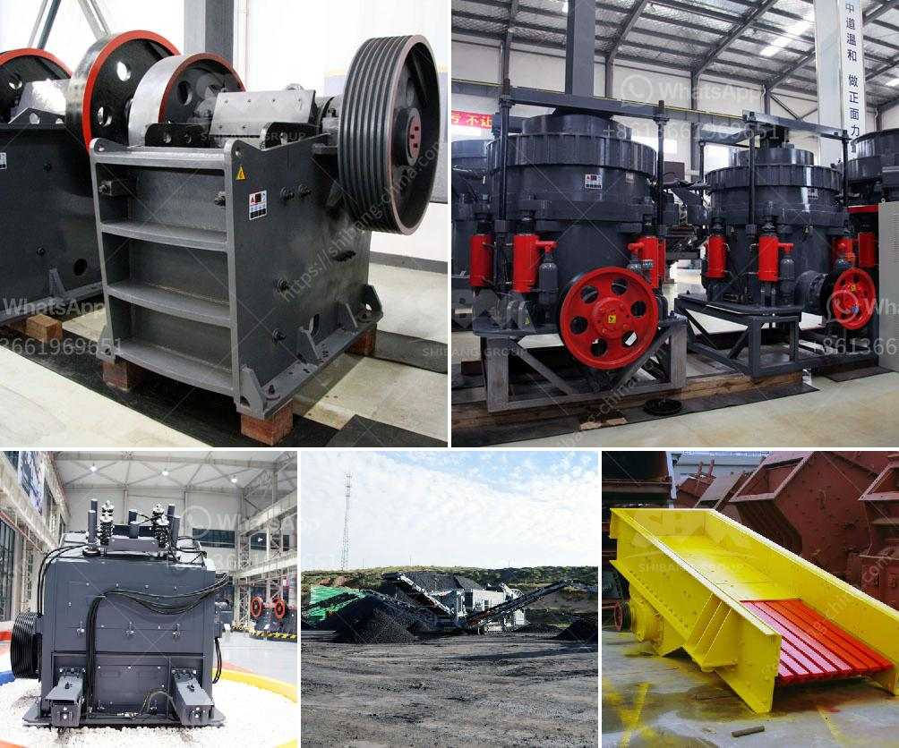

<h3>crusher prices in cameroon</h3>
Cameroon, a country located in Central Africa, has witnessed a steady rise in infrastructure development and construction projects in recent years. This has led to an increased demand for construction materials and equipment, including crushers. However, the prices of crushers in Cameroon can vary significantly due to various factors in the market.

One of the key factors influencing crusher prices in Cameroon is the type and size of the crusher. There are various types of crushers available in the market, such as jaw crushers, cone crushers, impact crushers, and gyratory crushers. Each type has its own unique features and capabilities, which can influence its cost. Similarly, the size of the crusher is also a significant factor, as larger crushers tend to be more expensive than smaller ones.

Another factor affecting crusher prices in Cameroon is the level of competition in the market. The presence of multiple suppliers and manufacturers of crushers can result in competitive pricing. When there is intense competition, suppliers may lower their prices to attract more customers. On the other hand, if there are only a few suppliers, they may have more control over the prices and can charge higher amounts.

The availability of raw materials and the cost of production can also impact crusher prices in Cameroon. If there is a shortage of raw materials, such as steel or concrete, the prices of crushers may escalate due to increased production costs. Similarly, fluctuations in energy prices can also influence the overall cost of running a crusher, which can be passed on to the consumers.

Furthermore, market demand plays a significant role in determining crusher prices. When there is a high demand for crushers, suppliers may increase their prices. Conversely, during times of low demand, prices may be more competitive as manufacturers want to sell their products and maintain cash flow.

In conclusion, crusher prices in Cameroon can vary based on factors such as the type and size of the crusher, competition in the market, availability of raw materials, production costs, and market demand. As construction projects continue to thrive in the country, it is essential for buyers to conduct thorough research, compare prices, and negotiate with suppliers to ensure they get the best value for their investment.
<h3>Contact us</h3><ul><li><strong>Whatsapp:&nbsp;<a href="https://wa.me/8613661969651">+8613661969651</a></strong></li><li><a href="https://swt.shibang-china.com/?git&amp;zhl&amp;crusher prices in cameroon"><strong>Online Service(chat now)</strong></a></li></ul><h3>Related</h3><ul><li><a href='price of mobile crusher.md'>price of mobile crusher</a></li><li><a href='jaw crushers prices in zimbabwe.md'>jaw crushers prices in zimbabwe</a></li><li><a href='mini cement plant capacity of ton per day.md'>mini cement plant capacity of ton per day</a></li><li><a href='coal washing plants for rental in malaysia.md'>coal washing plants for rental in malaysia</a></li><li><a href='hammer mill machine 20hp.md'>hammer mill machine 20hp</a></li></ul>