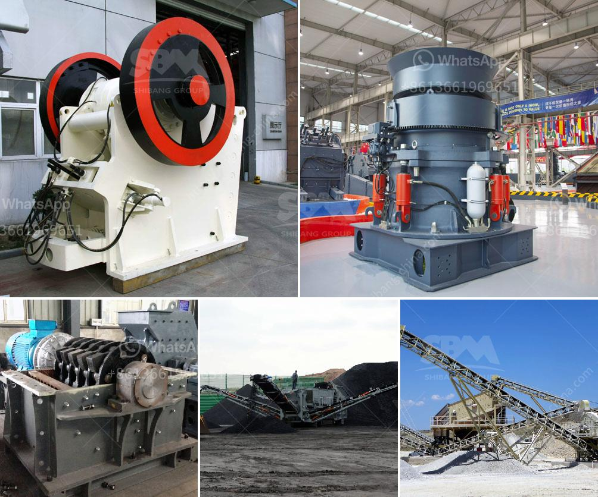

<h3>crusher processing plant malaysia</h3>
Crusher processing plants play a vital role in Malaysia's aggregate production line. From quarries to construction sites, crushers are the backbone of the crushing and screening process. To meet the growing demand for high-quality aggregates, the country's leading machinery and equipment manufacturers are investing in efficient crushing machines with advanced technology.

Malaysia is blessed with abundant natural resources, including limestone and granite, which are widely used as construction materials in various industries. With the rapid development of infrastructure projects, the demand for these raw materials has been increasing steadily. As a result, crusher processing plants have become an essential part of Malaysia's construction industry.

One of the key players in the industry is Machinery, a leading manufacturer of crushing and screening equipment. Their crushers are known for their durability, efficiency, and advanced technology. The company's extensive product range includes jaw crushers, cone crushers, impact crushers, and vibrating screens, among others.

Machinery's crushers are designed to process a wide range of materials, from limestone to granite, with various feed sizes. Their advanced technology allows for precise crushing and grading, ensuring high-quality aggregates for different construction applications. The crushers are also equipped with features like hydraulic adjustment systems, anti-failure protection, and automatic control, making them efficient and safe to operate.

The company's crusher processing plants are widely used in Malaysia's construction industry. From small-scale projects to large infrastructure developments, these plants provide the necessary materials for roads, bridges, buildings, and other construction projects. Their high capacity and efficient processing capabilities ensure timely supply of aggregates, meeting the demands of the industry.

In addition to traditional crushers, Machinery also offers mobile crushers, which are increasingly popular in Malaysia. These crushers can be easily transported to different sites, allowing for on-site crushing and processing. This eliminates the need for expensive transportation of raw materials, significantly reducing costs for construction companies.

Furthermore, Machinery provides comprehensive after-sales service and technical support to their clients in Malaysia. Their team of skilled technicians is available for installation, maintenance, and repair services, ensuring the continuous operation of crusher processing plants. This commitment to customer satisfaction has earned the company a strong reputation and a loyal customer base in Malaysia's construction industry.

In conclusion, crusher processing plants are essential in Malaysia's construction industry, providing high-quality aggregates for various infrastructure projects. Machinery, a leading manufacturer of crushing and screening equipment, offers a wide range of crushers with advanced technology, ensuring efficient and safe processing of materials. Their products, including mobile crushers, cater to the diverse needs of the industry. With their commitment to customer satisfaction, Machinery has established itself as a trusted supplier in Malaysia, contributing to the country's development and growth.
<h3>Contact us</h3><ul><li><strong>Whatsapp:&nbsp;<a href="https://wa.me/8613661969651">+8613661969651</a></strong></li><li><a href="https://swt.shibang-china.com/?git&amp;zhl&amp;crusher processing plant malaysia"><strong>Online Service(chat now)</strong></a></li></ul><h3>Related</h3><ul><li><a href='crusher machines for crushing limestone.md'>crusher machines for crushing limestone</a></li><li><a href='impact crusher for sale johannesburg.md'>impact crusher for sale johannesburg</a></li><li><a href='copper ore melting machines.md'>copper ore melting machines</a></li><li><a href='belt cost conveyor.md'>belt cost conveyor</a></li><li><a href='rock crusher production screen mesh.md'>rock crusher production screen mesh</a></li></ul>