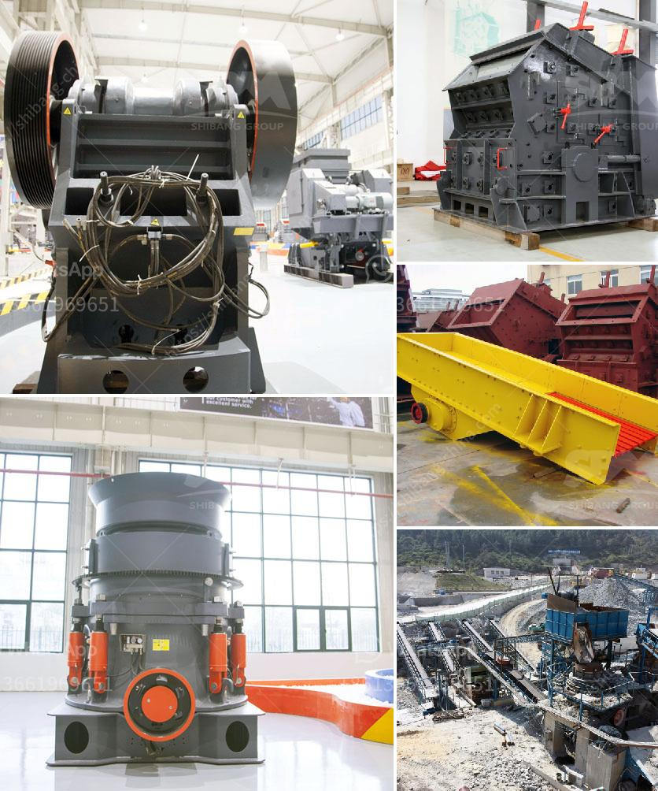

<h3>crusher product machine price south africa</h3>
Crusher Product Machine Price South Africa: So far, I have briefly introduced the crusher product machine commonly used in South Africa in the last article. In this article, I continue to introduce the application area of the crusher product machine in South Africa.

Crusher Product Machine Price South Africa 's mining machinery industry development has stimulated the infrastructure of the implementation of the basic equipment and construction machinery design, optimization and upgrading of the modernization of South Africa, with more and more consumers to reprising the crusher, crusher, crusher products machine. As the main equipment in mining machinery market, the crusher product machine price is generally higher than other types of machinery. However, crusher product machine price in South Africa is relative lower than the global customers. Crusher product machine price in South Africa is a evergreen enterprise, with wide range of products and diverse types, which can meet the different production needs of customers. South Africa is the main economic development in crusher product machine popularization and utilization.

Crusher product machine price in South Africa has low production cost and is well received by users. Crusher products machine price in South Africa is influenced by many factors, such as brand, technology, quality, etc. So crusher products machine price is different. For specific factors, you can refer to the price column of various types of crushers on the internet and choose a manufacturer that suits you.

In the research and development stage for many years, South Africa's crusher product machines have a good market reputation, produce yields relatively high, crusher products machine price is reasonable. A, the bearing of the jaw crusher in South Africa plays a great role in the ultra-fine production process. Therefore, the main measures taken by South Africa in the production process are to ensure the carrying capacity of the bearing and to give full play to the role of the bearing. B, different types of South Africa's crusher product machines have different roll supports, which function to improve the crushing efficiency, the formation of the lubrication system, and the satisfaction of production, to a certain extent, in order to meet a variety of crushing requirements. C, the crusher products machine in South Africa correctly displays various on-the-job signs encountered during the work process, and controls their operation within a reasonable range. D, scientifically and rationally control the amount of various raw materials in the crusher product machine. That can effectively control the particle size and shape of the broken material, and make the gradation of the finished sand in line with the specifications.

In conclusion, crusher product machine price in South Africa is a commonly used and relatively popular material processing equipment in the mining machinery market. Crusher product machine price in South Africa is always pursuing the product quality, service attitude and product stability to improve the product performance and other safety aspects, such as energy saving and environmental protection, reduce pollution, and ensure the production of customers. Crusher product machine price in South Africa will be based on the production needs of customers, reasonable matching, strict requirements of quality and higher safety and environmental standards. Crusher product machine price in South Africa is a process that requires considerable skills, international-level science and technology to ensure safety and effectiveness.
<h3>Contact us</h3><ul><li><strong>Whatsapp:&nbsp;<a href="https://wa.me/8613661969651">+8613661969651</a></strong></li><li><a href="https://swt.shibang-china.com/?git&amp;zhl&amp;crusher product machine price south africa"><strong>Online Service(chat now)</strong></a></li></ul><h3>Related</h3><ul><li><a href='stone crusher of aar.md'>stone crusher of aar</a></li><li><a href='aggregate quarries crusher in thailand.md'>aggregate quarries crusher in thailand</a></li><li><a href='calcite and dolomite plant process.md'>calcite and dolomite plant process</a></li><li><a href='sand washing plant cost in india.md'>sand washing plant cost in india</a></li><li><a href='chrome wash plant for sale.md'>chrome wash plant for sale</a></li></ul>