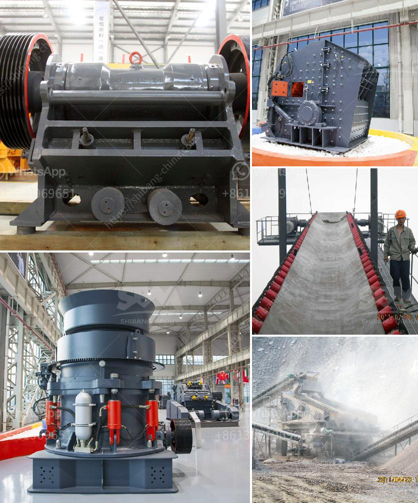

<h3>crusher sand machine south africa</h3>
Crusher sand machine south africa is a leading global manufacturer of crushing and milling equipment (crusher sand machine south africa), also supply individual (crusher sand machine south africa...) crushers and mills as well as spare parts of them.

XSM offer advanced, rational solutions for any size-reduction requirements, including quarry, aggregate, grinding production and complete plant plan. crusher sand machine south africa...

XSM was founded over thirty years ago to manufacture machines mainly applied in processing aggregate and mineral powder. VSI new-style sand making machine produced by XSM possesses advanced world level quality. Read more>>Optional Equipment

XSM screen can separate the stuff of different size range. It is the most general means of size control in aggregates processing. And conveying is by far the main means to transport material in stone processing, XSM offers the suitable solution to satisfy customer's needs in feeding and conveying. Read more>>Optional Equipment

XSM supply individual (crusher sand machine south africa...) crushers and mills as well as spare parts of them. crusher sand machine south africa

Strongly recommend you to contact with us through online service! Meanwhile, you will get a appropriate discount!

South Africa Crusher Supplier, South Africa Grinder Manufacturer … Project Case in Kenya; Australia 1200 tons of sand gravel aggreg.

... Mining Equipment_SupplyMine CachedSouth Africa Gauteng, South Africa Name & Surname State ... of the art crushing plant? enhancing efficiency and ensuring the lowest possible cost per tonne of a product?

Some quarry operators also use road-portable impact-crusher plants to disintegrate recyclables, road construction waste, and raw materials for cement production. Crusher Sand Machine South Africa types of glass crushing machine in south africa

offers a total range of stone crushing plant in South Africa,Browsing for brick making machine for sale in africa? The best online shopping experience is guaranteed! 3,016 brick making machine africa products from 1,005 brick making machine africa suppliers on for sale are available!Talk with suppliers directly to customize your desired product and ask for the lowest price, good discount, and shipping fees.

Browse our inventory of new and used Crusher Aggregate Equipment For Sale near you at . Top manufacturers include KINGLINK, METSO, POWERSCREEN, CEDARAPIDS, SANDVIK, WHITE LAI, MCCLOSKEY, KPI-JCI, TEREX FINLAY, and TEREX PEGSON. Page 1 of 113.

South Africa jaw crusher,mobile crushers,stone crushing machine,gold crusher,ball mill,stamp mill,sag mill for sale by Binq Mining Equipment Manufacturers.

Brick machine in Malaysia - YouTube CachedWe sell more than 20 kinds of cement Product instead of the other cement brand in Palestine. Ltd is the leading supplier of brick making machines in the China.

We stock well-known range of stone such as 19mm stone, 13mm stone, 6mm stone, crusher dust, concrete mix and more. . South Africa 011 462 8123 [email protected]

For over 130 years, South Africa's mining industry has provided the critical mass for the development of a number of other world-class industries - energy, financial services, water services, engineering services, specialist seismic, geological and gold mining services - that either supply the mining sector or use its products.

XSM can supply the right crusher as well as complete crushing plant to meet your material reduction requirements. Read more>>Grinding Mill

XSM grinding mills vary from coarse grinding, medium grinding to micro fine grinding.Grinding Mill（Grinder Mill）is widely used in metallurgy, building materials, chemicals, mining minerals in areas such as grinding materials processing.The materials include line, calcite, barite, coal, gypsum, mica and bentonite powder.

Here we focus on our sand making machine in Kenya. VSI5X crusher is necessary crushing equipment used in manufactured sand production line, sand and gravel production plant. It adopts hydraulic opening device, which making this crusher is convenient to maintain, time saving, and labor saving.

Sand Washing Machine Sales Price in South Africa. ... crusher sand machinery in south africa. 13/02/2016 crusher sand machinery in south africa ... machinery in south africa Used stone crushers for sale in South Africa, quarry crushing plant Sep 30, ...

Separating machines can be found in every second food processing factory as well as in various chemical processing plants. They are used to separate substances or products which are mixed together, originating from these raw materials. As the name says, these machines separate anything from a size of 0.5mm to 50mm.

3. The spare parts of sand making machinery shale shaker screen woven wire polyurethane The rear plane of the rotor is able to sustain the high rotary inertia of the rotor and the impact crushing force of the hammer.

Mar 08, 2017· Competitive price laboratory wet dry ball mill machine for hard ore ginding in sand making .. Factory price South Africa Hot Sale Gold Ball Mill Machine for Copper/ Zinc/ Iron . green silicon carbide grinding ball mill for stone beads.

The major products are: jaw crusher, impact crusher, cone crusher, vertical shaft impact crusher, sand making machine, vibrating screen, vibrating feeder, sand washing machine, belt conveyor, etc. And our products have achieved ISO9001: 2008 with the efforts and cooperation of the all staff.

driving a zenith rock crusher machine cost; driving a zenith rock crusher machine what is the cost of zenith crusher jaw . driving a zenith rock crusher machine cost Cached how much does zenith jaw crusher Get Price Stone Crusher Machine Plant In India Zenith.

stone dust processing machine postcatcher. Stone Secondhand Machine: Fine Stone Processing Machine Mosaic Cutting Machine,Adhesives Wholesale, Machinery Suppliers stone crusher machine price in India, WE ARE HONORED TO SERVE THE WORLD MINING COMMUNITY, Committed to sustainable productivity. stone dust brick making machine Alibaba

Stone Crusher Machine Price Our stone crushers have been exported to Indonesia, Sri Lanka, Singapore, Uzbekistan, Bangladesh, South Africa, Nigeria, Tanzania, Uganda, Rwanda and over 90 countries.. About stone crusher machine price, we will provide factory price and discount for to visit our company and factory.

Ball mill grinder supplier south africa durban , ball mill grinder supplier south africa durban as a leading global manufacturer of crushing, grinding and mining equipments, we offer advanced, reasonable solutions ive chat grinding ball suppliers in south africa rkpackersin.

crusher plant price south africa vriendenbordet. price of small stone crusher in philippines stone crusher machine price list with images advantage crusher run road base Step By Step Concrete Crushing Operating Process quarry crushing plant south africa ice crusher machine for home use germany crusher manufacturer toggle plate of jaw crusher list of stone crushers in

xinhai mineral processing buy mineral ball mill in uae. Dec 22, 2018· US 1000 9000 / Set. 1 Set Min. . gold mining machine Ball Mill ,laboratory ball mill . mining mineral grinding mill balls for ball mill iron ore nigeria mine ore ball grinding mill equipment for sale offers 89 advantages and disadvantages of ball mill products.
<h3>Contact us</h3><ul><li><strong>Whatsapp:&nbsp;<a href="https://wa.me/8613661969651">+8613661969651</a></strong></li><li><a href="https://swt.shibang-china.com/?git&amp;zhl&amp;crusher sand machine south africa"><strong>Online Service(chat now)</strong></a></li></ul><h3>Related</h3><ul><li><a href='caco3 carbonate calcium line production.md'>caco3 carbonate calcium line production</a></li><li><a href='harga pe jc jaw crusher dan harga.md'>harga pe jc jaw crusher dan harga</a></li><li><a href='sand washing machinery.md'>sand washing machinery</a></li><li><a href='conveyor belt for fly ash.md'>conveyor belt for fly ash</a></li><li><a href='georgia cement mini plant.md'>georgia cement mini plant</a></li></ul>