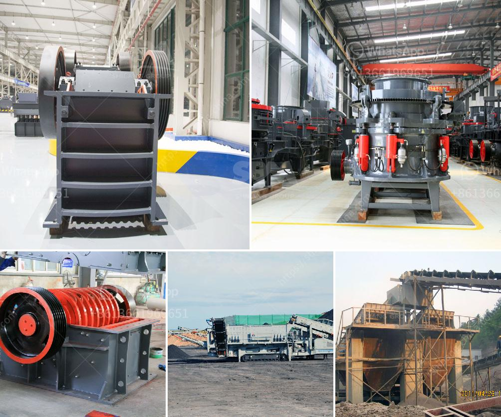

<h3>crusher seller in ethiopia</h3>
Ethiopia is a country located in the Horn of Africa. It is rich in ancient history and culture, offering stunning archaeological sites, ancient ruins, and breathtaking natural landscapes. The country is also known for its agricultural sector, which is the largest economic contributor. With a growing construction industry, Ethiopia is seeing a high demand for crushers.

Crushers are devices designed to break large rocks into smaller rocks, gravel, or rock dust. Crushers are commonly used to produce crushed stone for construction purposes. Due to their impressive power, reliability, and portability, crushers are a popular choice for many construction projects in Ethiopia.

The sale of crushers in Ethiopia is highly competitive, which is beneficial for customers. While there are many sellers of crushers in the market, it is also essential for customers to be cautious when choosing a crusher supplier. To help you with your buying decision, we will discuss the factors you should consider when selecting a crusher seller in Ethiopia.

First and foremost, reputation is key. Look for a seller with a good reputation in the market. Check online reviews, testimonials, and ratings to gauge the seller's credibility. Additionally, ask for recommendations from industry professionals to ensure the seller has a track record of delivering quality products and services.

The range of crushers the seller offers is another crucial factor to consider. Different construction projects may require specific types of crushers. Ensure that the seller provides a wide variety of crushers to suit your project requirements. This includes crushers for different applications, such as jaw crushers, cone crushers, impact crushers, and mobile crushers.

Quality is non-negotiable when it comes to crushers. Construction projects demand durable and reliable equipment that can withstand heavy use. Therefore, it is essential to choose a seller who offers high-quality crushers from reputable manufacturers. Look for crushers that are made with robust materials, have excellent build quality, and are equipped with advanced features that enhance productivity and efficiency.

In addition to quality, affordability is also a significant factor to consider. Look for a crusher seller that offers competitive prices without compromising on quality. Compare prices from different sellers and choose the one that offers the best value for your money. However, keep in mind that price should not be the only determining factor. Make sure you prioritize quality and reliability over cost.

Lastly, after-sales service is crucial when buying crushers. Construction equipment requires regular maintenance and occasional repairs. Therefore, choose a seller that provides excellent after-sales service, including prompt customer support, spare parts availability, and efficient technical assistance. A seller that offers comprehensive warranty packages is also a bonus.

Ethiopia's booming construction industry has increased the demand for crushers, making it imperative to choose a reliable crusher seller. By considering factors such as reputation, range of crushers, quality, affordability, and after-sales service, you can make an informed decision when selecting a crusher seller in Ethiopia.

In conclusion, choosing a crusher seller in Ethiopia requires careful evaluation. Take the time to research and compare different sellers based on reputation, range of crushers, quality, affordability, and after-sales service. By doing so, you will ensure that you are investing in a high-quality crusher that meets your project requirements, providing long-term value and efficiency.
<h3>Contact us</h3><ul><li><strong>Whatsapp:&nbsp;<a href="https://wa.me/8613661969651">+8613661969651</a></strong></li><li><a href="https://swt.shibang-china.com/?git&amp;zhl&amp;crusher seller in ethiopia"><strong>Online Service(chat now)</strong></a></li></ul><h3>Related</h3><ul><li><a href='roller mill ultrafine.md'>roller mill ultrafine</a></li><li><a href='typical roll and roll mill.md'>typical roll and roll mill</a></li><li><a href='vertical roller mill.md'>vertical roller mill</a></li><li><a href='quarry crusher for sale in ibadan.md'>quarry crusher for sale in ibadan</a></li><li><a href='conveyor belts for sale in zambia.md'>conveyor belts for sale in zambia</a></li></ul>