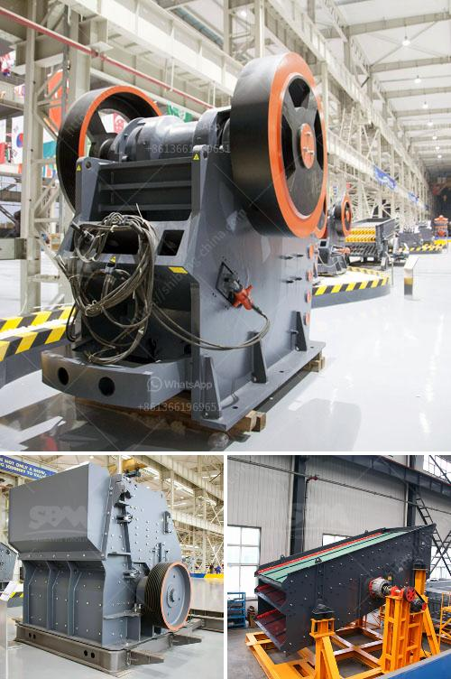

<h3>crusher stone sand making stone quarry</h3>
Crusher stone, also known as construction sand, has gained popularity over the years due to its various uses. With the booming infrastructure and construction industry, the demand for this material has skyrocketed. Quarrying crusher stone is a labor-intensive task that involves extracting these valuable resources from the earth's surface. The resulting crushed stones are then used in various construction projects, including buildings, roads, bridges, and even landscaping.

One of the key benefits of crusher stone is its versatility. It can be used as a base material for foundations, concrete production, and asphalt production. This makes it an essential component in the construction industry. Additionally, crusher stone is ideal for making paths and walkways in gardens and parks. Its compact nature provides stability, preventing erosion and enhancing the aesthetic appeal of these spaces.

Another advantage of using crusher stone is its environmentally friendly nature. Since it is sourced from quarries, it is a sustainable option compared to mining other materials. Furthermore, the process of crushing stone results in various-sized particles, allowing for better compaction and reducing the need for additional materials. This not only minimizes waste but also reduces transportation costs.

When selecting crusher stone, it is essential to consider its quality. High-quality crusher stone should have a uniform shape and size to achieve optimal compaction and stability. It should also be free from impurities such as clay, silt, and organic matter. Conducting routine tests on the material ensures that it meets the desired specifications, guaranteeing its suitability for various applications.

In conclusion, crusher stone plays a vital role in the construction industry. Its versatility and eco-friendly nature make it a preferred option for builders and landscapers alike. Nevertheless, it is crucial to source high-quality crusher stone to ensure the desired results. As the demand for construction materials continues to rise, responsible quarrying practices should be implemented to preserve the environment and meet the needs of future generations.
<h3>Contact us</h3><ul><li><strong>Whatsapp:&nbsp;<a href="https://wa.me/8613661969651">+8613661969651</a></strong></li><li><a href="https://swt.shibang-china.com/?git&amp;zhl&amp;crusher stone sand making stone quarry"><strong>Online Service(chat now)</strong></a></li></ul><h3>Related</h3><ul><li><a href='slag crushing machine hopper in india.md'>slag crushing machine hopper in india</a></li><li><a href='vertical mill size distribution.md'>vertical mill size distribution</a></li><li><a href='feldspar powder making machine in india.md'>feldspar powder making machine in india</a></li><li><a href='quarry crusher for sale in ibadan.md'>quarry crusher for sale in ibadan</a></li><li><a href='price three roll mill machinery.md'>price three roll mill machinery</a></li></ul>