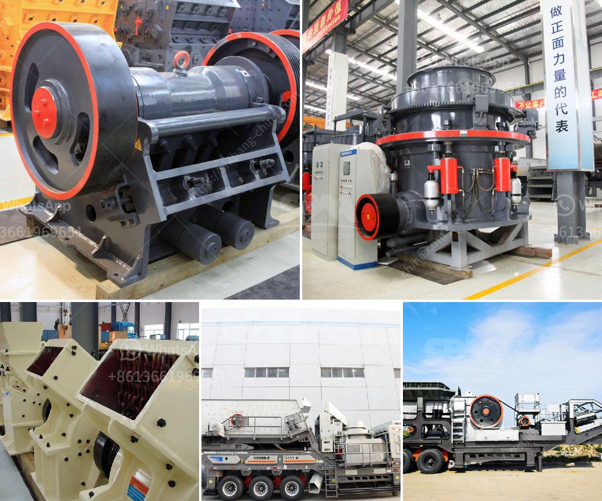

<h3>crusher suppliers in kenya</h3>
Kenya is one of the countries that have experienced a steady growth in economic development over the years. This has been attributed to various sectors that continuously contribute to the country's GDP, with the construction industry being one of them. As the construction industry grows, the demand for high-quality construction materials, such as aggregates, increases. This demand has led to the rise of crusher suppliers in Kenya, who play a significant role in meeting the country's construction needs.

Crushers are machines used to break down rocks, stones, and other hard materials into smaller pieces or aggregates. These aggregates are crucial in the construction industry as they form the foundation for building structures. Crusher suppliers play a crucial role in ensuring that the construction industry achieves its goals by providing the required crushed stones and other aggregates. This article highlights the importance of crusher suppliers in Kenya.

To begin with, crusher suppliers in Kenya provide a wide range of materials to construction companies. This variety ensures that construction projects can select the most suitable materials for their specific needs. These suppliers offer various types of crushers, including jaw crushers, cone crushers, impact crushers, and gyratory crushers, among others. Consequently, construction projects can find the right crusher to produce the desired particle size and shape of aggregates for their specific construction needs.

In addition to providing various crusher models, suppliers in Kenya also offer services such as installation, maintenance, and repair. This is crucial for construction companies that may lack the expertise or resources to handle the installation or maintenance of these machines. Having a reliable crusher supplier that offers these services ensures that construction projects can keep their crushers running efficiently, minimizing downtime and maximizing productivity.

Crusher suppliers in Kenya also contribute to the country's economy by providing employment opportunities to many people. The demand for crushed stones and other aggregates necessitates a large workforce to operate these crushers. Therefore, crusher suppliers employ skilled individuals to handle different tasks, such as operating the machines, managing inventory, and overseeing the smooth running of the crusher supplier's operations. By providing employment opportunities, these suppliers contribute to poverty alleviation and economic growth in Kenya.

Moreover, crusher suppliers in Kenya play a crucial role in ensuring the sustainability of the construction industry. Sustainable construction practices focus on minimizing negative impacts on the environment while promoting socio-economic benefits. Crusher suppliers that prioritize sustainability ensure that their machines are energy-efficient and environmentally friendly. They may use technologies that reduce energy consumption or recirculate water to minimize the waste generated during the crushing process. By embracing sustainable practices, crusher suppliers contribute to the overall sustainability of the construction industry in Kenya.

In conclusion, crusher suppliers in Kenya play a crucial role in meeting the construction industry's demands for high-quality aggregates. They provide a wide range of crusher models and offer services such as installation and maintenance. By employing a workforce and embracing sustainable practices, crusher suppliers contribute to the country's economy while ensuring the sustainability of the construction industry. Therefore, investing in reliable crusher suppliers is essential for construction projects in Kenya to achieve their goals efficiently and sustainably.
<h3>Contact us</h3><ul><li><strong>Whatsapp:&nbsp;<a href="https://wa.me/8613661969651">+8613661969651</a></strong></li><li><a href="https://swt.shibang-china.com/?git&amp;zhl&amp;crusher suppliers in kenya"><strong>Online Service(chat now)</strong></a></li></ul><h3>Related</h3><ul><li><a href='msi gold wash plant used.md'>msi gold wash plant used</a></li><li><a href='barite mill crusher.md'>barite mill crusher</a></li><li><a href='types of stone crusher and prices.md'>types of stone crusher and prices</a></li><li><a href='calcium oxide crusher.md'>calcium oxide crusher</a></li><li><a href='small mobile rock pulverizer.md'>small mobile rock pulverizer</a></li></ul>