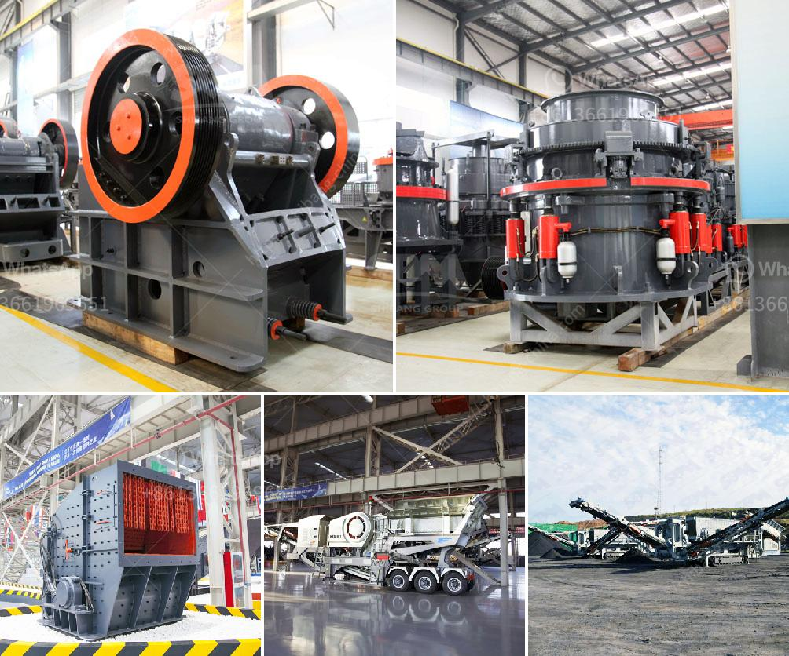

<h3>crushers for sale in south africa</h3>
Crushers play an essential role in the mineral processing industry. They are used to break larger rocks into smaller rocks, gravel, or rock dust, enabling efficient extraction of minerals. Crushers are also used for various industrial applications, such as recycling and construction. In South Africa, crushers are widely used due to its numerous mineral resources, including high-grade and abundant platinum group elements, gold, iron ore, and coal.

When it comes to purchasing a crusher in South Africa, there are several factors to consider. The first and foremost is the type and size of the material being processed. Crushers come in various types, including jaw crushers, cone crushers, impact crushers, and vertical shaft impact crushers (VSI). Each type has its unique advantages and is suitable for different applications.

Jaw crushers are often used for primary crushing, where large rocks are initially broken down into smaller pieces. They are highly versatile and can handle a wide range of materials, including hard and abrasive ones. Cone crushers, on the other hand, are typically used for secondary and tertiary crushing. They are especially suitable for crushing hard and medium-hard materials.

Impact crushers provide excellent shape of the end product and are widely used in the recycling industry. They are designed to crush a variety of materials, including concrete, asphalt, and natural rock. VSI crushers, meanwhile, are commonly used in the mining industry to produce high-quality aggregate and manufactured sand. They are highly efficient machines that can produce cubical-shaped end products.

Crushers for sale in South Africa come in a variety of sizes and capacities. Some crushers are mobile and can crush rocks as large as 1.5 meters (60 inches) in diameter. Crushers with a capacity of 200 tons per hour or higher are typically used for large-scale mining operations.

In addition to the type, size, and capacity, it is also important to consider the quality and reliability of the crusher. Look for reputable manufacturers that offer durable and long-lasting crushers. It is worth investing in a high-quality crusher that can withstand the harsh conditions often encountered in South Africa's mining and construction industries.

Price is another crucial factor to consider when purchasing a crusher in South Africa. The cost of a crusher can vary depending on the type, size, capacity, and other features. It is advisable to compare prices from different suppliers and consider the overall value for money. However, keep in mind that the cheapest option may not always be the best, as quality and reliability should also be taken into account.

There are several suppliers of crushers in South Africa, both local and international. Local suppliers are often more familiar with the market conditions and can provide better after-sales service and support. International suppliers, on the other hand, may offer a broader range of options and competitive pricing.

In conclusion, crushers play a crucial role in the mineral processing industry in South Africa. When looking for crushers for sale, it is important to consider factors such as the type, size, capacity, quality, reliability, and price. By choosing the right crusher, businesses can improve their efficiency, productivity, and overall profitability.
<h3>Contact us</h3><ul><li><strong>Whatsapp:&nbsp;<a href="https://wa.me/8613661969651">+8613661969651</a></strong></li><li><a href="https://swt.shibang-china.com/?git&amp;zhl&amp;crushers for sale in south africa"><strong>Online Service(chat now)</strong></a></li></ul><h3>Related</h3><ul><li><a href='list iron ore pellet plants in india.md'>list iron ore pellet plants in india</a></li><li><a href='coal mill company in srilanka.md'>coal mill company in srilanka</a></li><li><a href='river sand garnet processing machines.md'>river sand garnet processing machines</a></li><li><a href='nigeria ball mill pakistan.md'>nigeria ball mill pakistan</a></li><li><a href='prices for cement processing machines.md'>prices for cement processing machines</a></li></ul>