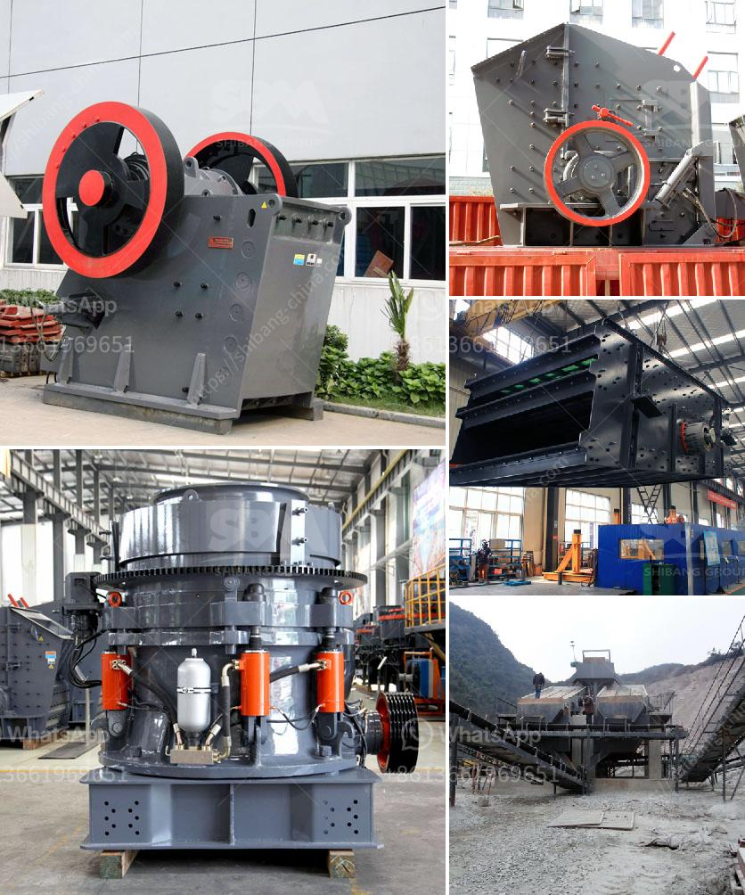

<h3>crushing aggregates philippines</h3>
The Philippines, with its archipelago of over 7,000 islands, is blessed with abundant natural resources. One of these resources is aggregates. With their variety of sizes and shapes, these rocks play a vital role in the construction industry as they provide the foundation and structural support for various infrastructure projects.

Aggregates are crushed rocks, stones, or gravel that are used in the production of concrete, asphalt, and road base materials. They are extracted from quarry sites and are typically manufactured through a crushing process. This process involves breaking down large pieces of stone into smaller sizes to meet the desired specifications for construction purposes.

In recent years, the demand for aggregates in the Philippines has been increasing rapidly. The country's robust economy, coupled with a booming population and rapid urbanization, has led to a surge in infrastructure projects such as roads, bridges, buildings, and housing developments. These projects require immense quantities of aggregates, driving the growth of the crushing industry.

The process of crushing aggregates involves several stages. The initial stage is the extraction of raw materials from quarry sites. Once the raw materials are extracted, they are transported to a crushing plant where they undergo various crushing processes. Jaw crushers, impact crushers, and cone crushers are commonly used in this process to break down the large rocks into smaller sizes.

After the initial crushing, the aggregates go through further stages to refine their sizes and shapes. Screens and classifiers are used to separate different sizes of aggregates, ensuring that they meet specific size requirements. The final product is then stored and transported to construction sites.

The crushing aggregates industry in the Philippines provides numerous benefits to the economy and society as a whole. First and foremost, it creates jobs for thousands of Filipinos. From quarry workers to plant operators, the industry offers employment opportunities to individuals from different backgrounds and skill sets.

Additionally, the crushing aggregates industry supports the growth of the construction sector. Infrastructure projects require a steady supply of high-quality aggregates to ensure the durability and longevity of structures. By providing these essential materials, the industry plays a vital role in promoting sustainable urban development and economic progress.

Furthermore, the local production of aggregates reduces the dependence on imported materials. By utilizing natural resources within the country, the Philippines can minimize costs and support its own economy. Additionally, producing aggregates locally reduces the carbon footprint associated with transportation, contributing to environmental sustainability.

However, despite its significant contributions, the crushing aggregates industry also faces challenges. One of the main challenges is ensuring sustainable quarrying practices. It is crucial to monitor and regulate quarry operations to prevent environmental degradation and protect the safety and well-being of communities near the sites.

To address these challenges, the government and industry stakeholders must work together to implement sustainable practices and promote responsible quarrying. This includes conducting environmental impact assessments, rehabilitating exhausted quarry sites, and enforcing strict regulations on quarry operations.

In conclusion, the crushing aggregates industry in the Philippines plays a crucial role in infrastructure development. Through the production and supply of high-quality aggregates, the industry supports the construction sector while creating employment opportunities and promoting economic growth. However, sustainable practices and responsible quarrying must be prioritized to ensure the long-term viability of the industry and the preservation of natural resources.
<h3>Contact us</h3><ul><li><strong>Whatsapp:&nbsp;<a href="https://wa.me/8613661969651">+8613661969651</a></strong></li><li><a href="https://swt.shibang-china.com/?git&amp;zhl&amp;crushing aggregates philippines"><strong>Online Service(chat now)</strong></a></li></ul><h3>Related</h3><ul><li><a href='manufacturer of stone crusher.md'>manufacturer of stone crusher</a></li><li><a href='are vertical ultrafine mill roller.md'>are vertical ultrafine mill roller</a></li><li><a href='vertical spindle roller mill.md'>vertical spindle roller mill</a></li><li><a href='cost of cone crusher.md'>cost of cone crusher</a></li><li><a href='copper ore melting machines.md'>copper ore melting machines</a></li></ul>