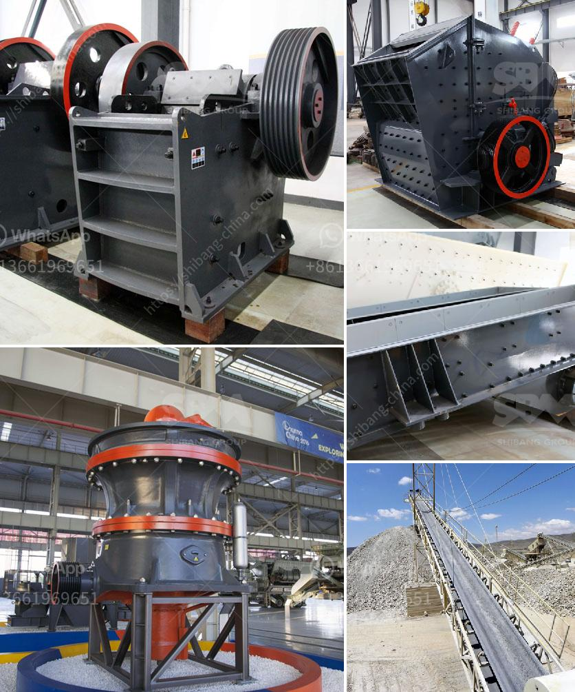

<h3>crushing asphalt with jaw crusher</h3>
Crushing asphalt with a jaw crusher is often a key component of mobile asphalt recycling processes. Utilizing a jaw crusher allows operators to crush pavement materials onsite, reducing transport costs and ensuring a consistent sized end product. While this can be an effective method for recycling asphalt, it is important to understand the process and potential challenges involved.

Asphalt is a durable and versatile material commonly used for road construction. However, over time, pavement surfaces can deteriorate and develop cracks or potholes, necessitating repairs. When roads are repaired or resurfaced, the old asphalt is often removed and replaced. This discarded asphalt can be recycled, saving valuable resources and reducing the demand for new materials.

One of the most common techniques for recycling asphalt is mobile asphalt recycling. This process involves crushing the old pavement materials onsite using a jaw crusher. The jaw crusher is a large machine that breaks down the asphalt into smaller, more manageable pieces. These smaller pieces are then processed through a series of screens and conveyors which separate and stockpile the different sizes of recycled asphalt.

There are several benefits to crushing asphalt with a jaw crusher. Firstly, it allows for the immediate reuse of the recycled material. This eliminates the need for transportation to an offsite facility for processing. Additionally, by crushing the asphalt onsite, operators can control the size and quality of the recycled material, ensuring a consistent end product that meets specifications.

However, crushing asphalt with a jaw crusher can have its challenges. One primary challenge is the hardness of the asphalt material. Asphalt is a tough and dense material, making it difficult to break down. This requires a powerful jaw crusher with sufficient force to crush the asphalt effectively. The jaw crusher must also be equipped with adequate protection to prevent damage from the abrasive nature of the asphalt.

Another challenge is the presence of contaminants in the recycled asphalt. Asphalt often contains bits of debris, such as gravel, concrete, or other foreign materials. These contaminants can cause wear and tear on the jaw crusher, affecting its performance and potentially leading to costly repairs. It is crucial to regularly inspect and maintain the jaw crusher to ensure optimal performance and longevity.

To overcome these challenges, proper maintenance and handling of the jaw crusher are essential. Regular inspections should be conducted to identify and address any issues that may arise. The equipment should also be operated correctly, following the manufacturer's guidelines and recommendations. Adequate training should be provided to operators to ensure they understand the proper techniques for handling and crushing asphalt.

In conclusion, crushing asphalt with a jaw crusher is an effective method for recycling asphalt onsite. This process helps to reduce costs and conserve resources by reusing the discarded pavement materials. However, it is important to understand the challenges involved and take the necessary precautions to ensure optimal performance and longevity of the equipment. With proper maintenance and handling, a jaw crusher can be a valuable tool in the asphalt recycling process.
<h3>Contact us</h3><ul><li><strong>Whatsapp:&nbsp;<a href="https://wa.me/8613661969651">+8613661969651</a></strong></li><li><a href="https://swt.shibang-china.com/?git&amp;zhl&amp;crushing asphalt with jaw crusher"><strong>Online Service(chat now)</strong></a></li></ul><h3>Related</h3><ul><li><a href='price of quarry crusher in zimbabwe.md'>price of quarry crusher in zimbabwe</a></li><li><a href='ball mills in monterrey.md'>ball mills in monterrey</a></li><li><a href='ball mill operation and maintenance manual pdf.md'>ball mill operation and maintenance manual pdf</a></li><li><a href='mobile jaw crusher plant.md'>mobile jaw crusher plant</a></li><li><a href='stone quarry crusher companies in ghana.md'>stone quarry crusher companies in ghana</a></li></ul>