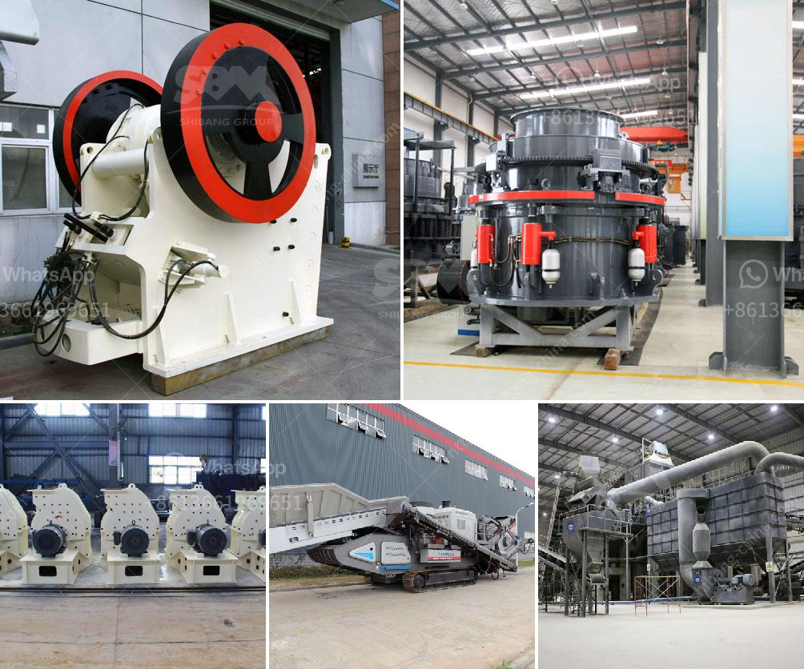

<h3>crushing equipment philippines</h3>
The Philippines is a country known for its rich natural resources, making it a promising hub for various industries. One such industry that thrives on these resources is the mining industry. To extract valuable minerals and ores, crushing equipment plays a critical role in the entire process. With the advancement of technology, crushing equipment in the Philippines has reached new heights, empowering local industries and contributing to the country's economic growth.

Crushing equipment, commonly known as crushers, are machines designed to break large rocks into smaller pieces for further processing. These machines are essential in mining, construction, and other related industries, as they make it possible to extract and process materials efficiently. The emergence of crushing equipment in the Philippines has significantly improved the productivity and profitability of local industries.

One of the key advantages of investing in crushing equipment in the Philippines is the abundance of mineral resources. The country is known for its vast deposits of copper, gold, nickel, and other valuable minerals. These resources provide opportunities for businesses to make substantial profits. However, extracting these minerals efficiently and cost-effectively requires the use of reliable and efficient crushing equipment.

In recent years, crushing equipment manufacturers have made significant advancements in terms of technology and design. Modern crushing equipment in the Philippines is equipped with intelligent systems, increased automation, and improved safety features. These advancements have led to higher productivity, reduced downtime, and increased overall efficiency. As a result, mining and construction companies can now process more materials in a shorter time, leading to higher output and profitability.

Moreover, successful crushing equipment companies in the Philippines provide comprehensive after-sales support to their customers. This includes regular maintenance, training, and technical assistance. By offering these services, equipment suppliers ensure that their clients can operate and maintain the machines effectively and minimize downtime. This level of support not only enhances the reliability of the equipment but also allows businesses to focus on their core operations without worrying about equipment breakdowns.

Another noteworthy factor is the strong commitment of the Philippine government to develop and regulate the mining industry. The government has implemented various policies and regulations to encourage responsible mining practices and attract investments. This commitment has created a favorable business environment for crushing equipment companies, enabling them to operate efficiently and expand their presence in the Philippines.

As the demand for crushed materials continues to grow, crushing equipment in the Philippines will play a vital role in meeting the needs of local industries. From constructing infrastructure to fueling manufacturing activities, the importance of crushing equipment cannot be overstated. With advanced technology, reliable support, and a booming mining sector, crushing equipment in the Philippines empowers local industries, creates jobs, and contributes to the country's overall economic development.

In conclusion, the crushing equipment industry in the Philippines holds immense potential for both local and international businesses. The abundance of mineral resources, technological advancements, and strong government support make it an attractive market for investing in crushing equipment. As the industry continues to evolve, upgrading and modernizing crushing equipment will contribute to the growth and success of the Philippines' mining and construction sectors. By harnessing the power of crushing equipment, local industries are on track to thrive and propel the country towards a prosperous future.
<h3>Contact us</h3><ul><li><strong>Whatsapp:&nbsp;<a href="https://wa.me/8613661969651">+8613661969651</a></strong></li><li><a href="https://swt.shibang-china.com/?git&amp;zhl&amp;crushing equipment philippines"><strong>Online Service(chat now)</strong></a></li></ul><h3>Related</h3><ul><li><a href='harga mesin pemecah batu merek jepang.md'>harga mesin pemecah batu merek jepang</a></li><li><a href='price of quarry crusher in zimbabwe.md'>price of quarry crusher in zimbabwe</a></li><li><a href='hammer crusher hammer balancing chart.md'>hammer crusher hammer balancing chart</a></li><li><a href='wiring circuit of grinding machine.md'>wiring circuit of grinding machine</a></li><li><a href='crusher stone sand making stone quarry.md'>crusher stone sand making stone quarry</a></li></ul>