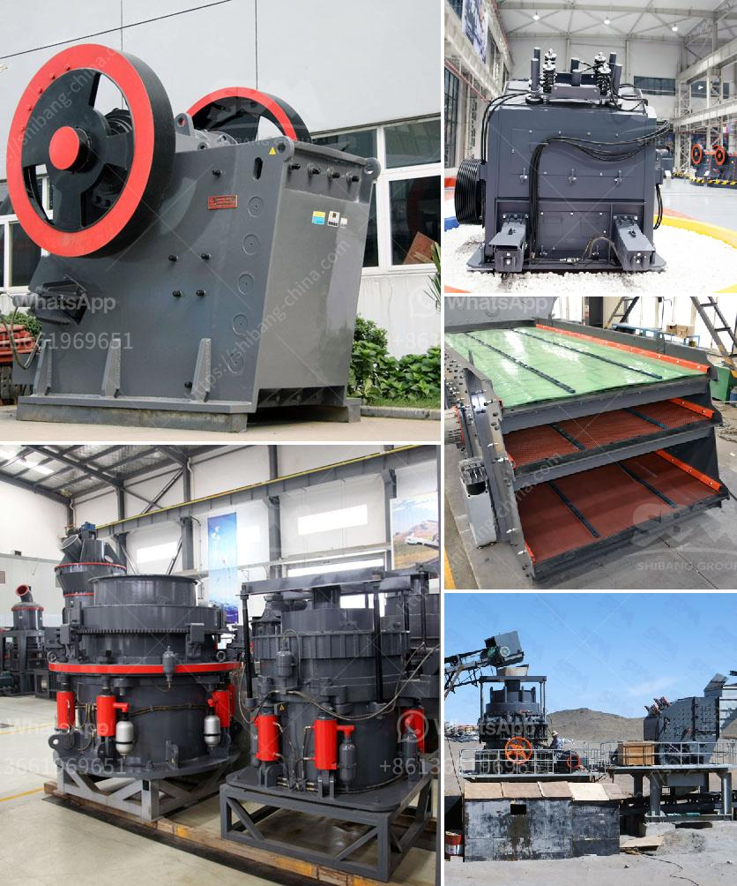

<h3>crushing machine 500 tons per hour size</h3>
In today's world, where sustainability and efficiency are key factors in any business, the demand for advanced crushing machines is ever-increasing. These machines are designed to break down large rocks into smaller, more manageable sizes, suitable for various construction and mining applications. One such machine is capable of crushing an impressive 500 tons per hour. Let's explore this crushing machine in detail.

The crushing machine, with its impressive capacity, can handle large quantities of materials effortlessly. This robust machinery uses advanced technology to break down rocks into different sizes. The efficient operation of this machine is critical for industries like mining, construction, and recycling, where reducing materials to specific sizes is crucial. With its ability to process large quantities of material, it significantly boosts productivity and helps companies meet their goals faster.

The size of the material that can be crushed plays a vital role in determining the success of any crushing operation. The crushing machine is designed to handle a broad range of materials, including granite, limestone, concrete, basalt, and more. With its powerful jaws and durable build, it effectively crushes these materials into sizes as small as 1-inch or less. This versatility allows it to be used in a variety of industries, offering maximum value for businesses.

Apart from the impressive output capacity, this crushing machine offers numerous advantages. Its high-efficiency design minimizes downtime, ensuring maximum uptime and productivity. Additionally, the machine is engineered to withstand heavy-duty applications and extreme conditions, offering durability and longevity. Its low maintenance requirements reduce operational costs, making it a cost-effective choice for many businesses.

Safety is always a top priority in any workplace, and crushing machines are no exception. This machine incorporates advanced safety features to protect operators during operation. The design includes safety guards, emergency stop buttons, and efficient dust suppression systems, ensuring a safe working environment.

In summary, a crushing machine capable of crushing 500 tons per hour in size is a valuable asset for any industry dealing with large quantities of materials. Its robust design, versatility, and efficiency enable businesses to enhance productivity and meet their targets efficiently. The machine's ability to handle various materials and reduce them to specific sizes makes it suitable for multiple applications. Furthermore, its safety features contribute to creating a secure working environment.

As businesses strive to streamline their operations and become more sustainable, the demand for advanced crushing machines continues to rise. By investing in a crushing machine with a 500 tons per hour crushing capacity, companies can effectively process large quantities of materials in a cost-effective and efficient manner. This not only improves productivity but also ensures a sustainable future by maximizing the use of available resources.
<h3>Contact us</h3><ul><li><strong>Whatsapp:&nbsp;<a href="https://wa.me/8613661969651">+8613661969651</a></strong></li><li><a href="https://swt.shibang-china.com/?git&amp;zhl&amp;crushing machine 500 tons per hour size"><strong>Online Service(chat now)</strong></a></li></ul><h3>Related</h3><ul><li><a href='quarry machine for sale.md'>quarry machine for sale</a></li><li><a href='conventional stone crushers in peru.md'>conventional stone crushers in peru</a></li><li><a href='brand new cone crusher for sale india.md'>brand new cone crusher for sale india</a></li><li><a href='iron processing machine.md'>iron processing machine</a></li><li><a href='automatic terrazzo pressing machine.md'>automatic terrazzo pressing machine</a></li></ul>