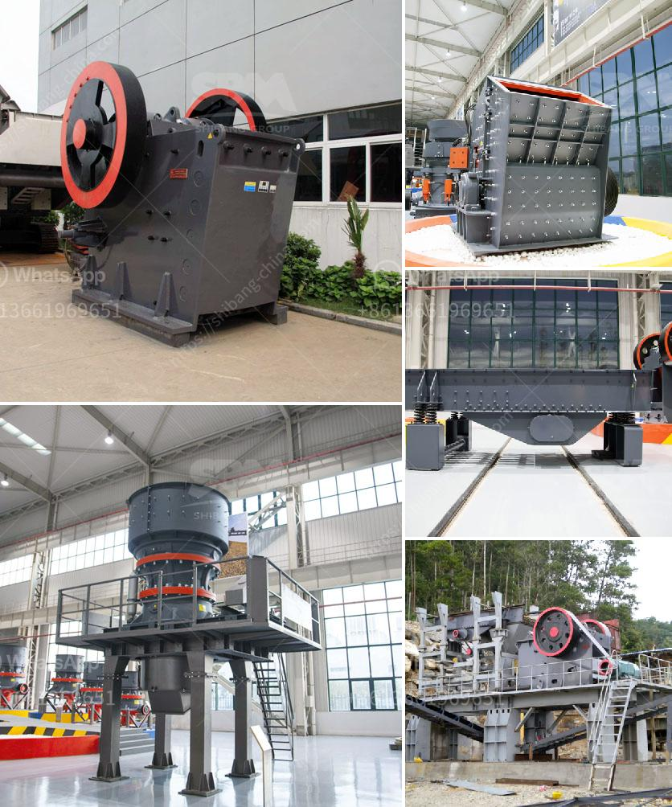

<h3>crushing machine for sale in nigeria</h3>
Crushing machines have become an integral part of the construction industry in Nigeria as they are used for reducing large rock samples into smaller sizes. There are different crushers available in the market, including gravel crushers, cone crushers, gyratory crushers, and more. These machines are cost-effective and highly efficient, making them perfect for crushing different types of materials.

One of the key factors driving the demand for crushing machines in Nigeria is the growing infrastructure development projects in the country. The government has embarked on several road and bridge construction projects, which require high-quality aggregates. Crushing machines are essential equipment in producing aggregates for such projects. They help in breaking down large rocks into smaller pieces, which can then be used as base materials for roads, bridges, and buildings.

Another factor contributing to the increasing demand for crushing machines in Nigeria is the rapid urbanization and population growth. As more people migrate to cities, the construction industry is booming, leading to an increased need for crushed materials. Crushing machines help in recycling and reusing demolished materials, reducing the environmental impact of construction activities.

There are various types of crushing machines available for sale in Nigeria, such as jaw crushers, gyratory crushers, cone crushers, impact crushers, and more. These machines are designed and built to handle a wide range of crushing applications, such as primary crushing, secondary crushing, and tertiary crushing. They can crush materials of different hardness levels, from soft limestone to hard granite, and everything in between.

When choosing a crushing machine, it is essential to consider factors such as the capacity, motor power, and reduction ratio. The capacity refers to the maximum amount of material the machine can handle per hour. It is crucial to select a machine with an adequate capacity that meets your project requirements. The motor power and reduction ratio determine the efficiency of the machine. A higher motor power ensures better performance, while a higher reduction ratio results in finer and more uniform crushed materials.

Furthermore, it is important to buy crushing machines from reputable manufacturers or suppliers in Nigeria. This ensures that you receive high-quality machines that are durable and reliable. Reputable manufacturers offer warranty and after-sales service, ensuring that any maintenance or repair needs are promptly addressed.

In conclusion, the demand for crushing machines in Nigeria is driven by the growing construction industry, urbanization, and population growth. These machines are crucial for producing high-quality aggregates used in infrastructure projects, and they help in recycling and reusing materials. When purchasing a crushing machine, one should consider factors such as capacity, motor power, reduction ratio, and buy from reputable manufacturers. Investing in a reliable and efficient crushing machine can significantly boost construction activities and contribute to the country's overall development.
<h3>Contact us</h3><ul><li><strong>Whatsapp:&nbsp;<a href="https://wa.me/8613661969651">+8613661969651</a></strong></li><li><a href="https://swt.shibang-china.com/?git&amp;zhl&amp;crushing machine for sale in nigeria"><strong>Online Service(chat now)</strong></a></li></ul><h3>Related</h3><ul><li><a href='process of making diamonds from coal.md'>process of making diamonds from coal</a></li><li><a href='gold mill equipment zimbabwe.md'>gold mill equipment zimbabwe</a></li><li><a href='prices of gemini concentrating tables manufacturers.md'>prices of gemini concentrating tables manufacturers</a></li><li><a href='complete crushing plant 150 200t.md'>complete crushing plant 150 200t</a></li><li><a href='granite crushing plant.md'>granite crushing plant</a></li></ul>