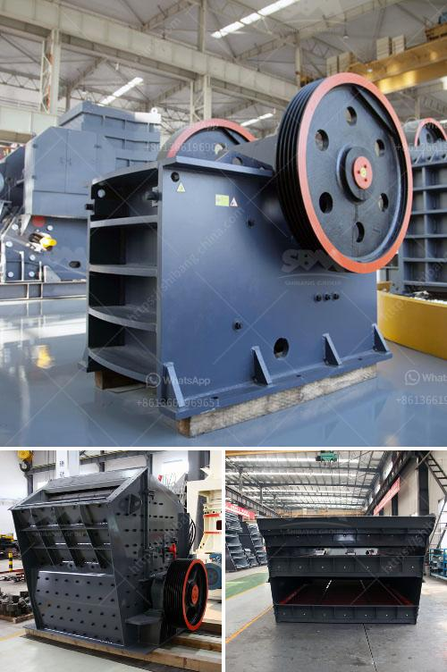

<h3>crushing machines for ceramic</h3>
In the world of ceramics, crushing machines play a vital role in enhancing efficiency and precision. Ceramics are widely used in various industries such as construction, automotive, aerospace, electronics, and more. These materials, known for their exceptional hardness and durability, require specialized equipment for processing and shaping. This is where crushing machines come into the picture, providing a reliable and efficient solution for ceramic production.

Ceramic crushing machines are specifically designed to crush ceramic materials with precision and achieve desired particle size reduction. These machines are robust and durable, capable of withstanding the harsh environments of ceramic production processes. Whether it's crushing large chunks into smaller pieces or fine powder production, crushing machines are essential in facilitating a smooth ceramic manufacturing process.

One of the primary application areas of crushing machines in ceramics is the preparation of raw materials. Ceramics manufacturing involves the use of various raw materials such as clay, feldspar, quartz, and other minerals. These raw materials are often present in the form of large chunks or blocks, which need to be crushed into smaller, uniform-sized particles for further processing.

Crushing machines equipped with ceramic crushing plates or hammers are commonly used for this purpose. These plates or hammers provide excellent wear resistance against the abrasive nature of ceramic materials. They are designed to withstand high impact forces and efficiently break down the raw materials into the desired size range.

Another crucial application of crushing machines in ceramics is the production of ceramic powders. Ceramic powders are extensively used in the manufacturing of ceramic products such as tiles, pottery, and advanced ceramics. However, achieving the required particle size distribution is critical for the properties and performance of the final ceramic product.

Crushing machines designed for powder production utilize various techniques to ensure precise particle size reduction. This includes technologies such as impact crushing, ball milling, or air jet milling. These methods effectively reduce the ceramic material to powder form, enabling manufacturers to control the size distribution and enhance the ceramic's properties.

In addition to raw material preparation and powder production, crushing machines also find application in ceramics recycling. Ceramic waste, such as broken tiles or rejected ceramic products, can be recycled and processed to create new ceramic products. Crushing machines equipped with advanced crushing technologies can efficiently process ceramic waste, reducing landfill waste and promoting the sustainability of the ceramics industry.

Furthermore, crushing machines play a vital role in quality control during the ceramics production process. By carefully monitoring the particle size distribution of crushed ceramic materials, manufacturers can ensure the consistency and uniformity of their products. This is particularly crucial when producing specialized ceramics for industries such as aerospace or electronics, where precise material properties are essential.

In conclusion, crushing machines for ceramics offer valuable solutions to enhance efficiency and precision in the production process. Whether it's raw material preparation, powder production, recycling, or quality control, these machines play a significant role in the ceramics industry. With their ability to crush ceramic materials with precision, crushing machines contribute to the production of high-quality ceramics used in various sectors, further driving the growth and innovation in this dynamic industry.
<h3>Contact us</h3><ul><li><strong>Whatsapp:&nbsp;<a href="https://wa.me/8613661969651">+8613661969651</a></strong></li><li><a href="https://swt.shibang-china.com/?git&amp;zhl&amp;crushing machines for ceramic"><strong>Online Service(chat now)</strong></a></li></ul><h3>Related</h3><ul><li><a href='copper crusher cost.md'>copper crusher cost</a></li><li><a href='rumus tegangan pada belt conveyor.md'>rumus tegangan pada belt conveyor</a></li><li><a href='gold wash plants built in the northwest.md'>gold wash plants built in the northwest</a></li><li><a href='brand crusher machine in malaysia.md'>brand crusher machine in malaysia</a></li><li><a href='cement manufacturing equipment pdf.md'>cement manufacturing equipment pdf</a></li></ul>