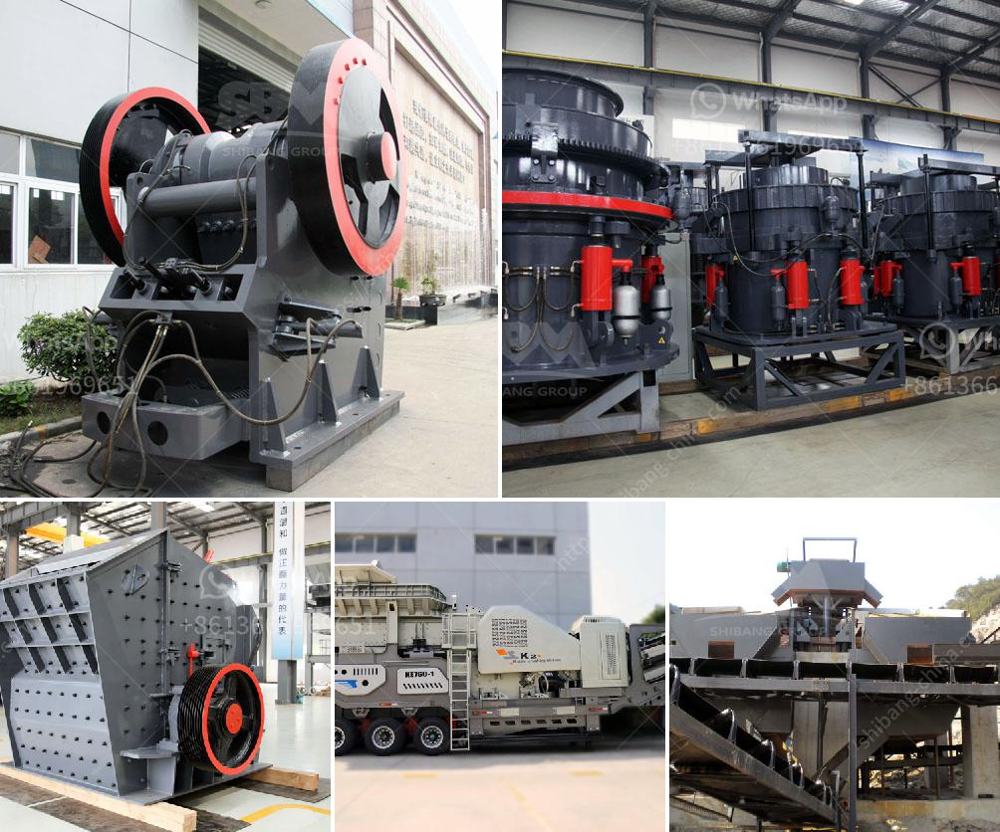

<h3>crushing machines for rent in uae</h3>
Crushing machines are utilized to reduce the size of large rocks and stones in the construction and mining industries. These machines come in different sizes, including stationary units and mobile versions to meet diverse crushing needs. Regardless of the size, crushing machines play a crucial role in the mining and construction sectors as they enable the processing of raw materials into usable products.

One of the leading markets for crushing machines is the United Arab Emirates (UAE). The UAE has always been at the forefront of infrastructure development, making it a lucrative market for equipment rental services. Many construction companies and mining operators rely on renting crushing machines rather than purchasing them outright due to cost-effectiveness and flexibility.

Renting crushing machines in the UAE offers several advantages. First and foremost, it provides access to a wide range of equipment options from different manufacturers. This allows businesses to select the most suitable machine for their specific needs, ensuring optimal performance and productivity. Renting also eliminates the need for significant upfront investments, making it an attractive option for companies with limited budgets or short-term projects.

Furthermore, renting crushing machines in the UAE offers flexibility. Construction and mining projects often have varying durations and requirements. When renting, businesses have the flexibility to choose the rental period that best suits their needs, whether it is for a few days, weeks, or even months. This allows companies to align their expenses with project timelines, optimizing cost efficiency. Moreover, if the project scope changes or additional equipment is required, rental providers can quickly accommodate such needs.

The UAE hosts a number of well-established equipment rental companies that cater specifically to the construction and mining industries. These rental providers offer a wide range of crushing machines, including jaw crushers, impact crushers, cone crushers, and more. Their machines are designed to meet various crushing requirements, such as primary crushing, secondary crushing, and final sizing.

When renting crushing machines in the UAE, it is essential to consider the reputation and track record of the rental provider. By selecting a reputable equipment rental company, businesses can ensure the machines are well-maintained, operated efficiently, and have undergone rigorous safety checks. Reliable rental providers also offer technical support, ensuring seamless operation and minimizing downtime.

The rental rates for crushing machines in the UAE vary depending on factors such as machine type, capacity, and duration of the rental period. However, rental rates are typically competitive when compared to the cost of purchasing and maintaining these machines. Renting crushers can be a cost-effective solution, particularly for short-term projects or when specific crushing requirements change frequently.

In conclusion, renting crushing machines in the UAE presents numerous benefits for construction and mining companies. By opting for rental services, businesses gain access to a wide range of equipment options, enjoy cost flexibility, and can readily adapt to project requirements. With the thriving construction and mining sectors in the UAE, the demand for crushing machines for rent is expected to continue growing in the coming years.
<h3>Contact us</h3><ul><li><strong>Whatsapp:&nbsp;<a href="https://wa.me/8613661969651">+8613661969651</a></strong></li><li><a href="https://swt.shibang-china.com/?git&amp;zhl&amp;crushing machines for rent in uae"><strong>Online Service(chat now)</strong></a></li></ul><h3>Related</h3><ul><li><a href='mobile gold processing plants 1 ton per.md'>mobile gold processing plants 1 ton per</a></li><li><a href='sample of project proposal on small scale mining.md'>sample of project proposal on small scale mining</a></li><li><a href='crusher plant for sale in usa.md'>crusher plant for sale in usa</a></li><li><a href='barite grinding equipment.md'>barite grinding equipment</a></li><li><a href='3 roller mill manufacturers in india.md'>3 roller mill manufacturers in india</a></li></ul>