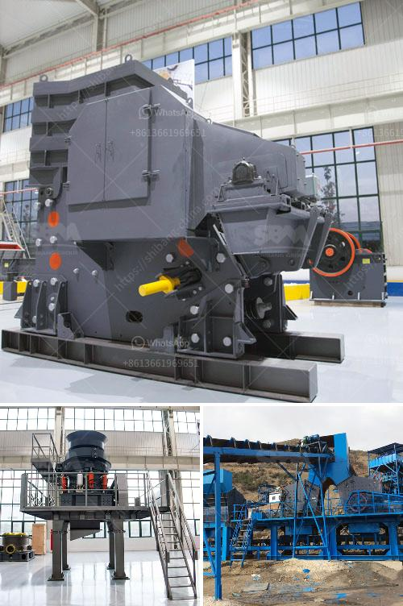

<h3>crushing machines for sale</h3>
In our fast-paced and ever-evolving world, industries are constantly searching for efficient ways to streamline their processes and increase productivity. One essential piece of equipment that plays a crucial role in various sectors is the crushing machine.

Crushing machines are powerful tools used to break down larger rocks, minerals, or other materials into smaller, more manageable pieces. They are commonly employed in mining, construction, recycling, and demolition industries, among others. With the rise in demand for materials and resources, these machines have become essential assets for any company looking to extract, process, or repurpose materials.

One significant advantage of crushing machines is their versatility. They can handle a wide array of materials, from hard rocks and ores to softer substances like concrete and asphalt. Whether it’s for road construction, building foundations, or even landscaping projects, crushing machines can efficiently reduce the size of materials, making them easier to transport and utilize.

As technology advances, so do the capabilities of crushing machines. Today, you can find machines equipped with advanced features like hydraulic systems, automation, and wireless controls. These innovations not only enhance productivity but also ensure safety for operators. With increased efficiency and ease of use, businesses can optimize their processes while minimizing downtime and reducing operational costs.

For those looking to invest in a crushing machine, there is a wide range of options available on the market. From small portable crushers suited for on-site projects to large stationary units designed for high-capacity operations, buyers can find the perfect machine to meet their specific needs. With the ability to adjust the size of output material, these machines offer incredible flexibility to adapt to various requirements.

Furthermore, the market for crushing machines is constantly evolving, driving competition among manufacturers. This means buyers are presented with a plethora of options across different price ranges. From brand new machines to used ones, there is a suitable choice for every budget.

In conclusion, the sale of crushing machines is becoming increasingly vital for industries across the globe. These machines offer immense benefits by streamlining processes, increasing productivity, and reducing operational costs. With cutting-edge technology, versatility, and a wide range of options available, it is no surprise that crushing machines have become essential equipment for modern businesses. Investing in a crushing machine can not only meet immediate needs but also present long-term advantages for companies, ensuring they remain competitive in today’s rapidly changing industrial landscape.
<h3>Contact us</h3><ul><li><strong>Whatsapp:&nbsp;<a href="https://wa.me/8613661969651">+8613661969651</a></strong></li><li><a href="https://swt.shibang-china.com/?git&amp;zhl&amp;crushing machines for sale"><strong>Online Service(chat now)</strong></a></li></ul><h3>Related</h3><ul><li><a href='small quarry crusher for sale.md'>small quarry crusher for sale</a></li><li><a href='sand washing machine zenith.md'>sand washing machine zenith</a></li><li><a href='limestone crushing plant input and output size.md'>limestone crushing plant input and output size</a></li><li><a href='vertical cement mill grinding plant.md'>vertical cement mill grinding plant</a></li><li><a href='marble ball mill.md'>marble ball mill</a></li></ul>