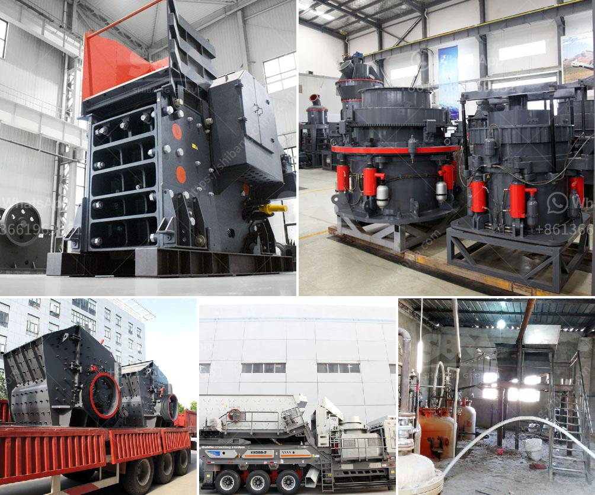

<h3>crushing machines of compostable material</h3>
Organic waste, such as food scraps, yard trimmings, or agricultural residues, holds great potential for composting and producing nutrient-rich soil amendments. However, before this waste can be transformed into compost, it needs to undergo a process that ensures it is broken down into smaller, more manageable pieces. This is where crushing machines for compostable material play a vital role.

Compostable materials, unlike non-biodegradable substances, can be decomposed naturally by microorganisms. However, their decomposition process can be accelerated significantly by breaking them down into smaller particles. Crushing machines offer an efficient solution to reduce the size of compostable material, making it easier to handle and speeding up the decomposition process.

One significant advantage of using crushing machines for compostable material is the increased surface area it creates. By reducing the material into smaller fragments, more surface space is exposed. This allows microorganisms to access a larger surface area for decomposition, leading to faster breakdown and a more robust composting process.

Furthermore, crushing machines enable compostable materials to reach an optimal consistency for composting. Certain waste, like tree branches or cornstalks, can be challenging to decompose due to their fibrous nature. By crushing these materials, machines break down their fibrous components, making them more susceptible to microbial attack. Consequently, the composting process becomes more efficient and less time-consuming.

The use of crushing machines in compostable waste management also offers environmental benefits. Firstly, it helps to reduce the amount of organic waste being sent to landfills. By breaking down these materials rapidly, composting becomes a more viable and sustainable option. Diverting organic waste from landfills not only minimizes methane emission, a potent greenhouse gas, but also reduces the need for new landfill space.

Additionally, the use of crushing machines reduces transportation costs associated with organic waste management. Smaller particle sizes obtained through these machines allow for higher waste density in transport, leading to more efficient haulage. This results in reduced fuel consumption and fewer carbon emissions, making it an eco-friendly option for waste management.

Furthermore, the versatility of crushing machines allows for the processing of a wide range of compostable materials. From kitchen scraps to agricultural waste, these machines can handle and crush various feedstocks, ensuring that no organic waste is left behind.

In conclusion, the use of crushing machines for compostable material is a game-changer in organic waste management. These machines enhance the efficiency of the composting process by breaking down materials into smaller particles, increasing the surface area available for microbial decomposition. Additionally, they enable compostable materials to reach an optimal consistency for easier and faster decomposition. The use of crushing machines not only reduces the amount of organic waste sent to landfills but also lowers transportation costs and associated carbon emissions. With their versatility and environmental benefits, crushing machines are crucial in enhancing the sustainability of composting and organic waste management systems.
<h3>Contact us</h3><ul><li><strong>Whatsapp:&nbsp;<a href="https://wa.me/8613661969651">+8613661969651</a></strong></li><li><a href="https://swt.shibang-china.com/?git&amp;zhl&amp;crushing machines of compostable material"><strong>Online Service(chat now)</strong></a></li></ul><h3>Related</h3><ul><li><a href='fine powder grinding machine.md'>fine powder grinding machine</a></li><li><a href='cost of conveyor belt system for coal loading.md'>cost of conveyor belt system for coal loading</a></li><li><a href='cyanide processing plants for sale usa.md'>cyanide processing plants for sale usa</a></li><li><a href='mobile crusher datasheet.md'>mobile crusher datasheet</a></li><li><a href='jaw crusher in bauxite processing plant.md'>jaw crusher in bauxite processing plant</a></li></ul>