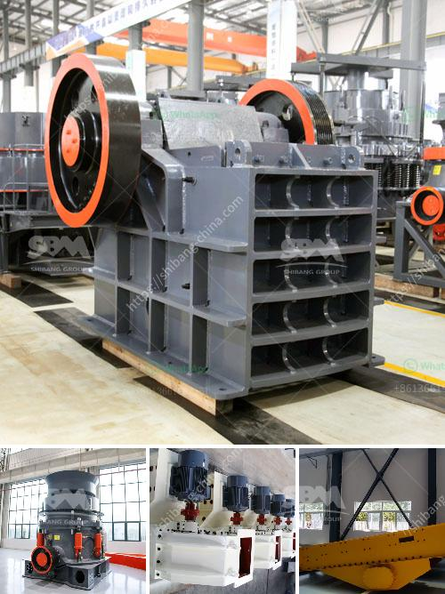

<h3>crushing plant for river materials in europe</h3>
Crushing plants are an indispensable part of the construction industry as they reduce the size of large rocks, making them suitable for various applications such as road construction, building foundations, and landscaping.

In Europe, where rivers are abundant, crushing plants for river materials are particularly important. These plants are specifically designed to process river gravel, stones, and other materials that are excavated from riverbeds. River materials are highly versatile and are widely used in construction projects due to their excellent drainage properties, durability, and aesthetic appeal.

One of the key advantages of using river materials is their natural roundness, which makes them ideal for concrete production. The smooth edges of river stones reduce the amount of water required for concrete mixtures, resulting in stronger and more cost-effective structures. Additionally, these materials can be easily sourced, reducing the carbon footprint associated with transportation.

Crushing plants for river materials in Europe are equipped with advanced technology to efficiently process large quantities of river stones. They consist of primary crushers for preliminary crushing, secondary crushers for further size reduction, vibrating screens to separate the desired sizes, and conveyor belts to transport the crushed materials. Some advanced plants even have dust control and water spraying systems to minimize environmental impact.

Furthermore, these crushing plants are designed to be mobile, enabling them to easily relocate to different sites. This flexibility is particularly beneficial in Europe, where large construction projects are often undertaken across various locations.

In conclusion, crushing plants for river materials play a crucial role in the construction industry in Europe. By processing river gravels and stones, these plants provide a sustainable and cost-effective solution for obtaining building materials with excellent properties. Their efficiency, flexibility, and environmental friendliness make them an essential asset for the European construction sector.
<h3>Contact us</h3><ul><li><strong>Whatsapp:&nbsp;<a href="https://wa.me/8613661969651">+8613661969651</a></strong></li><li><a href="https://swt.shibang-china.com/?git&amp;zhl&amp;crushing plant for river materials in europe"><strong>Online Service(chat now)</strong></a></li></ul><h3>Related</h3><ul><li><a href='crusher sand machine south africa.md'>crusher sand machine south africa</a></li><li><a href='stone crushers in bennta in bogota.md'>stone crushers in bennta in bogota</a></li><li><a href='kaolin powder machine.md'>kaolin powder machine</a></li><li><a href='raymond grinding machine.md'>raymond grinding machine</a></li><li><a href='consol glass cullet price per ton south africa.md'>consol glass cullet price per ton south africa</a></li></ul>