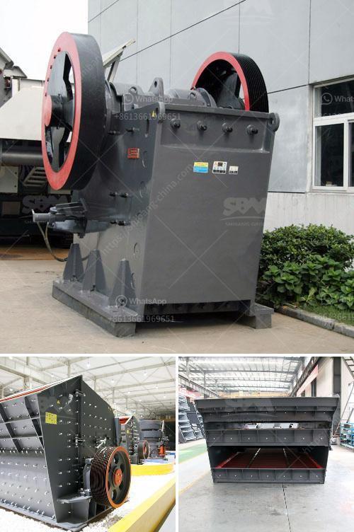

<h3>crushing plants south africa</h3>
South Africa is one of the largest producers of various precious metals and commodities, including gold, coal, and platinum group metals. It has a rich mining industry, and the country is abundant in minerals and ores. More than 1200 crushing plants are currently operating in various regions in South Africa to provide crushing solutions for all kinds of minerals, ores, and metals.

Crushing plants in South Africa are abundant in mining industry and stone quarrying industry. Various types of crusher machines are used in the stone crushing plant, such as jaw crusher, cone crusher, impact crusher, hammer crusher, and so on. These different crusher machines have different capacity range and yield, application from 10 tons per hour to 1000 tons per hour.

Crushing plants in South Africa have continued to develop throughout the years, and they are one of the most important pieces of machinery in the mining industry. The plants can be constructed in a variety of ways to ensure the equipment is laid out in the most efficient manner possible. Different crushing plants are used depending on the nature of the aggregate material or the material being crushed.

Some plants are mobile and can be broken down into separate components to be towed by semitruck or other large transport vehicles, while others are stationary fixed crushers. These mobile or stationary plants are capable of producing high-grade aggregates for various construction projects such as highways, railroads, bridges, airports, and dams.

Aggregate products produced by crushing plants are key components in the construction industry. As South Africa has experienced a fast pace of infrastructure development, the market demand for aggregates has been growing rapidly. This has led to a significant increase in the number of crushing plants in the country.

Investing in crushing plants in South Africa provides various opportunities for entrepreneurs and investors. The growing demand for aggregates and the need for infrastructure development in the country present a unique opportunity for investors in the crushing plant industry. Additionally, the government has been actively promoting the development of the infrastructure sector, which further boosts the demand for aggregates and, consequently, crushing plants.

Apart from opportunities in the construction industry, crushing plants also play a crucial role in the mining industry. Crushing is the first step in extracting valuable minerals and ores from the ground. Crushing plants help to break down the raw material into manageable pieces, which are then transported to the desired location for further processing.

South Africa's mining industry is a leading player and a substantial contributor to the country's GDP. With deep reserves of many precious metals and commodities, the mining industry offers tremendous growth potential for the crushing plant industry.

In conclusion, South Africa's fast-paced infrastructure development and growing mining industry are boosting the demand for crushing plants. South Africa has abundant mineral deposits, making it a lucrative market for the crushing plant industry. Entrepreneurs and investors can look forward to striking gold in the country's lucrative mining and infrastructure sectors. The booming industry offers numerous investment opportunities and is set to strengthen the economy, create employment opportunities, and contribute to the growth of the nation as a whole.
<h3>Contact us</h3><ul><li><strong>Whatsapp:&nbsp;<a href="https://wa.me/8613661969651">+8613661969651</a></strong></li><li><a href="https://swt.shibang-china.com/?git&amp;zhl&amp;crushing plants south africa"><strong>Online Service(chat now)</strong></a></li></ul><h3>Related</h3><ul><li><a href='marble crusher machinery manufacturer.md'>marble crusher machinery manufacturer</a></li><li><a href='estimate cost simple stone crusher plant.md'>estimate cost simple stone crusher plant</a></li><li><a href='stone crusher price in zambia.md'>stone crusher price in zambia</a></li><li><a href='brand new cone crusher for sale india.md'>brand new cone crusher for sale india</a></li><li><a href='rock crusher in ghana.md'>rock crusher in ghana</a></li></ul>