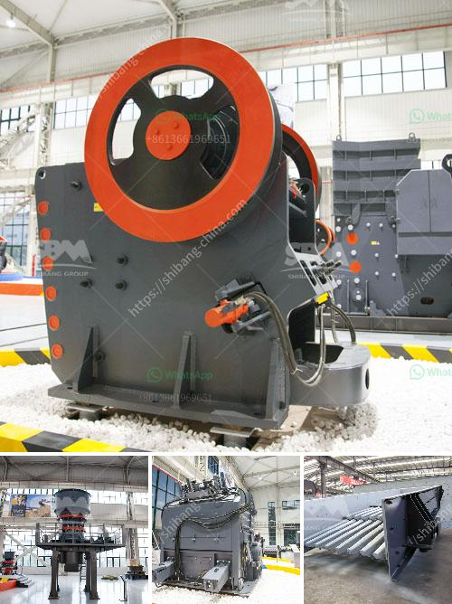

<h3>cyanide processing plants for sale usa</h3>
In recent years, the sale of cyanide processing plants in the United States has become a topic of much debate and controversy. These plants are integral in the extraction of gold and silver from ore, a process known as cyanidation. While they play a significant role in the mining industry, their use of cyanide has raised concerns about potential environmental and health risks. This article explores both sides of the argument and provides an objective analysis of the situation.

To understand the controversy surrounding cyanide processing plants, it is essential to grasp their fundamental purpose. These facilities use cyanide, a highly toxic chemical compound, to extract precious metals from mined ore. Cyanidation involves crushing the ore into a fine powder, mixing it with water and a weak cyanide solution, and then separating the gold or silver using activated carbon or zinc precipitation. The process is efficient and cost-effective, making it the preferred method for large-scale mining operations.

However, the use of cyanide has sparked concerns about its impact on the environment and human health. Cyanide is not only toxic but also highly persistent and can persist in water, soil, and air long after the mining process has ended. Accidental spills or leaks can contaminate local ecosystems, harming aquatic life and polluting water sources. Additionally, workers in these plants are at risk of exposure to cyanide, which can have severe health effects, ranging from neurological damage to respiratory distress.

Opponents of cyanide processing plants argue that the potential environmental and health risks outweigh the economic benefits they bring. They point to several incidents in the past, such as the 2000 Baia Mare cyanide spill in Romania, which resulted in severe ecological damage and contaminated water supplies for thousands of people. They also emphasize alternative methods of extraction, such as the use of safer chemicals or non-toxic technologies like gravity separation, which can replace cyanidation without compromising efficiency.

On the other hand, proponents of cyanide processing plants argue that the mining industry plays a crucial role in the economy, providing jobs and supporting local communities. They contend that strict regulations and safety measures can mitigate the risks associated with cyanide use. Furthermore, they highlight the significant financial investment and expertise required to develop and operate these plants, making it impractical to abruptly phase them out without a viable alternative.

As with many complex issues, finding a middle ground may be the best approach. Stricter regulations and increased oversight can help minimize the risks associated with cyanide processing plants. It is crucial for the government to ensure that companies adhere to rigorous safety protocols and invest in adequate monitoring systems. This would involve conducting thorough environmental impact assessments, implementing proper waste management practices, and regularly testing for cyanide levels in surrounding areas.

Additionally, research and development should be encouraged to find alternative methods of gold and silver extraction. Governments, universities, and private entities can work together to support the implementation of safer and environmentally friendly technologies. This approach would allow the mining industry to continue its operations while gradually reducing its reliance on cyanide.

In conclusion, the debate surrounding cyanide processing plants for sale in the United States is far from settled. While the risks associated with cyanide use are significant and should not be overlooked, it is important to consider the economic implications and the potential for responsible mining practices. By implementing stringent regulations and actively seeking alternative extraction methods, it is possible to strike a balance between economic growth and environmental sustainability.
<h3>Contact us</h3><ul><li><strong>Whatsapp:&nbsp;<a href="https://wa.me/8613661969651">+8613661969651</a></strong></li><li><a href="https://swt.shibang-china.com/?git&amp;zhl&amp;cyanide processing plants for sale usa"><strong>Online Service(chat now)</strong></a></li></ul><h3>Related</h3><ul><li><a href='graphite mine slurry ball mill.md'>graphite mine slurry ball mill</a></li><li><a href='quartz crushing plant german tecnology.md'>quartz crushing plant german tecnology</a></li><li><a href='250tph comprehensive portable crushing plant.md'>250tph comprehensive portable crushing plant</a></li><li><a href='mineral grinding mill.md'>mineral grinding mill</a></li><li><a href='quarry plant for sale.md'>quarry plant for sale</a></li></ul>