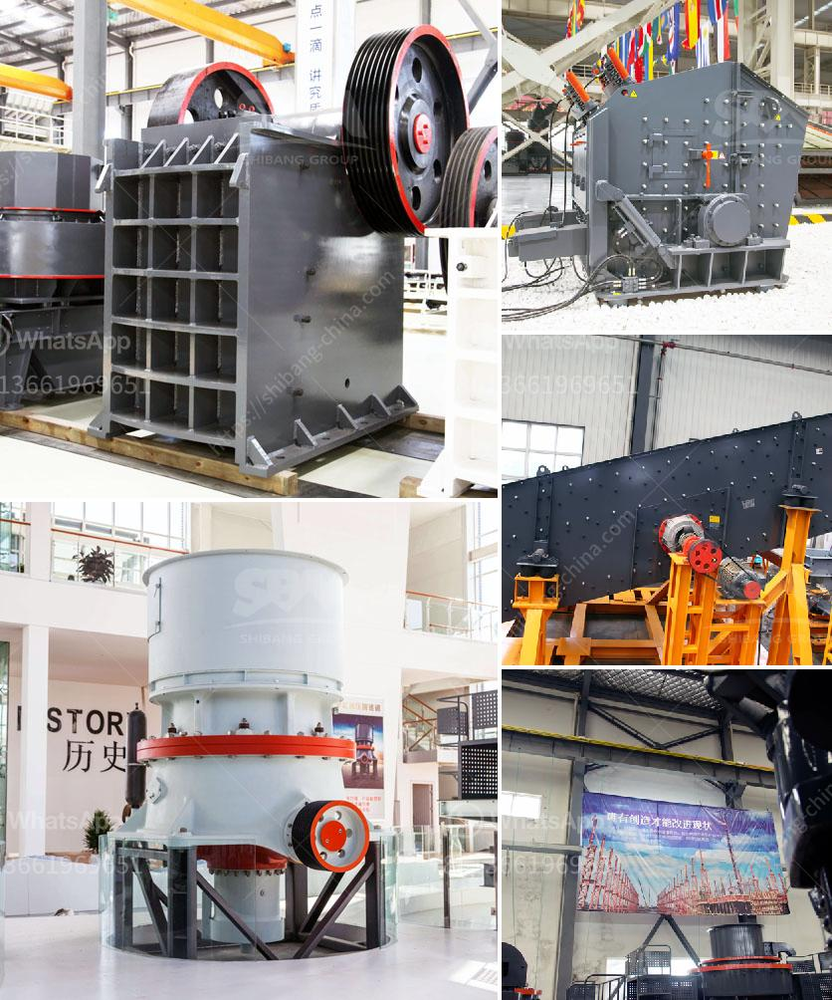

<h3>decibels declined jaw crusher hebro</h3>
The mining and construction industries rely heavily on jaw crushers for the extraction and processing of raw materials. These powerful machines are designed to break down rocks into smaller, more manageable sizes for further processing. However, the noise generated by jaw crushers has been a persistent concern, as it can have detrimental effects on workers' health and the surrounding environment. 

Enter the Jaw Crusher Hebro, a revolutionary machine that aims to address this issue by reducing noise levels while maintaining superior performance. Developed by a team of dedicated engineers, this innovative jaw crusher has made significant strides in minimizing noise pollution in mining and construction sites.

One of the primary sources of noise in traditional jaw crushers is the mechanical vibrations caused by the moving parts. These vibrations can result in decibel levels exceeding acceptable limits, leading to noise-induced hearing loss in workers over time. The Jaw Crusher Hebro tackles this issue head-on by incorporating advanced vibration control technologies.

Firstly, special dampening materials are strategically placed throughout the machine to absorb and dissipate vibrations. This effectively reduces the noise generated during operation, resulting in a quieter working environment. Additionally, advanced hydraulic systems have been integrated into the Jaw Crusher Hebro to further minimize vibrations.

Another important feature of the Jaw Crusher Hebro is its soundproof enclosure. The machine is built within a specially designed housing that effectively traps and absorbs noise. This enclosure not only minimizes noise emissions but also protects workers from potential hazards associated with the crushing process.

Furthermore, the Jaw Crusher Hebro boasts an intelligent control system that optimizes the machine's operation for maximum efficiency. This system ensures that the jaw crusher adapts its power output based on the hardness and size of the material being crushed. Not only does this enhance productivity, but it also lowers noise levels as the machine operates only at the required power level.

Overall, the Jaw Crusher Hebro represents a remarkable advancement in the mining and construction industries. By significantly reducing noise emissions without compromising performance, this innovative machine prioritizes the well-being of workers and the environment. As regulations surrounding noise pollution become increasingly stringent, the Jaw Crusher Hebro offers a solution that aligns with industry demands for responsible and sustainable operations.

In conclusion, the arrival of the Jaw Crusher Hebro marks a turning point in the use of jaw crushers. Its innovative design, incorporating advanced vibration control technologies and a soundproof enclosure, ensures that noise levels are significantly reduced, benefiting workers and the surrounding environment. With its intelligent control system, the Jaw Crusher Hebro streamlines operations by optimizing power output, enhancing efficiency, and minimizing noise pollution. This groundbreaking machine is a testament to the continuous efforts made by engineers to revolutionize the mining and construction industries while preserving the well-being of workers and the ecological balance.
<h3>Contact us</h3><ul><li><strong>Whatsapp:&nbsp;<a href="https://wa.me/8613661969651">+8613661969651</a></strong></li><li><a href="https://swt.shibang-china.com/?git&amp;zhl&amp;decibels declined jaw crusher hebro"><strong>Online Service(chat now)</strong></a></li></ul><h3>Related</h3><ul><li><a href='micro mill grinding mills.md'>micro mill grinding mills</a></li><li><a href='screen plants for shade.md'>screen plants for shade</a></li><li><a href='china processing plants for sale.md'>china processing plants for sale</a></li><li><a href='barite mill crusher.md'>barite mill crusher</a></li><li><a href='gold mining equipment for sale at malaysia.md'>gold mining equipment for sale at malaysia</a></li></ul>