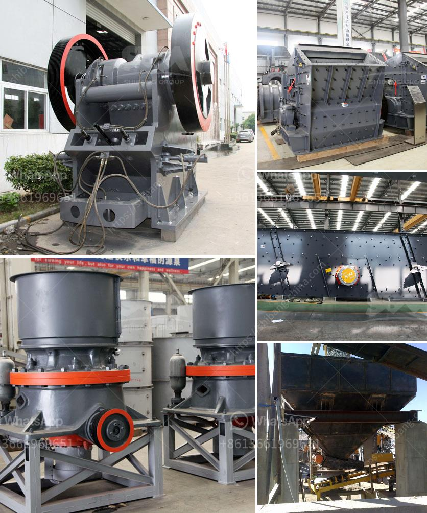

<h3>dedusting systems for crushers</h3>
In the world of mining and aggregate production, crushers play a vital role in reducing large pieces of rock into smaller, more manageable sizes. However, crushing operations generate significant amounts of dust and other airborne particles that can pose various health hazards for workers, affect equipment performance, and harm the environment. To mitigate these concerns, dedusting systems for crushers are a critical component in ensuring efficient, safe, and environmentally friendly crushing processes.

Dust, which is generated during the crushing operation, is typically fine and can be easily transported by air currents. When inhaled, it can cause respiratory problems, including lung diseases. Furthermore, the accumulation of dust on machinery can impair their efficiency, reduce productivity, and lead to costly maintenance and repairs. Therefore, a robust dedusting system for crushers is indispensable for the overall safety and efficiency of the crushing plant.

The primary goal of a dedusting system is to capture and remove airborne particles, including dust, smoke, and fumes, generated by the crushing process. There are several types of dedusting systems available, with each designed to meet specific operational needs and comply with environmental regulations. Cyclone separators, fabric filters, and wet scrubbers are among the most commonly employed dedusting solutions for crushers.

Cyclone separators utilize the principle of centrifugal force to separate dust particles from the airstream. As the dust-laden air enters the cyclone chamber, it spirals downward, causing the heavier particles to strike the walls and fall into a collection hopper. The clean air is then discharged from the top of the cyclone. Cyclone separators are efficient in removing larger particles but may be less effective in capturing smaller ones.

Fabric filters, commonly known as baghouses, are highly efficient dedusting systems that can effectively remove both large and small particles. This system employs fabric bags as filtration media, where the dust-laden air passes through. The dust particles are retained on the fabric surface while clean air passes through, ensuring that a high percentage of dust is captured. Fabric filters require regular maintenance to clean or replace the filter bags and ensure optimum performance.

Wet scrubbers are another commonly used dedusting solution for crushers. By creating a fine mist of water droplets, wet scrubbers capture and entrap dust particles through a process known as agglomeration or absorption. The wet scrubbing action causes the dust particles to adhere to the water droplets, after which they are separated from the airstream through various separation mechanisms. Wet scrubbers are efficient at capturing both large and small particles, making them suitable for crushers operating in high-dust environments.

In conclusion, dedusting systems for crushers are essential for several reasons. They ensure the safety and well-being of workers by reducing the inhalation of harmful dust particles. These systems also promote the efficiency and reliability of the crushing equipment by minimizing dust accumulation and its detrimental effects. Moreover, dedusting systems help companies comply with environmental regulations by reducing emissions and preventing pollution. When selecting a dedusting system for crushers, it is crucial to consider the type and size of particles generated during the crushing process, as well as the specific requirements and constraints of the operation. By implementing an effective dedusting system, crushers can operate safely, efficiently, and in an environmentally friendly manner.
<h3>Contact us</h3><ul><li><strong>Whatsapp:&nbsp;<a href="https://wa.me/8613661969651">+8613661969651</a></strong></li><li><a href="https://swt.shibang-china.com/?git&amp;zhl&amp;dedusting systems for crushers"><strong>Online Service(chat now)</strong></a></li></ul><h3>Related</h3><ul><li><a href='mining equipment companies in nigeria.md'>mining equipment companies in nigeria</a></li><li><a href='china conveyor belts.md'>china conveyor belts</a></li><li><a href='hammer mill mesin impor china.md'>hammer mill mesin impor china</a></li><li><a href='machinery for talc manufacturing.md'>machinery for talc manufacturing</a></li><li><a href='vsi5x crusher for sale.md'>vsi5x crusher for sale</a></li></ul>