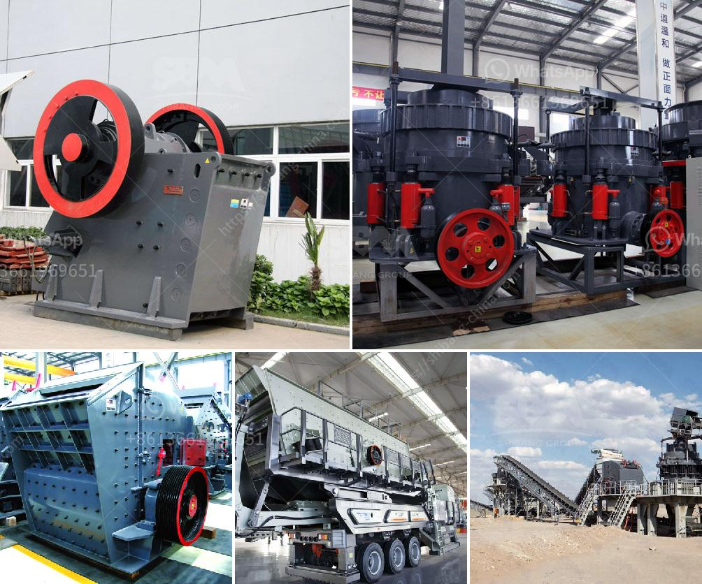

<h3>density of 2mm 1mm aggregate and river crusher sand</h3>
The density of aggregate materials is an important factor to consider in construction and engineering projects. It determines the overall strength and stability of the structure being built. In this article, we will compare the density of two commonly used aggregate materials - 2mm and 1mm aggregate - to river crusher sand.

The density of aggregate is typically measured in kilograms per cubic meter (kg/m³). For lighter materials, such as river crusher sand, the density can typically range from 1,500 to 1,700 kg/m³. This type of density is suitable for most general construction projects, including buildings, roads, and bridges.

On the other hand, 2mm and 1mm aggregates have denser compositions. The density of 2mm aggregate can range from approximately 1,800 to 2,200 kg/m³, while 1mm aggregate can range from 2,100 to 2,500 kg/m³. These higher densities make them more suitable for specific engineering applications that require stronger and more durable structures. These applications often include specialized concrete mixes, such as high-strength concrete or lightweight concrete.

When deciding between river crusher sand and the finer aggregates, several factors should be considered. Firstly, the intended use of the material should be taken into account. If the project requires a heavy-duty structure, such as a nuclear power plant or a dam, the higher density of 2mm and 1mm aggregates may be more suitable. However, for simpler structures or general construction projects, river crusher sand with its lower density can often be sufficient.

Cost is another important factor to consider. Generally, the denser the aggregate material, the higher the cost. As such, it is essential to balance the desired density with the project's budget constraints.

In conclusion, when it comes to the density of aggregate materials, there is no one-size-fits-all solution. The density of aggregate determines the strength and stability of structures. While river crusher sand with its lower density is suitable for general construction projects, specific engineering applications may require the higher densities of 2mm and 1mm aggregates. Ultimately, careful consideration of the intended use and project budget will help determine the most appropriate choice of density for the aggregate material.
<h3>Contact us</h3><ul><li><strong>Whatsapp:&nbsp;<a href="https://wa.me/8613661969651">+8613661969651</a></strong></li><li><a href="https://swt.shibang-china.com/?git&amp;zhl&amp;density of 2mm 1mm aggregate and river crusher sand"><strong>Online Service(chat now)</strong></a></li></ul><h3>Related</h3><ul><li><a href='mobile crushing plant for sale in africa.md'>mobile crushing plant for sale in africa</a></li><li><a href='rock crusher cone.md'>rock crusher cone</a></li><li><a href='chrome concentrate wash plant for sale.md'>chrome concentrate wash plant for sale</a></li><li><a href='ball mill outpot capicity 180 tph.md'>ball mill outpot capicity 180 tph</a></li><li><a href='stone crushing plant manufacturer.md'>stone crushing plant manufacturer</a></li></ul>