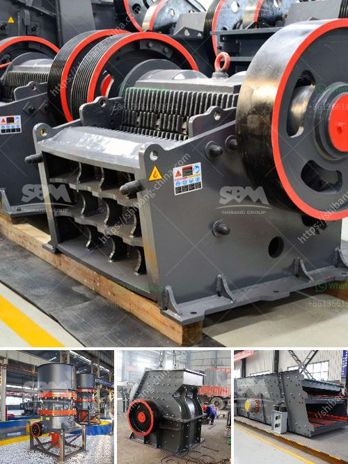

<h3>denver lab jaw crusher</h3>
The Denver lab jaw crusher, also known as the D12 laboratory flotation machine, is used to crush and grind various medium-hard ores and materials. The machine is highly versatile and can perform various tasks like splitting, grinding, and fractioning of samples. This lab jaw crusher is suitable for mining, metallurgy, geology, construction materials, chemical industry, and other fields for crushing materials with a compressive strength of less than 320 MPa.

One of the key features of the Denver lab jaw crusher is its ease of use, which allows for consistent results and reliable performance. The machine is equipped with a primary crushing area where the samples are initially crushed. The crushed material is then further reduced into smaller sizes in the secondary crushing area. This ensures that the samples are properly processed for subsequent analysis.

Another notable feature of the Denver lab jaw crusher is its adjustable discharge opening. This allows for precise control over the size of the crushed material, making it ideal for producing uniform samples. The machine also has an adjustable speed control, which enables users to select the desired crushing speed depending on their specific requirements.

In addition to its functionality, the Denver lab jaw crusher is also designed for durability and long-lasting performance. The machine is made from high-quality materials, ensuring resistance to wear and tear. Its compact design and small footprint make it easy to move and store, making it suitable for both laboratory and field use.

Overall, the Denver lab jaw crusher is a reliable and efficient machine for reducing raw materials into smaller sizes. Its ease of use, adjustable discharge opening, and durable construction make it a preferred choice for laboratories and research facilities. Whether it is for sample preparation or pilot plant applications, this lab jaw crusher delivers consistent and accurate results every time.
<h3>Contact us</h3><ul><li><strong>Whatsapp:&nbsp;<a href="https://wa.me/8613661969651">+8613661969651</a></strong></li><li><a href="https://swt.shibang-china.com/?git&amp;zhl&amp;denver lab jaw crusher"><strong>Online Service(chat now)</strong></a></li></ul><h3>Related</h3><ul><li><a href='scale gold mining business plan.md'>scale gold mining business plan</a></li><li><a href='gravel screening equipment.md'>gravel screening equipment</a></li><li><a href='crushing machines for rent in uae.md'>crushing machines for rent in uae</a></li><li><a href='quartz crusher machine.md'>quartz crusher machine</a></li><li><a href='second hand sand making machine cost.md'>second hand sand making machine cost</a></li></ul>