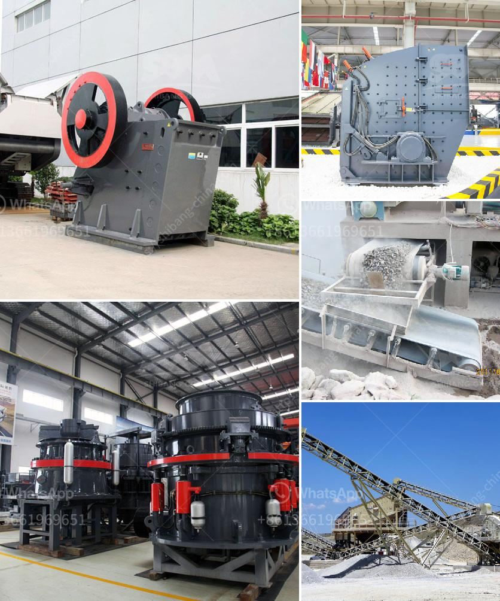

<h3>design calculation of jaw crusher pdf</h3>
Jaw crusher is a device which is used to crush rocks into smaller pieces, usually for gravel or some other road or building application. Most rock crushers have a hopper at the top, a container which holds the rock above the crusher and uses gravity to feed it in. Alternately, rock crushers can use a belt drive to continuously transport the rock into the crusher.

At the bottom of nearly every type of crusher is a hole. Once the rock has been pressed into small enough pieces to fit through the hole, it exits the crusher either onto, a conveyor belt, into a bin or onto a large pile. In this way, jaw crushers are able to store large quantities of rock while not using as much space as a traditional rock crusher.

Jaw crushers, like the Grizzly-King Jaw Crusher, are powerful primary crushers. They’re used in mining, pit and quarry, construction aggregates, and demolition recycling. They have a high output rate: up to 950 tons per hour. Jaw crushers like the Grizzly-King Jaw Crusher are different. They’re built tough. And there are reasons why.

First, a stronger superstructure while using the same amount of material, reinforcing beams constructed from high-quality steel, castings that are bolted together, and structurally connected on the front side to form a Symmetrical design.

Second, jaw crushers are robust pieces of machinery, offering a long lifespan, ease of use and accuracy of performance. And that’s thanks to their robust design. The Grizzly-King Jaw Crusher is one example of an effective aggregate solution. Jaw Crusher Benefits.

Every site has different needs and requirements, so jaw crushers can be found in different sizes and capacities. This gives you the opportunity to make the most suitable choice for your project. If you are not sure which size fits your current needs, speak to an engineer or knowledgeable equipment representative. They will help you find the best product for your specific situation.

The package often comes with additional benefits. In the case of the Grizzly-King Jaw Crusher, size reduction takes place between a stationary jaw plate and a moving jaw plate. To keep things simple, we’ll mention the central components: the pitman, toggle plate, and toggle seat.

The pitman is the main support for the moving jaw. Meanwhile, the toggle plate fulfills all the functions of a jaw crusher while wearing everything down to size. Remember to adjust the hydraulics periodically. To assist with clearing the jaws, the hydraulic gap adjustment uses shims. Once this procedure has been completed, it’s easy to adjust the size of the discharge opening.

In conclusion, jaw crushers are an effective solution for a variety of applications. They’re versatile, and the difference between what’s possible and impossible can sometimes be quite small. Millions of tons of material can be reduced and separated into usable aggregates. By using better equipment and minimal production losses, a successful operation can be achieved.
<h3>Contact us</h3><ul><li><strong>Whatsapp:&nbsp;<a href="https://wa.me/8613661969651">+8613661969651</a></strong></li><li><a href="https://swt.shibang-china.com/?git&amp;zhl&amp;design calculation of jaw crusher pdf"><strong>Online Service(chat now)</strong></a></li></ul><h3>Related</h3><ul><li><a href='ballast crushing project.md'>ballast crushing project</a></li><li><a href='prices of gemini concentrating tables manufacturers.md'>prices of gemini concentrating tables manufacturers</a></li><li><a href='copper mining process.md'>copper mining process</a></li><li><a href='dedusting systems for crushers.md'>dedusting systems for crushers</a></li><li><a href='rock crusher plant operations manager.md'>rock crusher plant operations manager</a></li></ul>