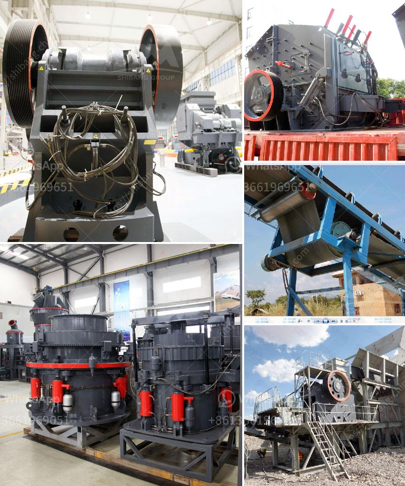

<h3>design design your alluvial mining plant</h3>
Alluvial mining is a popular method used to extract valuable minerals and metals from loose, unconsolidated deposits such as sand, gravel, and mud. These minerals are often found near streams and rivers, making alluvial mining an environmentally friendly alternative to traditional underground excavation. To ensure the success of your alluvial mining operation, it is crucial to design your plant with precision and careful consideration. This article will guide you through the key factors to consider when designing your alluvial mining plant.

1. Site Assessment: Before starting the design process, conduct a thorough assessment of your mining site. Consider factors such as topography, water sources, drainage patterns, and vegetation cover. Understanding the site's characteristics will help you choose the right equipment and design the most efficient layout.

2. Equipment Selection: Selecting the appropriate equipment is critical to the success of your alluvial mining plant. Commonly used equipment includes excavators, draglines, bulldozers, and screeners. Consider the size, capacity, and mobility of the equipment to ensure it suits the specific needs of your mining site.

3. Sizing and Sorting: Alluvial mining involves the extraction of a wide range of minerals. It is essential to design your plant with the ability to capture and separate minerals of various sizes efficiently. Use different screening methods, such as trommels and vibrating screens, to ensure accurate sizing and sorting of minerals.

4. Concentration and Recovery: Effective concentration and recovery systems are vital to maximize the yield of your alluvial mining plant. Use techniques such as gravity separation, centrifugal concentration, and magnetic separation to extract the desired minerals from the sediment. Incorporate these techniques into your plant design to enhance recovery rates and overall efficiency.

5. Water Management: Proper water management is crucial in alluvial mining plants. Take into account the availability, quality, and usage of water in your design. Incorporate recycling systems and sediment control measures to minimize water consumption and reduce environmental impact.

6. Power and Energy: Alluvial mining plants require a continuous and reliable power supply. Design your plant with appropriate power sources, considering factors such as proximity to the grid, accessibility of fuel, and capacity requirements. Explore renewable energy options such as solar or hydroelectric power to reduce operating costs and environmental impact.

7. Maintenance and Safety: Design your alluvial mining plant with ease of maintenance and safety in mind. Ensure easy access to equipment for regular upkeep and repairs. Implement safety protocols, including training programs and protective measures, to minimize accidents and ensure the well-being of your workforce.

8. Environmental Considerations: Alluvial mining plants have the potential to impact the surrounding environment. Take measures to minimize negative environmental effects, such as proper waste management, reclamation plans, and adherence to local regulations. Implement sustainable practices to conserve resources and protect ecosystems.

In conclusion, designing your alluvial mining plant is a complex task that requires careful consideration of various factors. By conducting a comprehensive site assessment, selecting appropriate equipment, and incorporating efficient concentration and recovery systems, you can maximize productivity and yield. Pay attention to water management, power sources, maintenance, safety, and environmental considerations to ensure a successful and sustainable mining operation. Following these guidelines will help you design a well-rounded and efficient alluvial mining plant.
<h3>Contact us</h3><ul><li><strong>Whatsapp:&nbsp;<a href="https://wa.me/8613661969651">+8613661969651</a></strong></li><li><a href="https://swt.shibang-china.com/?git&amp;zhl&amp;design design your alluvial mining plant"><strong>Online Service(chat now)</strong></a></li></ul><h3>Related</h3><ul><li><a href='vibration screen machine in pakistan.md'>vibration screen machine in pakistan</a></li><li><a href='small scale miners tonnes hour crushing machines.md'>small scale miners tonnes hour crushing machines</a></li><li><a href='dry processing of coal in south africa.md'>dry processing of coal in south africa</a></li><li><a href='limestone manufacturer supplier egypt.md'>limestone manufacturer supplier egypt</a></li><li><a href='ultrafine ball mills machine.md'>ultrafine ball mills machine</a></li></ul>