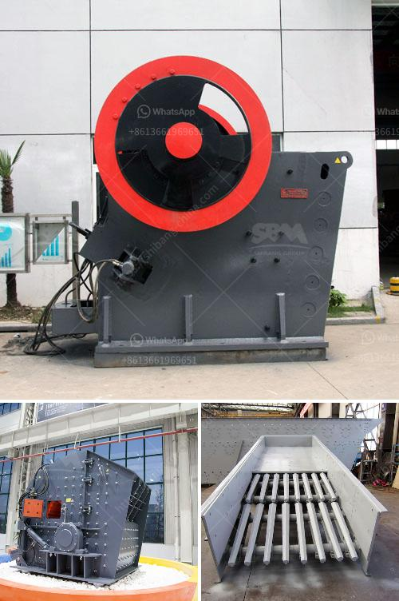

<h3>design drawings of a hammer mill</h3>
Design drawings of a hammer mill play a crucial role in the functionality and efficiency of this milling and grinding machine. A hammer mill is designed to crush materials into smaller pieces by repeatedly hitting them with high-speed rotating hammers. This rugged and robust machine is extensively used in agricultural, wood processing, and metal crushing industries.

The design drawings of a hammer mill typically include a range of specifications and details that help define the capabilities and limitations of the machine. These drawings provide a clear understanding of the overall dimensions and shape of the hammer mill, the arrangement of the crushing elements, and the drive system that powers the machine.

The design drawings also specify the capacity and feed size requirements of the hammer mill, which are vital for determining the optimal size and weight of the machine. In addition, the drawings provide valuable information on the number and arrangement of hammers, the type and thickness of the crushing chamber liners, and the presence of any additional features such as screens or grates to control the particle size of the final product.

A well-designed hammer mill should be able to deliver consistent performance and optimal efficiency. The design drawings ensure that the machine is structurally sound and capable of withstanding the high-impact forces generated during operation. Additionally, the drawings guide the manufacturing process and allow for quality control checks to ensure that the final product meets the intended design specifications.

In conclusion, design drawings of a hammer mill are essential for the successful construction and operation of this powerful milling machine. These detailed drawings provide the necessary information for engineers, manufacturers, and operators to build and utilize hammer mills that meet specific requirements. By incorporating the insights from design drawings, hammer mills can effectively and reliably crush and grind a wide range of materials, making them an indispensable tool in various industries.
<h3>Contact us</h3><ul><li><strong>Whatsapp:&nbsp;<a href="https://wa.me/8613661969651">+8613661969651</a></strong></li><li><a href="https://swt.shibang-china.com/?git&amp;zhl&amp;design drawings of a hammer mill"><strong>Online Service(chat now)</strong></a></li></ul><h3>Related</h3><ul><li><a href='impact crusher seller.md'>impact crusher seller</a></li><li><a href='price of ball mill.md'>price of ball mill</a></li><li><a href='cyanide processing plants for sale usa.md'>cyanide processing plants for sale usa</a></li><li><a href='ball mill grinding manufacturer in india.md'>ball mill grinding manufacturer in india</a></li><li><a href='stone crusher made in greece.md'>stone crusher made in greece</a></li></ul>