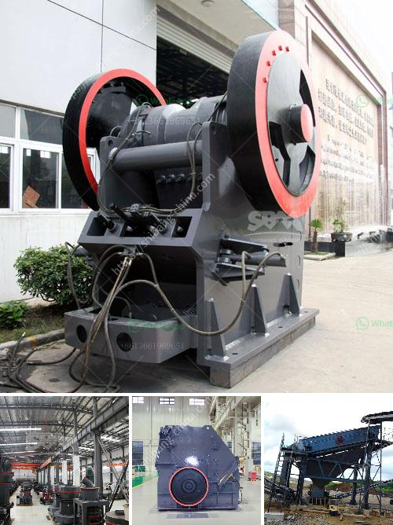

<h3>design of coal screen</h3>
The design of coal screens plays a crucial role in the effective and efficient extraction of coal from mining sites. These screens are used to separate larger coal particles from smaller ones, ensuring the quality and purity of the extracted coal. The process of designing coal screens involves considering various factors, including material properties, screen deck configuration, and screen openings. By optimizing these elements, mining operations can significantly improve their coal processing efficiency and reduce overall costs.

Understanding the properties of the coal being processed is fundamental in designing an effective screen. Variables such as coal size, moisture content, and density dictate the screen's structural requirements and screening capacity. This knowledge allows for the selection of the appropriate materials, screen panels, and vibrating mechanisms to handle the specific coal characteristics. A well-designed screen configuration ensures optimal screening efficiency, minimizing the potential for blockages and material buildup.

The size and shape of screen openings directly impact the coal screening process. By selecting the right size and shape, oversized coal particles can be efficiently separated, allowing for a higher quality end-product. Additionally, the preferred type of screen deck (such as wire mesh, rubber, or polyurethane) must meet the demands of the coal being processed. Each deck material offers different advantages, such as resistance to wear, increased screening performance, and ease of maintenance.

Vibrating mechanisms are essential components of coal screens, facilitating the movement of coal particles through the screen openings. An efficient vibrating mechanism should offer sufficient amplitude and frequency to ensure effective particle separation without excessive energy consumption. Balancing these factors helps minimize operational costs while maintaining optimal screening efficiency.

Designing effective coal screens is crucial for the efficient extraction and processing of coal in mining operations. The material properties of coal, screen configuration, selection of screen openings and deck preference, as well as energy-efficient vibrating mechanisms, all play vital roles in achieving desired outcomes. By investing in the careful and thoughtful design of coal screens, mining companies can enhance their operations, improve product quality, and ultimately increase their profitability.
<h3>Contact us</h3><ul><li><strong>Whatsapp:&nbsp;<a href="https://wa.me/8613661969651">+8613661969651</a></strong></li><li><a href="https://swt.shibang-china.com/?git&amp;zhl&amp;design of coal screen"><strong>Online Service(chat now)</strong></a></li></ul><h3>Related</h3><ul><li><a href='hp cone crusher.md'>hp cone crusher</a></li><li><a href='marble crusher for sale.md'>marble crusher for sale</a></li><li><a href='china coal mill grinder manufacturers china.md'>china coal mill grinder manufacturers china</a></li><li><a href='used stone crusher in ontario.md'>used stone crusher in ontario</a></li><li><a href='sand sieving machine by vibrating system chennai.md'>sand sieving machine by vibrating system chennai</a></li></ul>