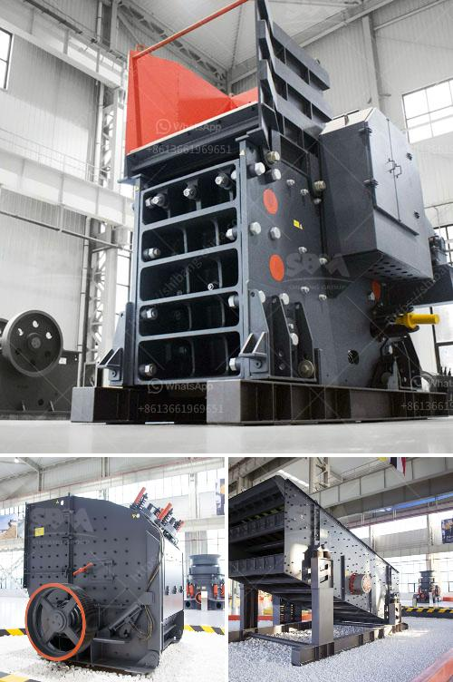

<h3>diagram of hammer mill machine</h3>
A hammer mill machine, also known as a grinder or a pulverizer, is a device used to shred or crush materials into smaller pieces. These machines consist of a large, heavy-duty rotor with rotating hammers that strike and grind materials until they are small enough to pass through a screen. This article will provide a detailed diagram of a hammer mill machine, explaining its working principles and the main components.

The diagram of a hammer mill machine consists of several components, including the feeding mechanism, the grinding chamber, the rotor, and the discharge mechanism. It is important to understand each component's function and how it contributes to the overall operation.

The feeding mechanism is responsible for delivering materials into the grinding chamber. It typically consists of a hopper that allows materials to be loaded, regulated, and directed to the grinding area. The hopper can be manually or automatically controlled, depending on the type of hammer mill machine.

The grinding chamber is where the action happens. It contains a series of hammers attached to a rotor that spins at high speed. The rotor's rotation causes the hammers to swing and strike the materials, delivering an impact force that grinds them into smaller particles. The design and size of the hammers can vary, depending on the desired output size and the type of material being processed.

The rotor is the heart of the hammer mill machine. It is usually made of heavy-duty steel and is driven by an electric motor or a diesel engine. The rotor's main function is to provide the necessary power and speed to the hammers, allowing them to crush and grind the materials effectively. The rotor's size and speed depend on the capacity and requirements of the machine.

The discharge mechanism is responsible for collecting and directing the processed materials out of the hammer mill machine. It usually consists of a screen or perforated plate that allows smaller particles to pass through while larger particles are discharged or recirculated for further grinding. The size of the screen or perforated plate determines the final particle size of the materials.

In addition to the main components, a hammer mill machine may also have additional features and accessories. These can include a control panel for adjusting and monitoring the machine's operation, a dust collection system to minimize dust emissions, and safety features to protect the operator and prevent accidents.

In conclusion, a diagram of a hammer mill machine illustrates its main components and their functions. Understanding the machine's working principles is crucial for maximizing its performance and productivity. Whether used in agriculture, mining, or other industries, a hammer mill machine is a versatile and efficient tool for grinding and shredding materials.
<h3>Contact us</h3><ul><li><strong>Whatsapp:&nbsp;<a href="https://wa.me/8613661969651">+8613661969651</a></strong></li><li><a href="https://swt.shibang-china.com/?git&amp;zhl&amp;diagram of hammer mill machine"><strong>Online Service(chat now)</strong></a></li></ul><h3>Related</h3><ul><li><a href='what is the cost of limestone crushing process.md'>what is the cost of limestone crushing process</a></li><li><a href='vertical spindle roller mill.md'>vertical spindle roller mill</a></li><li><a href='cement mill vertical price in india.md'>cement mill vertical price in india</a></li><li><a href='gypsum crushing machine price.md'>gypsum crushing machine price</a></li><li><a href='minimum output size in jaw crusher.md'>minimum output size in jaw crusher</a></li></ul>