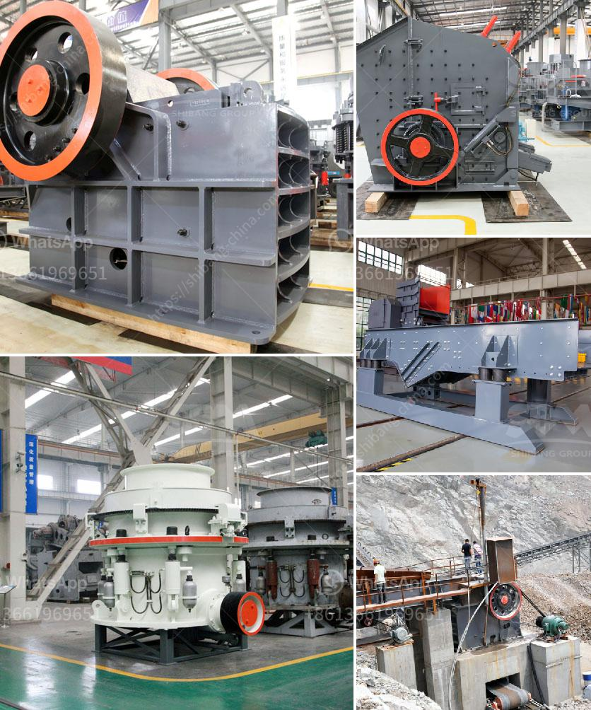

<h3>diamond and gold washing plant</h3>
Diamond and gold washing plants have become increasingly popular in recent years. These plants are designed to separate gold and diamonds from sand and gravel, ensuring a more efficient and reliable mining operation. With the rise in demand for precious metals and diamonds, it is essential to have a reliable and effective washing plant to ensure the highest quality minerals are extracted.

A diamond and gold washing plant is a versatile tool used to extract diamonds and gold from various terrains. These plants can be easily set up and moved to different locations, enabling mining companies to effectively extract precious metals and diamonds in different areas without any hassle. The portable design allows miners to quickly set up and start extracting minerals, increasing productivity and profitability.

One of the main advantages of diamond and gold washing plants is their ability to process large amounts of material. These plants are equipped with powerful machinery and high-quality screens that can efficiently separate diamonds and gold particles from other minerals. This enables miners to extract maximum reserves of precious metals and diamonds, ensuring a higher return on investment.

The washing process is another vital aspect of these plants. It involves separating diamond and gold particles from sand and gravel, using various techniques such as trommels, jigs, and shaking tables. These plants are equipped with state-of-the-art technology, such as water pumps and sluice boxes, which allow for effective washing of the material. The water used in the washing process is also carefully controlled to ensure the maximum recovery of diamonds and gold.

In addition to their efficiency and effectiveness, diamond and gold washing plants are also environmentally friendly. These plants are designed to minimize the impact on the environment by reducing water usage and minimizing the release of harmful chemicals. The water used in the washing process is often recycled, reducing the need for fresh water supply. This not only conserves water resources but also lowers operational costs, making it a sustainable option for mining companies.

Overall, diamond and gold washing plants are essential tools for the mining industry. They offer a convenient and efficient solution for extracting diamonds and gold from various terrains. With their portable design, powerful machinery, and advanced washing techniques, these plants ensure the maximum recovery of precious metals and diamonds. Furthermore, the environmentally friendly features make them a sustainable option for mining operations. As the demand for diamonds and gold continues to rise, investing in a diamond and gold washing plant is a wise decision for mining companies looking to maximize their returns and minimize their environmental impact.
<h3>Contact us</h3><ul><li><strong>Whatsapp:&nbsp;<a href="https://wa.me/8613661969651">+8613661969651</a></strong></li><li><a href="https://swt.shibang-china.com/?git&amp;zhl&amp;diamond and gold washing plant"><strong>Online Service(chat now)</strong></a></li></ul><h3>Related</h3><ul><li><a href='marble crusher for sale.md'>marble crusher for sale</a></li><li><a href='used stone crusher for sale in usa.md'>used stone crusher for sale in usa</a></li><li><a href='low cost roller mill suppliers india.md'>low cost roller mill suppliers india</a></li><li><a href='marble mining equipment.md'>marble mining equipment</a></li><li><a href='tractor pto stone crusher for sale.md'>tractor pto stone crusher for sale</a></li></ul>