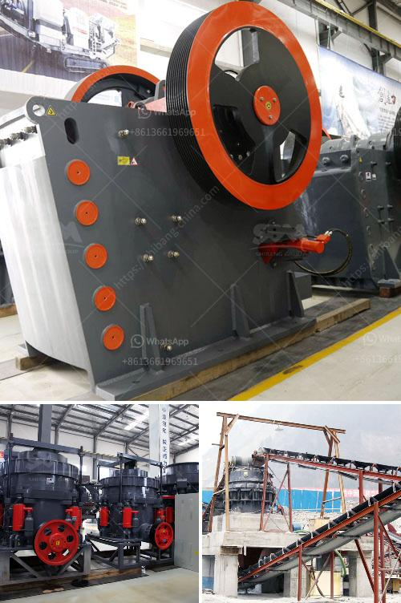

<h3>diamond dms plant for sale south africa</h3>
South Africa, renowned for its rich mineral deposits, is a global leader in diamond production. To meet the ever-increasing global demand and optimize the diamond mining process, cutting-edge technologies like the Diamond DMS (Dense Media Separation) Plant have become indispensable. In this article, we will explore the value and benefits of investing in a Diamond DMS Plant for sale in South Africa.

The Diamond DMS Plant is a technologically advanced separation system designed specifically to efficiently extract diamonds from diamond-bearing ore. This groundbreaking technology uses a dense media separation method to separate diamond-rich material from barren rocks in a highly efficient and cost-effective manner.

1. Increased Extraction Efficiency: The Diamond DMS Plant leverages state-of-the-art technology to separate diamond-rich materials from non-valuable minerals. This enhances the overall extraction efficiency and reduces the need for manual labor-intensive processes, making it a highly desirable investment.

2. Exceptional Cut Accuracy: The DMS Plant allows for the accurate identification and separation of diamonds based on their unique properties, such as density and electromagnetic behavior. This ensures that no valuable diamonds are lost during the extraction process.

3. Cost-effective Operation: By streamlining the diamond extraction process, the Diamond DMS Plant significantly reduces operational costs associated with labor, time, and energy requirements. Thus, investors can achieve higher return on investment and reduced operational overheads.

4. Environmental Sustainability: The Diamond DMS Plant contributes to environmental sustainability by minimizing the need for excessive mining and reducing the ecological impact caused by traditional diamond extraction methods. It ensures that valuable resources are utilized efficiently, making it an ecologically responsible investment option.

5. Scalability and Flexibility: The modular design of the Diamond DMS Plant allows for easy scalability and customization to meet specific operational requirements. Investors can adapt the plant's capacity as per the project's demands, providing flexibility to expand and optimize the extraction process.

South Africa, blessed with extensive diamond reserves, offers a lucrative market for diamond extraction equipment and technologies like the Diamond DMS Plant. An investment in this plant can unlock the country's vast diamond potential and establish your business as a significant player in the African diamond industry.

Furthermore, South Africa's favorable business environment, supportive mining legislation, and well-established infrastructure make it an attractive destination for investors seeking to capitalize on the growing global diamond demand.

Investing in a Diamond DMS Plant for sale in South Africa presents an exceptional opportunity to maximize diamond extraction efficiency, reduce operational costs, and achieve significant returns on investment. The advanced technology of the Diamond DMS Plant, coupled with South Africa's favorable mining landscape, makes it a compelling investment choice for those eager to explore the country's rich diamond reserves.

Therefore, entrepreneurs, mining companies, and investors seeking to tap into the lucrative diamond mining market in South Africa should consider acquiring a Diamond DMS Plant to elevate their operations to unparalleled heights of success.
<h3>Contact us</h3><ul><li><strong>Whatsapp:&nbsp;<a href="https://wa.me/8613661969651">+8613661969651</a></strong></li><li><a href="https://swt.shibang-china.com/?git&amp;zhl&amp;diamond dms plant for sale south africa"><strong>Online Service(chat now)</strong></a></li></ul><h3>Related</h3><ul><li><a href='powder mill rollers machine.md'>powder mill rollers machine</a></li><li><a href='quarry crusher for sale in ibadan.md'>quarry crusher for sale in ibadan</a></li><li><a href='crush granite to powder.md'>crush granite to powder</a></li><li><a href='mobile crushing station.md'>mobile crushing station</a></li><li><a href='coal roller mill.md'>coal roller mill</a></li></ul>